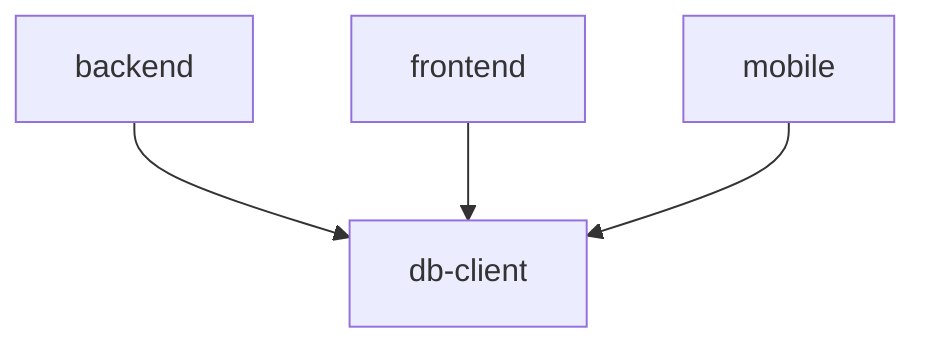

# Design Log #002: Monorepo Architecture

## Background

AgentInSync has multiple deployable units (backend API, frontend app, mobile app) that share common code (database schema, types). A monorepo structure allows code sharing while maintaining clear package boundaries.

## Problem

- Need to share database schema and types between backend and frontend
- Want consistent tooling (linting, testing, building) across packages
- Must support independent deployment of each package
- Need efficient CI/CD with caching

## Design

### Package Structure

```
AgentInSync/
├── packages/
│   ├── backend/        # Express API server
│   ├── db-client/      # Drizzle ORM client + schema
│   ├── frontend/       # React backoffice app
│   └── mobile/         # Mobile app (planned)
├── turbo.json          # Task orchestration
├── pnpm-workspace.yaml # Workspace definition
└── tsconfig.base.json  # Shared TypeScript config
```

### Dependency Graph



### Turborepo Configuration

Tasks respect dependencies via `dependsOn: ["^task"]`:

| Task        | Caching | Dependencies                         |
| ----------- | ------- | ------------------------------------ |
| `build`     | Yes     | `^build` (builds dependencies first) |
| `dev`       | No      | None (persistent)                    |
| `test`      | Yes     | `^build`                             |
| `lint`      | Yes     | `^lint`                              |
| `typecheck` | Yes     | `^typecheck`                         |

### Package Dependencies

```yaml
# pnpm-workspace.yaml
packages:
  - 'packages/*'
```

Internal packages reference each other via workspace protocol:

```json
{
  "dependencies": {
    "@agent-in-sync/db-client": "workspace:*"
  }
}
```

### Shared TypeScript Configuration

All packages extend the base config:

```json
// packages/backend/tsconfig.json
{
  "extends": "../../tsconfig.base.json",
  "compilerOptions": { "outDir": "dist" }
}
```

## Trade-offs

| Pros                                | Cons                                          |
| ----------------------------------- | --------------------------------------------- |
| Shared code without npm publishing  | More complex initial setup                    |
| Single PR for cross-package changes | Larger repo size                              |
| Turborepo caching speeds up CI      | Learning curve for contributors               |
| Consistent tooling                  | All packages must use compatible Node version |

## Implementation Notes

Key files:

- `turbo.json` - Task definitions and caching rules
- `pnpm-workspace.yaml` - Workspace package locations
- `tsconfig.base.json` - Shared compiler options
- `package.json` - Root scripts (`pnpm -r`, `turbo run`)

Commands:

```bash
pnpm install                      # Install all workspace deps
pnpm --filter @agent-in-sync/backend dev  # Run single package
turbo run build                   # Build all with caching
turbo run test --filter=backend   # Test single package
```

---

_Created: 2026-01-15_
_Status: Implemented_
