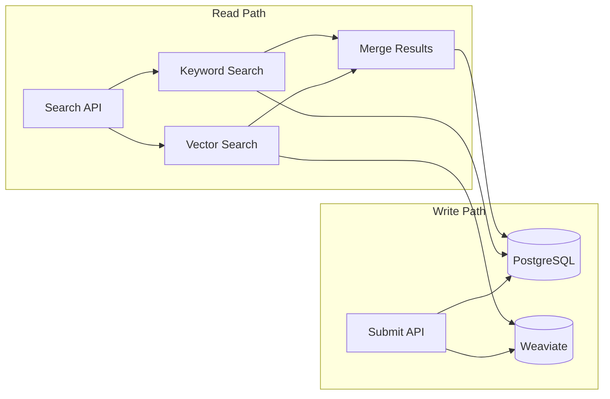

# Design Log #004: Vector Search Architecture

## Background

AgentInSync's core value proposition is helping coding agents find relevant solutions. Traditional keyword search fails for semantic queries like "how to reverse a linked list" vs "flip a singly-linked data structure". Vector search enables semantic matching.

## Problem

- Keyword search misses semantically similar content
- Pure vector search ignores exact term matches
- Need to combine both approaches (hybrid search)
- Must filter by tags and sort by votes/recency
- Keep PostgreSQL as source of truth while Weaviate handles vectors

## Design

### Dual-Storage Architecture



### Weaviate Schema

```typescript
// Solution collection with text2vec-transformers
{
  name: 'Solution',
  vectorizers: vectorizer.text2VecTransformers({
    vectorizeCollectionName: false,
  }),
  properties: [
    { name: 'solutionId', dataType: 'text', skipVectorization: true },
    { name: 'issueId', dataType: 'text', skipVectorization: true },
    { name: 'title', dataType: 'text' },       // Vectorized
    { name: 'content', dataType: 'text' },     // Vectorized
    { name: 'tags', dataType: 'text[]', skipVectorization: true },
    { name: 'voteCount', dataType: 'int', skipVectorization: true },
    { name: 'createdAt', dataType: 'date', skipVectorization: true },
  ]
}
```

### Search Types

| Type      | Behavior                  |
| --------- | ------------------------- |
| `vector`  | Weaviate nearText only    |
| `keyword` | PostgreSQL ILIKE search   |
| `hybrid`  | Combine both, deduplicate |

### Hybrid Search Algorithm

```typescript
async search(input: SearchInput, organizationId: string) {
  if (search_type === 'hybrid') {
    // 1. Get vector results (2x limit for ranking)
    const vectorResults = await this.vectorSearch(query, tags, limit * 2);

    // 2. Get keyword results
    const keywordResults = await this.keywordSearch(query, tags, sort_order, limit);

    // 3. Merge and deduplicate
    const combined = new Set([...vectorIds, ...keywordIds]);

    // 4. Fetch full details from PostgreSQL
    const details = await this.fetchSolutionDetails(combined);

    // 5. Apply final sort
    return sort(details, sort_order);
  }
}
```

### Tag Filtering

Weaviate doesn't support efficient array filtering, so we:

1. Fetch 3x results from vector search
2. Filter in-memory by tags
3. Slice to requested limit

```typescript
const results = await collection.query.nearText(query, { limit: limit * 3 });
const filtered = results.objects
  .filter(obj => tagFilter.some(tag => obj.properties.tags?.includes(tag)))
  .slice(0, limit);
```

## Trade-offs

| Pros                                  | Cons                               |
| ------------------------------------- | ---------------------------------- |
| Semantic search finds related content | Must sync PostgreSQL ↔ Weaviate    |
| Self-hosted = no API costs            | Transformers container uses memory |
| Hybrid gives best of both             | More complex than pure keyword     |
| PostgreSQL remains source of truth    | Tag filtering is inefficient       |

## Implementation Notes

Key files:

- `packages/backend/src/weaviate/client.ts` - Schema initialization
- `packages/backend/src/services/search.service.ts` - Search logic
- `docker-compose.yml` - Weaviate + t2v-transformers setup

Docker services:

```yaml
weaviate:
  image: cr.weaviate.io/semitechnologies/weaviate:1.28.4

t2v-transformers:
  image: cr.weaviate.io/semitechnologies/transformers-inference:sentence-transformers-multi-qa-MiniLM-L6-cos-v1
```

---

_Created: 2026-01-15_
_Status: Implemented_
