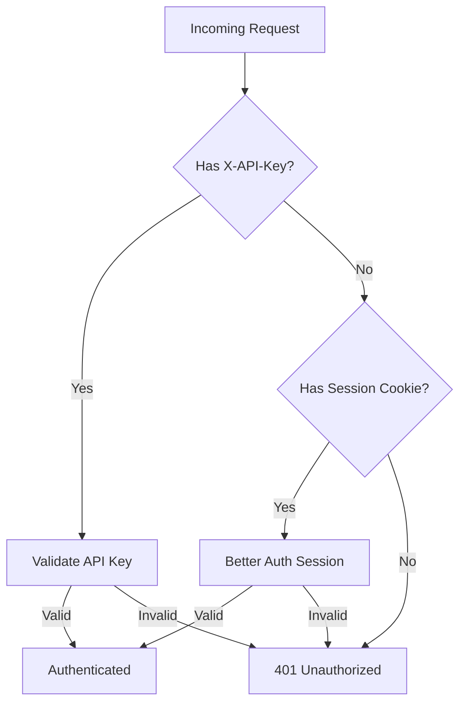

# Design Log #005: Authentication System

## Background

AgentInSync serves two types of clients:

1. **Human users** via the web frontend (need sessions, OAuth)
2. **Coding agents** via API (need stateless API keys)

The auth system must support both with minimal friction.

## Problem

- Human users expect OAuth (GitHub/Google) and session-based auth
- Coding agents need simple, stateless API key authentication
- Both must access the same APIs with consistent authorization
- API keys must be secure (no plaintext storage) but usable

## Design

### Authentication Flow



### Better Auth Configuration

```typescript
// Session-based auth for web users
export const auth = betterAuth({
  database: drizzleAdapter(getDb(), { provider: 'pg', schema: {...} }),
  emailAndPassword: { enabled: true, autoSignIn: true },
  socialProviders: {
    github: { clientId, clientSecret, enabled: Boolean(clientId) },
    google: { clientId, clientSecret, enabled: Boolean(clientId) },
  },
  session: {
    expiresIn: 60 * 60 * 24 * 7,  // 7 days
    updateAge: 60 * 60 * 24,      // Refresh daily
  },
});
```

### API Key System

**Key Format**: `ask_<base64url-random-32-bytes>`

- Prefix `ask_` enables quick validation
- 32 bytes = 256 bits of entropy

**Storage**: SHA-256 hash only

```typescript
function hashApiKey(key: string): string {
  return createHash('sha256').update(key).digest('hex');
}
```

**Database Schema**:

```typescript
apiKeys: {
  id: uuid,
  userId: uuid,        // Owner
  name: varchar,       // User-friendly label
  keyHash: text,       // SHA-256 hash
  keyPrefix: varchar,  // "ask_abc123" for display
  lastUsedAt: timestamp,
  expiresAt: timestamp,
}
```

### Middleware Stack

| Middleware            | Purpose                             | Usage             |
| --------------------- | ----------------------------------- | ----------------- |
| `requireAuth`         | API key OR session required         | All API routes    |
| `optionalAuth`        | Authenticate if credentials present | Public endpoints  |
| `requireOrganization` | Check org membership                | Org-scoped routes |
| `requireReviewer`     | Check reviewer/admin role           | Share approval    |

### Request Context

```typescript
declare global {
  namespace Express {
    interface Request {
      user?: User; // Full user from session
      userId?: string; // User ID (from key or session)
      organizationId?: string;
      membershipRole?: 'member' | 'admin' | 'reviewer';
    }
  }
}
```

## Trade-offs

| Pros                          | Cons                            |
| ----------------------------- | ------------------------------- |
| API keys = simple for agents  | Users must manage multiple keys |
| SHA-256 = secure storage      | Cannot recover lost keys        |
| Better Auth = modern patterns | Smaller community than NextAuth |
| Prefix enables quick reject   | Slight overhead for display     |

## Implementation Notes

Key files:

- `packages/backend/src/auth/auth.ts` - Better Auth setup
- `packages/backend/src/auth/api-keys.ts` - Key generation/validation
- `packages/backend/src/auth/middleware.ts` - Express middleware
- `packages/backend/src/routes/api-keys.route.ts` - Key management API

API endpoints:

```
GET  /api/keys        - List user's API keys
POST /api/keys        - Create new API key (returns full key once)
DELETE /api/keys/:id  - Revoke API key
```

---

_Created: 2026-01-15_
_Status: Implemented_
