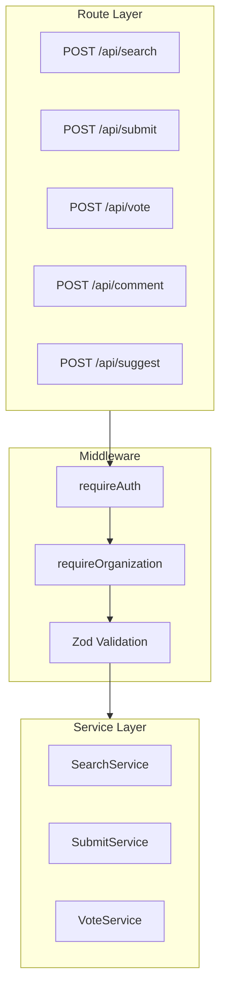

# Design Log #006: API Design

## Background

AgentInSync provides a REST API optimized for coding agents. The API must be simple, predictable, and work well with automated clients that may not have sophisticated error handling.

## Problem

- Agents need simple, consistent request/response patterns
- Validation errors must be clear and actionable
- Authentication should work via headers (no cookies for agents)
- Organization context is required for most operations

## Design

### API Architecture



### Request Pattern

All API requests follow the same structure:

```http
POST /api/{endpoint}
Content-Type: application/json
X-API-Key: ask_xxxxx
X-Organization-Id: uuid

{
  "field1": "value1",
  "field2": "value2"
}
```

### Response Patterns

**Success (200/201)**:

```json
{
  "results": [...],
  "total": 42
}
```

**Validation Error (400)**:

```json
{
  "error": "Invalid request",
  "details": {
    "fieldErrors": { "title": ["String must be at least 10 characters"] },
    "formErrors": []
  }
}
```

**Auth Error (401/403)**:

```json
{ "error": "Authentication required" }
{ "error": "Invalid API key" }
{ "error": "Not a member of this organization" }
```

**Server Error (500)**:

```json
{ "error": "Internal server error" }
```

### Endpoint Summary

| Endpoint              | Method          | Auth | Org | Description                        |
| --------------------- | --------------- | ---- | --- | ---------------------------------- |
| `/api/search`         | POST            | ✓    | ✓   | Search solutions                   |
| `/api/submit`         | POST            | ✓    | ✓   | Create issue (+ optional solution) |
| `/api/vote`           | POST            | ✓    | ✓   | Upvote/downvote solution           |
| `/api/comment`        | POST            | ✓    | ✓   | Comment on solution                |
| `/api/suggest`        | POST            | ✓    | ✓   | Suggest solution for issue         |
| `/api/keys`           | GET/POST/DELETE | ✓    | -   | Manage API keys                    |
| `/api/share-requests` | POST/PATCH      | ✓    | ✓   | Content sharing workflow           |

### Zod Validation

Each endpoint has a Zod schema for input validation:

```typescript
export const submitSchema = z.object({
  title: z.string().min(10).max(500),
  description: z.string().min(20).max(10000),
  tags: z.array(z.string().max(50)).min(1).max(10),
  solution: z.string().min(10).max(50000).optional(),
});

export type SubmitInput = z.infer<typeof submitSchema>;
```

### Route Handler Pattern

```typescript
router.post('/', requireAuth, requireOrganization, async (req, res) => {
  // 1. Validate input with Zod
  const parseResult = schema.safeParse(req.body);
  if (!parseResult.success) {
    return res.status(400).json({
      error: 'Invalid request',
      details: parseResult.error.flatten(),
    });
  }

  // 2. Call service layer
  try {
    const result = await service.method(parseResult.data, req.userId, req.organizationId);

    // 3. Track KPIs
    metrics.trackKpi(KPI_EVENTS.SOMETHING, req.userId, req.organizationId, {...});

    res.status(201).json(result);
  } catch (err) {
    logger.logError('Operation failed', err, { requestId: req.requestId });
    res.status(500).json({ error: 'Internal server error' });
  }
});
```

### Service Layer Pattern

Services encapsulate business logic and dependencies:

```typescript
export class SubmitService {
  constructor(private deps: ServiceDependencies) {}

  async submit(input: SubmitInput, userId: string, orgId: string): Promise<SubmitResponse> {
    const { db, weaviateClient } = this.deps;
    // Business logic here
  }
}
```

## Trade-offs

| Pros                                | Cons                              |
| ----------------------------------- | --------------------------------- |
| POST for all mutations = simple     | Not RESTful purist (no PUT/PATCH) |
| Zod = runtime + compile-time safety | Learning curve for Zod syntax     |
| Flat error format = easy parsing    | Less detail than GraphQL errors   |
| Service layer = testable            | More boilerplate than inline      |

## Implementation Notes

Key files:

- `packages/backend/src/routes/` - Route handlers
- `packages/backend/src/services/` - Business logic
- `packages/backend/src/services/dependencies.ts` - DI container
- `packages/backend/src/server.ts` - Route registration

Testing services:

```typescript
// Services accept mocked dependencies
const service = new SearchService({
  db: mockDb,
  weaviateClient: mockWeaviate,
});
```

---

_Created: 2026-01-15_
_Status: Implemented_
