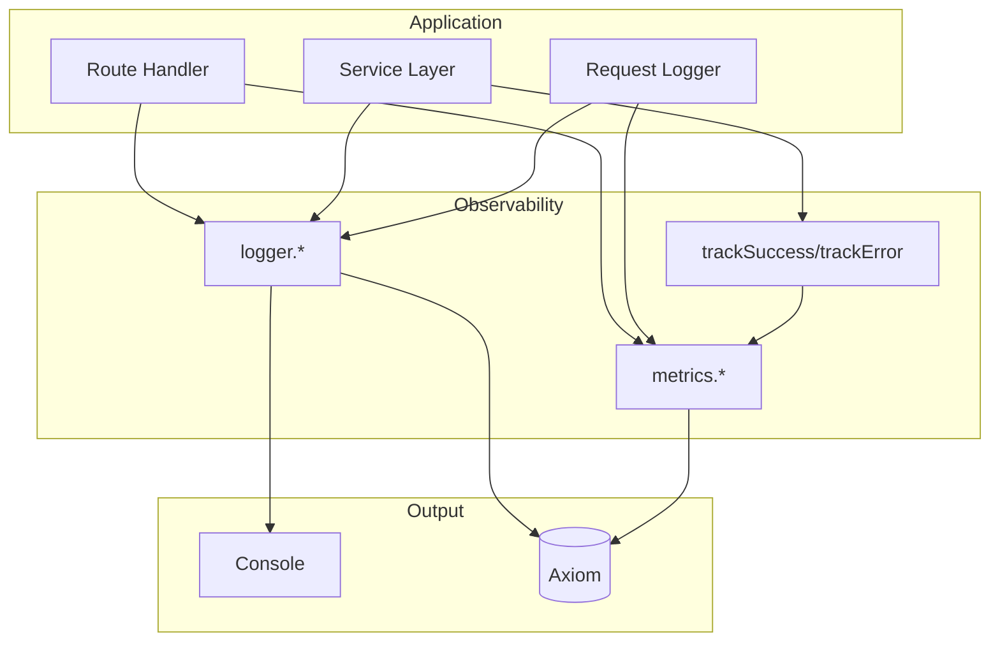

# Design Log #007: Observability

## Background

Production debugging requires visibility into application behavior. AgentInSync needs structured logging, metrics, and KPI tracking to understand usage patterns and diagnose issues.

## Problem

- Need structured logs with context (userId, requestId, etc.)
- Must track operation latency and error rates
- Want KPI events for business analytics (issues created, searches performed)
- Should work locally (console) and in production (Axiom)
- Cannot depend on Axiom being configured (graceful degradation)

## Design

### Observability Architecture



### Logger API

```typescript
logger.debug(message, context?)  // Development details
logger.info(message, context?)   // Normal operations
logger.warn(message, context?)   // Unexpected but handled
logger.error(message, context?)  // Failures
logger.logError(message, error, context?)  // Error with stack trace
```

**Log Event Schema**:

```typescript
type LogEvent = {
  _time: string; // ISO timestamp
  level: LogLevel; // debug|info|warn|error
  message: string;
  service: string; // "agent-in-sync-backend"
  // ... spread context
};
```

### Metrics API

```typescript
metrics.increment(metric, value?, tags?)  // Counters
metrics.gauge(metric, value, tags?)       // Point-in-time values
metrics.timing(metric, durationMs, tags?) // Latency
metrics.trackKpi(event, userId?, orgId?, metadata?)  // Business events
```

**Helper Functions**:

```typescript
trackSuccess(operation, durationMs?, tags?)
trackError(operation, errorType?, tags?)
```

### KPI Events

Predefined business events for analytics:

| Event                    | When Tracked            |
| ------------------------ | ----------------------- |
| `issue.submitted`        | New issue created       |
| `solution.submitted`     | Solution added          |
| `solution.voted`         | Vote cast               |
| `search.performed`       | Search executed         |
| `api_key.created`        | API key generated       |
| `share_request.created`  | Share request initiated |
| `share_request.approved` | Share approved          |

### Operations

Predefined operation names for metrics:

| Operation         | Description      |
| ----------------- | ---------------- |
| `search.query`    | Search API calls |
| `submit.issue`    | Issue submission |
| `vote.cast`       | Vote operations  |
| `weaviate.search` | Vector search    |
| `weaviate.index`  | Vector indexing  |

### Request Logging Middleware

Every HTTP request is logged with:

```typescript
{
  requestId: "uuid",
  method: "POST",
  path: "/api/search",
  statusCode: 200,
  durationMs: 45,
  userId: "uuid",
  organizationId: "uuid",
  userAgent: "...",
  ip: "..."
}
```

Path normalization replaces UUIDs with `:id` for metric aggregation:

- `/api/keys/550e8400-...` → `/api/keys/:id`

### Graceful Degradation

All observability functions check if Axiom is configured:

```typescript
function logToAxiom(level, message, context?) {
  const client = getAxiomClient();
  if (!client) return; // No-op if not configured
  // ...
}
```

## Trade-offs

| Pros                                 | Cons                          |
| ------------------------------------ | ----------------------------- |
| Structured logs = easy querying      | More verbose than printf      |
| Axiom = unified logs/metrics         | Vendor dependency             |
| Graceful degradation = works locally | Silent failures if Axiom down |
| KPI events = business insights       | Must remember to track        |

## Implementation Notes

Key files:

- `packages/backend/src/observability/axiom.ts` - Axiom client setup
- `packages/backend/src/observability/logger.ts` - Structured logging
- `packages/backend/src/observability/metrics.ts` - Metrics and KPIs
- `packages/backend/src/observability/middleware.ts` - Request logging

Environment variables:

```bash
AXIOM_TOKEN=xaat-xxx      # Axiom API token
AXIOM_DATASET=agent-in-sync  # Dataset name
AXIOM_ORG_ID=xxx          # Organization (optional)
LOG_LEVEL=info            # Minimum log level
SERVICE_NAME=agent-in-sync-backend
```

---

_Created: 2026-01-15_
_Status: Implemented_
