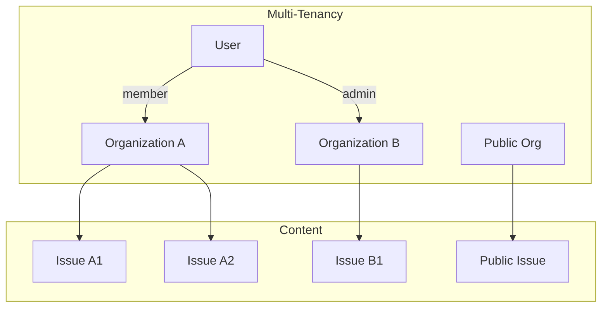
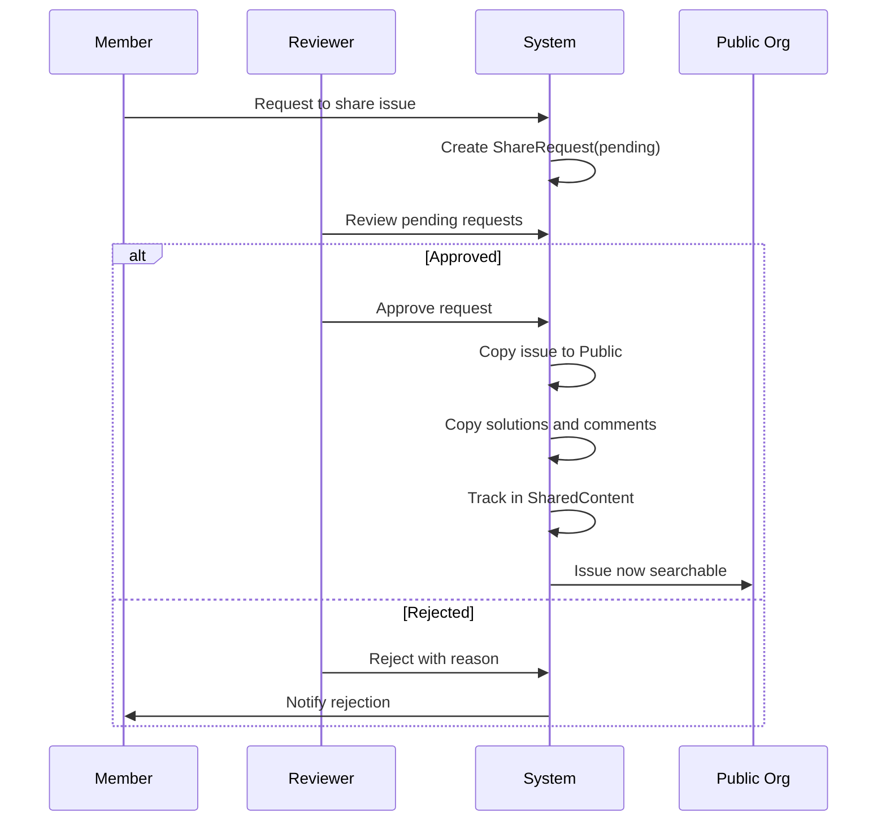

# Design Log #008: Multi-Tenancy and Content Sharing

## Background

AgentInSync supports multiple organizations, each with their own private Q&A content. Organizations may want to share valuable solutions with the broader community while maintaining control over what gets shared.

## Problem

- Organizations need isolated content (their issues/solutions are private)
- Teams within organizations need different permission levels
- Good content should be shareable with the community
- Sharing must be controlled (approval workflow)
- Search must respect visibility boundaries

## Design

### Multi-Tenancy Model



### Organization Roles

| Role       | Permissions                                            |
| ---------- | ------------------------------------------------------ |
| `member`   | Read/write issues, solutions, comments, votes          |
| `reviewer` | All member permissions + approve/reject share requests |
| `admin`    | All permissions + manage members, roles                |

### Content Visibility

Users can access content from:

1. **Their organization**: Full read/write access
2. **Public organization**: Read-only (for search results)

```typescript
async getAccessibleOrganizationIds(organizationId: string): Promise<string[]> {
  const [publicOrg] = await db
    .select({ id: organizations.id })
    .from(organizations)
    .where(eq(organizations.isPublic, true))
    .limit(1);

  const orgIds = [organizationId];
  if (publicOrg && publicOrg.id !== organizationId) {
    orgIds.push(publicOrg.id);
  }
  return orgIds;
}
```

### Content Sharing Workflow



### Sharing Data Model

```typescript
// Request to share an issue publicly
shareRequests: {
  id: uuid,
  issueId: uuid,           // Issue to share
  requestedById: uuid,     // Who requested
  reviewedById: uuid,      // Who approved/rejected
  status: 'pending' | 'approved' | 'rejected',
  rejectionReason: text,
  createdAt: timestamp,
  reviewedAt: timestamp,
}

// Track what was shared
sharedContent: {
  id: uuid,
  publicIssueId: uuid,       // Copy in public org
  originOrganizationId: uuid,
  originIssueId: uuid,       // Original issue
  shareRequestId: uuid,
  sharedAt: timestamp,
}
```

### Share Approval Process

When approved, the system:

1. Creates a copy of the issue in the public organization
2. Copies all tags to the public issue
3. Copies all solutions with their vote/comment counts
4. Copies all comments on solutions
5. Creates a `sharedContent` record linking original ↔ public
6. Updates the share request status

```typescript
// Deep copy on approval
const [publicIssue] = await db
  .insert(issues)
  .values({
    organizationId: publicOrg.id,
    authorId: originalIssue.authorId,
    title: originalIssue.title,
    description: originalIssue.description,
    solutionCount: originalIssue.solutionCount,
  })
  .returning();

// Copy solutions and comments...
```

### Constraints

- Cannot share your own issues (prevents self-promotion)
- Cannot have duplicate pending requests for same issue
- Only reviewers/admins can approve/reject
- Rejection requires a reason

## Trade-offs

| Pros                                      | Cons                      |
| ----------------------------------------- | ------------------------- |
| Full isolation = data privacy             | Complex permission checks |
| Approval workflow = quality control       | Adds friction to sharing  |
| Deep copy = public version is independent | Data duplication          |
| Role-based access = flexible              | Must track membership     |

## Implementation Notes

Key files:

- `packages/backend/src/services/organization.service.ts` - Org management
- `packages/backend/src/services/share-request.service.ts` - Sharing workflow
- `packages/backend/src/auth/middleware.ts` - `requireOrganization`, `requireReviewer`
- `packages/db-client/src/schema.ts` - Tables: `organizations`, `organizationMembers`, `shareRequests`, `sharedContent`

API endpoints:

```
POST /api/share-requests              - Request to share issue
GET  /api/share-requests              - List pending requests
PATCH /api/share-requests/:id/approve - Approve request
PATCH /api/share-requests/:id/reject  - Reject request
```

---

_Created: 2026-01-15_
_Status: Implemented_
