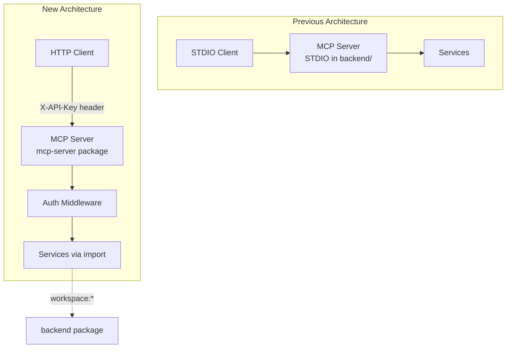

# Design Log #010: MCP Server Separation

## Background

The MCP (Model Context Protocol) server was originally embedded within the backend package at `packages/backend/src/mcp/`. It used STDIO transport which is suitable for local MCP clients but not for remote HTTP-based clients like Cursor or Claude Code.

## Problem

1. **Tight Coupling**: MCP code was embedded in the backend package, mixing concerns
2. **STDIO Only**: No support for HTTP transport required by remote MCP clients
3. **Tool-based Auth**: Authentication required passing `api_key` as a tool parameter, which is non-standard and exposes keys in tool calls
4. **No Header Auth**: MCP clients expect to pass credentials via headers (`Authorization: Bearer` or `X-API-Key`)

## Design

### Architecture



### New Package Structure

Created `packages/mcp-server/` as a standalone package:

```
packages/mcp-server/
├── package.json          # @agent-in-sync/mcp-server
├── tsconfig.json
└── src/
    ├── index.ts          # Entry point, server startup
    ├── server.ts         # Express + StreamableHTTPServerTransport
    ├── tools.ts          # Tool definitions (no api_key param)
    └── middleware/
        └── auth.ts       # X-API-Key header validation
```

### HTTP Transport

Uses `StreamableHTTPServerTransport` from MCP SDK with Express:

```typescript
const app = express();
app.use(cors({ origin: '*', exposedHeaders: ['Mcp-Session-Id'] }));

app.post('/mcp', requireApiKey, handleMcpRequest);
app.get('/mcp', requireApiKey, handleSessionRequest);
app.delete('/mcp', requireApiKey, handleSessionRequest);
```

### Header-based Authentication

Middleware validates `X-API-Key` header before MCP requests:

```typescript
export async function requireApiKey(req, res, next) {
  const apiKey = req.headers['x-api-key'];
  if (!apiKey) {
    return res.status(401).json({ error: 'X-API-Key header required' });
  }
  const userId = await validateApiKey(apiKey);
  if (!userId) {
    return res.status(401).json({ error: 'Invalid API key' });
  }
  req.userId = userId;
  req.organizationId = req.headers['x-organization-id'] ?? 'default';
  next();
}
```

### Tool Simplification

Removed `api_key` parameter from all 5 tools since authentication is now via headers:

| Tool    | Required Params (Before)          | Required Params (After)  |
| ------- | --------------------------------- | ------------------------ |
| search  | api_key, query                    | query                    |
| submit  | api_key, title, description, tags | title, description, tags |
| vote    | api_key, solution_id, vote        | solution_id, vote        |
| comment | api_key, solution_id, comment     | solution_id, comment     |
| suggest | api_key, issue_id, suggestion     | issue_id, suggestion     |

### Backend Package Exports

Added exports to `packages/backend/package.json` for service reuse:

```json
{
  "exports": {
    ".": "./dist/index.js",
    "./services": "./dist/services/index.js",
    "./auth": "./dist/auth/api-keys.js",
    "./weaviate": "./dist/weaviate/index.js"
  }
}
```

### Client Configuration

MCP clients configure the server with API key in headers:

```json
{
  "mcpServers": {
    "agent-in-sync": {
      "url": "http://localhost:3001/mcp",
      "type": "http",
      "headers": {
        "X-API-Key": "ask_xxxxx"
      }
    }
  }
}
```

## Environment Variables

| Variable     | Description              | Default    |
| ------------ | ------------------------ | ---------- |
| MCP_PORT     | HTTP port for MCP server | 3001       |
| DATABASE_URL | PostgreSQL connection    | (required) |
| WEAVIATE_URL | Weaviate connection      | (required) |

## Scripts

```bash
pnpm --filter @agent-in-sync/mcp-server dev    # Development
pnpm --filter @agent-in-sync/mcp-server build  # Production build
pnpm --filter @agent-in-sync/mcp-server start  # Production server
```

## Trade-offs

| Pros                                  | Cons                                       |
| ------------------------------------- | ------------------------------------------ |
| Clean separation of concerns          | Additional package to maintain             |
| Standard HTTP transport               | Requires running separate server           |
| Header-based auth (industry standard) | Breaking change for existing STDIO clients |
| Supports remote MCP clients           | Adds network latency vs STDIO              |
| Simpler tool interfaces               | Dependency on backend package              |

## Implementation Notes

Files created:

- `packages/mcp-server/package.json`
- `packages/mcp-server/tsconfig.json`
- `packages/mcp-server/src/index.ts`
- `packages/mcp-server/src/server.ts`
- `packages/mcp-server/src/tools.ts`
- `packages/mcp-server/src/middleware/auth.ts`

Files modified:

- `packages/backend/package.json` - Added exports field

Files removed:

- `packages/backend/src/mcp/server.ts`
- `packages/backend/src/mcp/index.ts`
- `start:mcp` script from backend package.json

References:

- [MCP Authorization Tutorial](https://modelcontextprotocol.io/docs/tutorials/security/authorization)
- [MCP TypeScript SDK](https://github.com/modelcontextprotocol/typescript-sdk)

---

_Created: 2026-01-31_
_Status: Implemented_
