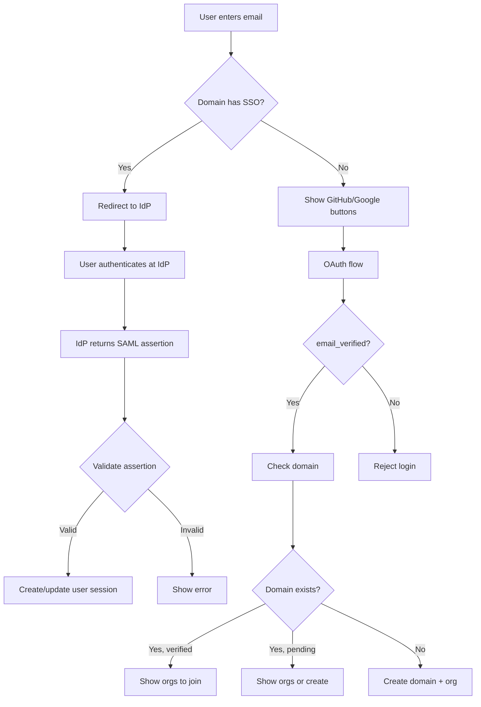

# Design Log #011: Domain-Based Organizations with Optional SAML SSO

## Background

Currently, organizations in AgentInSync are created manually with no validation of ownership. Any user can create an organization with any name/slug. There's no mechanism to:

- Verify that a user belongs to a company domain
- Auto-group users from the same company
- Integrate with enterprise identity providers (SSO)

## Problem

1. **No domain ownership validation**: Anyone can claim an organization for any company
2. **No email verification enforcement**: The `emailVerified` field exists but isn't checked
3. **Manual member management**: Admins must manually add each member
4. **No SSO support**: Enterprises can't use their existing identity providers
5. **Potential for abuse**: Domain squatting, unauthorized organization creation

## Questions and Answers

> Q: How do we validate that a user owns a domain?

A: Three verification methods:

1. **Social proof** - Auto-verify when 3+ users from the same domain join
2. **DNS TXT record** - Admin adds a verification token to DNS
3. **SSO setup** - Successfully configuring SSO proves domain ownership

> Q: Should we support SAML, OIDC, or both?

A: SAML 2.0 only for now. It's the enterprise standard (Okta, Azure AD, OneLogin).

> Q: Can SSO be enforced (mandatory)?

A: No. Only DISABLED or OPTIONAL modes. No REQUIRED enforcement for now.

> Q: What happens to existing sessions when SSO is enabled?

A: Sessions expire naturally. No forced logout.

> Q: How many organizations can exist per domain?

A: Maximum 5 organizations total per verified domain.

> Q: What about personal email domains (gmail.com, etc.)?

A: Users with public email domains create "personal" organizations with no domain link. They invite others via shareable links.

## Design

### Core Concepts

```mermaid
flowchart TB
    subgraph domain [Domain: ppp.com]
        D[Domain Record]
        D -->|owns| O1[Org: Backend]
        D -->|owns| O2[Org: Frontend]
        D -->|owns| O3[Org: DevOps]
        D -->|has| SSO[SAML SSO Config]
    end

    subgraph users [Users]
        U1[jo@ppp.com] -->|domain admin| D
        U2[sarah@ppp.com] -->|member| D
        U3[mike@ppp.com] -->|member| D
    end

    subgraph personal [Personal Org]
        U4[dev@gmail.com] -->|admin| P1[My Projects]
    end
```

### Authentication Flow



### Schema Changes

```typescript
// New table: domains
export const domainStatusEnum = pgEnum('domain_status', ['pending', 'verified']);
export const verificationMethodEnum = pgEnum('verification_method', [
  'social_proof',
  'dns_txt',
  'sso',
]);

export const domains = pgTable('domains', {
  id: uuid('id').primaryKey().defaultRandom(),
  name: varchar('name', { length: 255 }).notNull().unique(),

  // Verification
  status: domainStatusEnum('status').notNull().default('pending'),
  verificationMethod: verificationMethodEnum('verification_method'),
  verificationToken: varchar('verification_token', { length: 64 }),
  verifiedAt: timestamp('verified_at'),

  // SSO Configuration (SAML only)
  ssoEnabled: boolean('sso_enabled').notNull().default(false),
  ssoConfig: jsonb('sso_config').$type<SamlConfig>(),

  // Domain admin (first verified user)
  domainAdminId: uuid('domain_admin_id').references(() => users.id, { onDelete: 'set null' }),

  createdAt: timestamp('created_at').notNull().defaultNow(),
  updatedAt: timestamp('updated_at').notNull().defaultNow(),
});

// New table: domain_members
export const domainMembers = pgTable(
  'domain_members',
  {
    id: uuid('id').primaryKey().defaultRandom(),
    domainId: uuid('domain_id')
      .notNull()
      .references(() => domains.id, { onDelete: 'cascade' }),
    userId: uuid('user_id')
      .notNull()
      .references(() => users.id, { onDelete: 'cascade' }),
    joinedAt: timestamp('joined_at').notNull().defaultNow(),
  },
  table => [uniqueIndex('domain_member_unique').on(table.domainId, table.userId)]
);

// Modified: organizations - add domainId
// Remove: ssoEnabled, ssoProvider, ssoConfig (moved to domains table)
export const organizations = pgTable('organizations', {
  // ...existing fields
  domainId: uuid('domain_id').references(() => domains.id, { onDelete: 'set null' }),
});

// Modified: users - add domainId for quick lookup
export const users = pgTable('users', {
  // ...existing fields
  domainId: uuid('domain_id').references(() => domains.id, { onDelete: 'set null' }),
});
```

### SAML Configuration Type

```typescript
type SamlConfig = {
  // Identity Provider (customer's IdP)
  idpEntityId: string;
  idpSsoUrl: string;
  idpCertificate: string; // X.509 PEM format

  // Service Provider (AgentInSync - auto-generated)
  spEntityId: string; // "https://api.agentinsync.com/saml/{domain-slug}"
  spAcsUrl: string; // "https://api.agentinsync.com/saml/{domain-slug}/acs"
  spMetadataUrl: string; // "https://api.agentinsync.com/saml/{domain-slug}/metadata"

  // Attribute mapping
  attributeMapping: {
    email: string;
    firstName?: string;
    lastName?: string;
    groups?: string; // For future role mapping
  };

  // Security options
  signRequests: boolean;
  wantAssertionsSigned: boolean;

  createdAt: string;
  updatedAt: string;
};
```

### Public Email Domains Blocklist

```typescript
const PUBLIC_EMAIL_DOMAINS = [
  'gmail.com',
  'googlemail.com',
  'yahoo.com',
  'yahoo.co.uk',
  'yahoo.fr',
  'hotmail.com',
  'outlook.com',
  'live.com',
  'msn.com',
  'icloud.com',
  'me.com',
  'mac.com',
  'protonmail.com',
  'proton.me',
  'aol.com',
  'zoho.com',
  'yandex.com',
  'yandex.ru',
  'mail.com',
  'gmx.com',
];
```

Users with these domains:

- Cannot claim domain ownership
- Create "personal" organizations (`domainId: null`)
- Invite others via shareable invite links

### API Endpoints

```
# Domain Management
GET    /api/v1/domains/:domainName              # Get domain info
POST   /api/v1/domains/:domainName/verify       # Request DNS verification
GET    /api/v1/domains/:domainName/verify       # Check verification status

# SSO Configuration (domain admin only)
GET    /api/v1/domains/:domainName/sso          # Get SSO config
PUT    /api/v1/domains/:domainName/sso          # Update SSO config
DELETE /api/v1/domains/:domainName/sso          # Disable SSO
GET    /api/v1/domains/:domainName/sso/metadata # SP metadata XML (public)

# SAML Endpoints (public, no auth)
GET    /saml/:domainSlug/metadata               # SP metadata for IdP setup
POST   /saml/:domainSlug/acs                    # Assertion Consumer Service
GET    /saml/:domainSlug/login                  # Initiate SSO login

# Organization (updated)
POST   /api/v1/organizations                    # Create org (checks domain limit)
GET    /api/v1/organizations/available          # List orgs user can join
POST   /api/v1/organizations/:id/join           # Join an organization
```

### Validation Rules

| Rule                                 | Enforcement                                   |
| ------------------------------------ | --------------------------------------------- |
| OAuth email must be verified         | Check `email_verified === true` from provider |
| Max 5 orgs per verified domain       | Count check on org creation                   |
| Only domain admin can configure SSO  | Middleware: `requireDomainAdmin`              |
| SAML certificate must be valid X.509 | Parse and validate on save                    |
| IdP SSO URL must be HTTPS            | URL validation                                |
| Domain name must be valid            | Regex: lowercase, dots, no spaces             |

## Implementation Plan

### Phase 1: Domain Foundation

1. Add `domains` and `domain_members` tables
2. Add `domainId` to `organizations` and `users` tables
3. Migration to move existing `ssoEnabled/ssoConfig` from orgs to domains
4. Extract domain from email on user creation
5. Create domain service with basic CRUD

### Phase 2: Verification & Organization Limits

1. Implement social proof verification (auto at 3+ users)
2. Implement DNS TXT verification flow
3. Add domain org count check on org creation
4. Update signup flow to show available orgs
5. Add "join organization" endpoint

### Phase 3: SAML SSO

1. Add `@node-saml/node-saml` dependency
2. Implement SP metadata generation
3. Implement SSO configuration endpoints
4. Implement SAML assertion consumer service
5. Integrate SSO login into auth flow
6. Add SSO login initiation endpoint

## Examples

✅ Corporate user signup flow:

```typescript
// jo@ppp.com signs up via Google OAuth
const { email, email_verified } = googleProfile;

if (!email_verified) {
  throw new UnauthorizedError('EMAIL_NOT_VERIFIED', 'Email must be verified');
}

const domainName = extractDomain(email); // "ppp.com"

if (isPublicDomain(domainName)) {
  // Personal org flow - no domain linking
  return { domainId: null, showOrgCreation: true };
}

const domain = await domainService.findOrCreate(domainName, userId);
const orgs = await orgService.getOrgsForDomain(domain.id);

if (orgs.length === 0) {
  // First user - create domain + org, become admin
  return { domainId: domain.id, isFirstUser: true };
}

// Show available orgs to join
return { domainId: domain.id, availableOrgs: orgs };
```

❌ Insecure pattern (what we're replacing):

```typescript
// Current: Anyone can create any org without validation
await orgService.createOrganization(
  {
    name: 'Apple Inc', // No proof of ownership!
    slug: 'apple',
  },
  userId
);
```

## Trade-offs

| Pros                                    | Cons                                        |
| --------------------------------------- | ------------------------------------------- |
| Domain-based grouping is intuitive      | Adds complexity to signup flow              |
| SSO improves enterprise security        | SAML is complex to implement                |
| Social proof requires no manual action  | First-come model has small window for abuse |
| 5 org limit prevents sprawl             | May be restrictive for large enterprises    |
| Self-service SSO reduces support burden | Users may misconfigure SSO                  |

## Migration Notes

Existing organizations without domains will continue to work:

- `domainId: null` = personal/legacy organization
- No breaking changes to existing API consumers
- Existing `ssoEnabled/ssoConfig` fields on organizations should be deprecated and removed after migration

Key files to modify:

- `packages/db-client/src/schema.ts` - Add domain tables
- `packages/backend/src/services/domain.service.ts` - New service
- `packages/backend/src/services/organization.service.ts` - Add domain checks
- `packages/backend/src/auth/middleware.ts` - Add `requireDomainAdmin`
- `packages/backend/src/routes/domain.route.ts` - New routes
- `packages/backend/src/routes/saml.route.ts` - New SAML endpoints

Dependencies to add:

- `@node-saml/node-saml` - SAML 2.0 implementation

---

_Created: 2026-02-02_
_Status: Draft_

## Implementation Results — Welcome Onboarding (2026-05-24)

Phase 2 left a gap in the signup UX: backend auto-joined a new user to the default org for their domain, but **did not surface any other organizations** the user could optionally join. Users could only discover them by visiting `/organizations`.

### Change

Added a one-time `/welcome` step shown right after consent acceptance. The page:

1. Lists organizations the user was auto-joined to (Public + domain default).
2. If their domain has more organizations (`getAvailableOrganizations` returns > 0), lists them with checkboxes so the user can opt into one or many.
3. "Skip for now" or "Join N and continue" both navigate to `/dashboard`.
4. If there is nothing to choose (no domain, gmail user, or only the default org exists), the page redirects to `/dashboard` immediately.

No new endpoints — fully built on the existing `GET /organizations/available` and `POST /organizations/:id/join`.

### Files

- `packages/frontend/src/routes/_protected.welcome.tsx` — new route + page
- `packages/frontend/src/routes/_protected.welcome.test.tsx` — 4 tests covering empty-redirect, render, skip, multi-join
- `packages/frontend/src/routes/_protected.consent.tsx` — post-consent navigation now goes to `/welcome` instead of `/dashboard`

### Why not a backend change

The "auto-join default org" and public-domain skip logic were already complete in `DomainService.findOrCreateForUser` + `OrganizationService.joinDefaultOrg`. The only gap was discovery, which is a UI concern.
