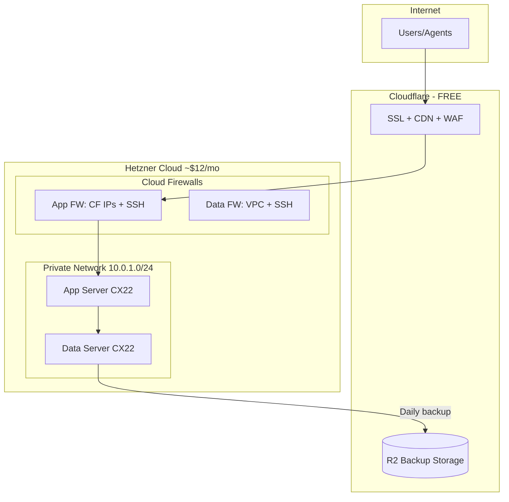
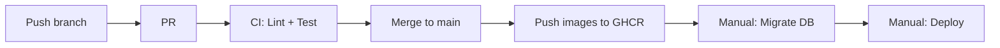
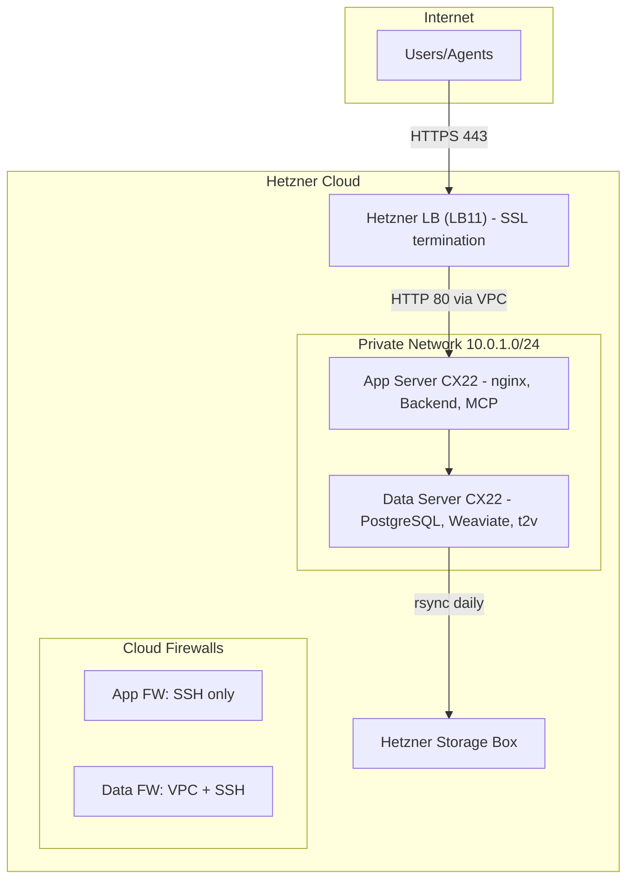

# Design Log #012: CI/CD Pipeline

## Background

AgentInSync needs a production deployment pipeline. The existing CI workflow (`.github/workflows/ci.yml`) runs linting, tests, and builds Docker images on PRs, but images are not pushed and there's no deployment automation.

## Problem

1. **No CD**: Docker images are built but not published or deployed
2. **No production infrastructure**: No defined hosting, networking, or security setup
3. **Manual deployments**: No automated way to deploy after merging to main
4. **No backup strategy**: Database backups not automated

## Questions and Answers

> Q: Which cloud provider?

A: Hetzner Cloud - ~70% cheaper than DigitalOcean/Linode with comparable performance. EU and US data centers available.

> Q: How to handle SSL/HTTPS?

A: Cloudflare (free tier) handles SSL termination, CDN caching, and DDoS protection. No load balancer needed.

> Q: How to secure the servers?

A: Cloud firewalls restrict port 80 to Cloudflare IPs only. Data server only accessible via private network. SSH restricted to admin IP.

> Q: What about database backups?

A: Daily `pg_dump` uploaded to Cloudflare R2 (off-site storage). Retention: 7 daily, 4 weekly, 12 monthly. R2 has zero egress fees for restores. Free tier covers up to 10GB.

> Q: How to handle rolling deployments with DB changes?

A: Expand-contract migration pattern. Add new columns first, deploy code that handles both, then remove old columns after full rollout.

## Design

### Architecture



### Server Configuration

| Server | Type | RAM | Services                               | Monthly |
| ------ | ---- | --- | -------------------------------------- | ------- |
| App    | CX22 | 4GB | nginx, Backend, MCP Server             | €5.77   |
| Data   | CX22 | 4GB | PostgreSQL, Weaviate, t2v-transformers | €5.77   |

### CI/CD Flow



### Key Decisions

1. **GitHub Container Registry (GHCR)** for Docker images - free for public repos, integrated with GitHub Actions
2. **Manual deploy trigger** via `workflow_dispatch` - provides control over production updates
3. **Separate migration workflow** - run DB changes before deploying new code
4. **nginx as reverse proxy** - serves frontend static files and proxies `/api/` to backend

### File Structure

```
.github/workflows/
├── ci.yml              # Existing + push-images job
├── deploy.yml          # Manual deployment
└── migrate.yml         # Database migrations

packages/frontend/
├── Dockerfile          # Multi-stage build → nginx
└── nginx.conf          # SPA routing + API proxy

packages/mcp-server/
└── Dockerfile          # Multi-stage Node.js build

docker-compose.app.yml  # App server services
docker-compose.data.yml # Data server services
scripts/backup.sh       # PostgreSQL backup cron
```

## Implementation Plan

### Phase 1: Docker Images

1. Create `packages/frontend/Dockerfile` with nginx
2. Create `packages/frontend/nginx.conf` for SPA routing
3. Create `packages/mcp-server/Dockerfile`
4. Update `.github/workflows/ci.yml` to push images on main merge

### Phase 2: Compose Files

1. Create `docker-compose.app.yml` for app server
2. Create `docker-compose.data.yml` for data server
3. Create `scripts/backup.sh` for PostgreSQL backups

### Phase 3: GitHub Workflows

1. Create `.github/workflows/deploy.yml` for SSH deployment
2. Create `.github/workflows/migrate.yml` for DB migrations

### Phase 4: Infrastructure (Manual)

1. Create Hetzner account and API token
2. Create private network and cloud firewalls
3. Create servers with Docker pre-installed
4. Configure Cloudflare DNS and SSL

## Examples

✅ Deploying a new version:

```bash
# 1. Merge PR to main (triggers image push)
# 2. If DB changes needed:
#    GitHub Actions → Run workflow → migrate.yml → Type "migrate"
# 3. Deploy:
#    GitHub Actions → Run workflow → deploy.yml → target: app
```

✅ Rolling back:

```bash
# Deploy previous commit SHA
# GitHub Actions → Run workflow → deploy.yml
# image_tag: abc123def (previous commit SHA)
```

❌ Don't deploy without testing migrations:

```bash
# Wrong: Deploy code that requires new DB columns
# Right: Run migrate.yml first, then deploy.yml
```

## Backup & Disaster Recovery

### Strategy

Off-site backups to Cloudflare R2 (S3-compatible object storage):

| Backup Type | Frequency     | Retention | Purpose           |
| ----------- | ------------- | --------- | ----------------- |
| Daily       | Every day 2am | 7 days    | Quick recovery    |
| Weekly      | Every Sunday  | 4 weeks   | Medium-term       |
| Monthly     | 1st of month  | 12 months | Long-term archive |

### Why Cloudflare R2?

- **Zero egress fees** - Critical for disaster recovery (restores are free)
- **Free 10GB** - Covers most small-medium databases
- **S3-compatible** - Works with standard tools (rclone, aws-cli)
- **Already using Cloudflare** - Single vendor for CDN + backups

### Backup Script

`scripts/backup.sh`:

```bash
#!/bin/bash
set -e

DATE=$(date +%Y%m%d_%H%M%S)
DAY_OF_WEEK=$(date +%u)
DAY_OF_MONTH=$(date +%d)
BACKUP_FILE="/tmp/pg_${DATE}.sql.gz"

source /opt/agentinsync/.env

# Dump PostgreSQL
docker exec agentinsync-postgres-1 pg_dump -U $DB_USER $DB_NAME | gzip > "$BACKUP_FILE"

# Upload to R2 (always daily)
rclone copy "$BACKUP_FILE" r2:agentinsync-backups/daily/

# Weekly (Sunday)
[ "$DAY_OF_WEEK" -eq 7 ] && rclone copy "$BACKUP_FILE" r2:agentinsync-backups/weekly/

# Monthly (1st)
[ "$DAY_OF_MONTH" -eq 01 ] && rclone copy "$BACKUP_FILE" r2:agentinsync-backups/monthly/

# Cleanup local
rm "$BACKUP_FILE"

# Cleanup old R2 backups
rclone delete r2:agentinsync-backups/daily/ --min-age 7d
rclone delete r2:agentinsync-backups/weekly/ --min-age 28d
rclone delete r2:agentinsync-backups/monthly/ --min-age 365d

echo "Backup complete: $DATE"
```

### Restore Procedure

```bash
# 1. List available backups
rclone ls r2:agentinsync-backups/daily/

# 2. Download backup
rclone copy r2:agentinsync-backups/daily/pg_20260204_020000.sql.gz /tmp/

# 3. Stop backend (prevent writes)
ssh deploy@APP_IP "cd /opt/agentinsync && docker compose -f docker-compose.app.yml stop backend"

# 4. Restore database
gunzip -c /tmp/pg_20260204_020000.sql.gz | \
  ssh deploy@DATA_IP "docker exec -i agentinsync-postgres-1 psql -U agentinsync agentinsync"

# 5. Restart backend
ssh deploy@APP_IP "cd /opt/agentinsync && docker compose -f docker-compose.app.yml start backend"
```

### R2 Setup

1. Create bucket in Cloudflare Dashboard → R2 → Create Bucket (`agentinsync-backups`)
2. Create API token with read/write access
3. Configure rclone on data server:

```bash
rclone config
# Type: s3
# Provider: Cloudflare
# Access Key ID: <from R2 API token>
# Secret Access Key: <from R2 API token>
# Endpoint: https://<account-id>.r2.cloudflarestorage.com
```

### Backup Cost

| DB Size     | Storage Used | Monthly Cost |
| ----------- | ------------ | ------------ |
| < 500MB     | ~3GB         | Free         |
| 500MB - 2GB | ~10GB        | Free         |
| 2GB - 10GB  | ~50GB        | ~$0.75       |

## Trade-offs

| Pros                                      | Cons                                |
| ----------------------------------------- | ----------------------------------- |
| Very low cost (~$12/mo)                   | Single app server (no redundancy)   |
| Simple 2-server architecture              | Manual Hetzner setup required       |
| Cloudflare handles SSL/CDN free           | Cloudflare sees all traffic         |
| Cloud firewalls auto-apply to new servers | Must update CF IPs if they change   |
| Docker-based = reproducible               | Data server needs backup monitoring |

## Security Considerations

1. **Firewall Rules**:
   - App server: Port 80 only from Cloudflare IPs, SSH from admin IP
   - Data server: Ports 5432/8080 only from private network, SSH from admin IP

2. **Secrets Management**:
   - Database credentials in `.env` files on servers
   - GitHub Secrets for deployment (SSH key, server IPs)
   - Never commit `.env` files

3. **Cloudflare Settings**:
   - SSL mode: Flexible (CF terminates SSL)
   - Always use HTTPS: Enabled
   - Proxy status: Orange cloud (proxied)

## GitHub Secrets Required

| Secret              | Description                             |
| ------------------- | --------------------------------------- |
| `APP_SERVER_IP`     | Hetzner app server public IP            |
| `DATA_SERVER_IP`    | Hetzner data server public IP           |
| `SSH_PRIVATE_KEY`   | SSH key for deploy user                 |
| `DB_USER`           | PostgreSQL username                     |
| `DB_PASSWORD`       | PostgreSQL password                     |
| `DB_NAME`           | PostgreSQL database name                |
| `PRODUCTION_DOMAIN` | Domain name (e.g., api.agentinsync.com) |

## Cost Summary

| Resource                | Monthly               |
| ----------------------- | --------------------- |
| App Server (CX22)       | €5.77                 |
| Data Server (CX22)      | €5.77                 |
| Private Network         | Free                  |
| Cloud Firewall          | Free                  |
| Cloudflare CDN/SSL      | Free                  |
| Cloudflare R2 (backups) | Free\*                |
| **Total**               | **~€11.50 (~$12.40)** |

\*R2 free tier: 10GB storage, 1M Class A ops, 10M Class B ops/month

---

## Implementation Results: Hetzner-Only (No Cloudflare)

_Date: 2026-02-08_

### Deviation: Removed Cloudflare, Added Hetzner Load Balancer

The original design used Cloudflare for SSL termination, CDN, WAF, and R2 backups. This was changed to a fully Hetzner-managed setup using their Load Balancer for SSL (built-in Let's Encrypt) and Storage Box for backups.

Initially considered self-managed certbot + nginx SSL, but switched to Hetzner LB because:

- Zero SSL maintenance (built-in Let's Encrypt with auto-renewal)
- No bootstrap/chicken-and-egg problem for cert provisioning
- Fewer files and moving parts (no certbot container, no SSL nginx template, no init script)
- More secure: app server has no public HTTP/HTTPS ports, only LB is internet-facing

### What Changed

#### SSL: Hetzner Load Balancer (replaces Cloudflare SSL)

- LB11 (~€5.39/mo) terminates SSL with built-in Let's Encrypt
- LB forwards HTTP to app server via private network (port 80)
- App server has no public HTTP/HTTPS ports -- only SSH
- DNS A record points to LB public IP (not app server)

#### MCP Server: Proxied Through nginx

- MCP no longer exposed directly on port 3001
- Added `/mcp/` location in nginx config, proxied to `mcp-server:3001`
- MCP gets SSL for free via the LB without extra configuration
- `docker-compose.app.yml`: MCP changed from `ports` to `expose`

#### Firewall Rules (more restrictive than original)

- App server: SSH only (was Cloudflare IPs on port 80)
- Data server: unchanged (VPC + SSH only)
- LB reaches app server via private network, bypassing firewall

#### Backups: Hetzner Storage Box (replaces Cloudflare R2)

- `scripts/backup.sh` uses `rsync` over SSH instead of `rclone` to R2
- Same retention policy: 7 daily, 4 weekly, 12 monthly
- Storage Box is in the same DC as servers -- fast transfers, ~€3.50/mo for 1TB

#### nginx Config

- `packages/frontend/nginx.conf`: `X-Real-IP` uses `$http_x_forwarded_for` (from LB) instead of `$http_cf_connecting_ip`
- Added `/mcp/` proxy location with streaming-friendly settings (no buffering, no cache)

#### Deploy Workflow

- `.github/workflows/deploy.yml`: added checkout + SCP step to sync compose file to server before deploying

### Updated Architecture



### Updated Cost Summary

| Resource             | Monthly            |
| -------------------- | ------------------ |
| App Server (CX22)    | €5.77              |
| Data Server (CX22)   | €5.77              |
| Load Balancer (LB11) | ~€5.39             |
| Hetzner Storage Box  | ~€3.50             |
| Private Network      | Free               |
| Cloud Firewall       | Free               |
| Let's Encrypt SSL    | Free (via LB)      |
| **Total**            | **~€20.43 (~$22)** |

### Trade-offs vs Original Design

| Lost (no Cloudflare)   | Mitigation                                               |
| ---------------------- | -------------------------------------------------------- |
| DDoS protection        | Hetzner includes basic network-level DDoS protection     |
| CDN caching            | nginx gzip + cache headers; acceptable for API-first app |
| WAF                    | Rate limiting in backend; can add fail2ban later         |
| Free SSL management    | Hetzner LB handles Let's Encrypt automatically           |
| Zero-egress R2 backups | Storage Box in same DC; fast + ~€3.50/mo                 |

### Files Changed

| File                           | Change                                                            |
| ------------------------------ | ----------------------------------------------------------------- |
| `packages/frontend/nginx.conf` | `$http_x_forwarded_for` instead of CF header; added `/mcp/` proxy |
| `docker-compose.app.yml`       | MCP changed from `ports` to `expose` (routed via nginx)           |
| `scripts/backup.sh`            | rsync to Storage Box instead of rclone to R2                      |
| `.github/workflows/deploy.yml` | checkout + SCP deploy files before docker compose up              |

---

## Implementation Results: SSH Tunnel for DB Migrations

_Date: 2026-02-11_

### Problem

The `migrate.yml` workflow failed because the GitHub Actions runner couldn't connect to the production PostgreSQL database. The data server's firewall only allows connections from the private network and SSH — port 5432 is not exposed to the internet.

### Solution

Replaced the direct `PRODUCTION_DATABASE_URL` approach with an SSH tunnel through the data server:

1. The runner opens an SSH tunnel (`ssh -fN -L 5432:localhost:5432`) to the data server using the existing `SSH_PRIVATE_KEY` and `DATA_SERVER_IP` secrets
2. Drizzle connects to `localhost:5432` which tunnels to the remote PostgreSQL
3. The tunnel is closed after the migration completes (even on failure)

### What Changed

| File                            | Change                                                                                        |
| ------------------------------- | --------------------------------------------------------------------------------------------- |
| `.github/workflows/migrate.yml` | SSH tunnel instead of direct `DATABASE_URL`; uses `DB_USER`, `DB_PASSWORD`, `DB_NAME` secrets |

### GitHub Secrets

- **Removed:** `PRODUCTION_DATABASE_URL` (no longer needed)
- **Added:** `DB_USER`, `DB_PASSWORD`, `DB_NAME` (composed into connection string locally)

### Why Not Direct Connection

- Data server firewall blocks port 5432 from the internet (by design)
- Whitelisting GitHub Actions IPs is impractical (they rotate frequently)
- SSH tunnel reuses existing infrastructure (deploy user + SSH key) with zero firewall changes

---

_Created: 2026-02-04_
_Updated: 2026-02-11_
_Status: Implemented (Hetzner-only, LB for SSL, Storage Box for backups, SSH tunnel for migrations)_
