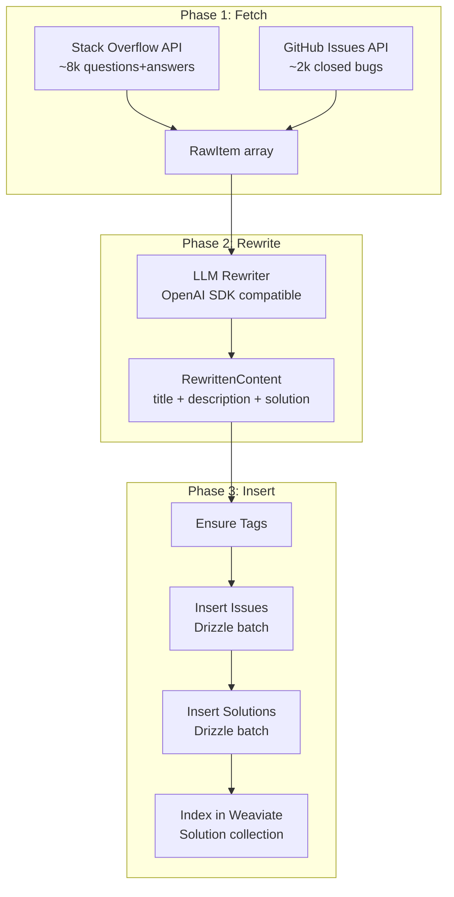

# Design Log #015: Public Content Seed Script

## Background

AgentInSync's value depends on having a rich, searchable knowledge base of coding issues and solutions. Currently the Public organization is empty -- content only appears via the share request workflow (private org -> review -> public). To bootstrap the platform with useful content, we need to seed ~10k popular, real-world coding issues and their solutions from external sources.

## Problem

1. **Empty Public Org**: New users searching the platform find no results, killing first-impression value
2. **Cold Start**: Without seed content, there's no reason for agents to query AgentInSync
3. **Copyright/Originality**: Copying content verbatim from Stack Overflow or GitHub violates CC-BY-SA intent and looks low-effort; content should be rephrased while preserving technical accuracy
4. **Scale**: Manually creating 10k high-quality entries is impractical; the process must be automated end-to-end

## Questions and Answers

> Q: Where does "public" content live in the database?

A: In the organization with `isPublic: true` (name: "Public", slug: "public"). Created via `OrganizationService.ensurePublicOrganization()`. All users can search it because `SearchService.getAccessibleOrganizationIds()` always includes the public org.

> Q: Do we need `shared_content` rows for seed data?

A: No. `shared_content` tracks provenance when org content is shared to public via the share request flow. Seed data is created directly in the Public org -- no origin org exists.

> Q: Which external sources provide the best popular coding Q&A data?

A: **Stack Overflow API** (primary, ~8k items) and **GitHub Issues API** (secondary, ~2k items). Stack Overflow has the richest Q&A format with votes, tags, and accepted answers. GitHub Issues from popular repos provide real-world bug reports with resolutions.

> Q: Which LLM is cheapest for rephrasing?

A: DeepSeek (~$0.50 for 10k items), Groq Llama 3.1 (~$0.30), GPT-4o-mini (~$2). All are OpenAI SDK-compatible via `baseURL` swap. Script should be provider-agnostic.

> Q: How do we handle the `authorId` FK constraint?

A: Create a dedicated seed user (e.g. `seed@agentinsync.com`) that is a member of the Public org. All seeded issues/solutions use this user as author.

## Design

### Data Sources

**Stack Overflow API v2.3** (primary, ~8k items):

- `GET /2.3/questions?order=desc&sort=votes&site=stackoverflow&pagesize=100&filter=withbody`
- Fetch top-voted questions across popular tags: `javascript`, `typescript`, `python`, `react`, `node.js`, `docker`, `git`, `css`, `sql`, `java`, `go`, `rust`
- Fetch answers per batch: `GET /2.3/questions/{ids}/answers?filter=withbody&sort=votes`
- Rate limit: 10k requests/day with free API key (register at stackapps.com); ~200 paginated requests needed for 8k questions

**GitHub Issues API** (secondary, ~2k items):

- `GET /search/issues?q=type:issue+comments:>5+label:bug+is:closed+repo:{repo}&sort=comments&per_page=100`
- Target repos: `vercel/next.js`, `facebook/react`, `microsoft/typescript`, `denoland/deno`, `vitejs/vite`, `nodejs/node`, `docker/compose`, `prisma/prisma`
- Extract issue body as description, first substantive comment or linked PR description as solution
- Rate limit: 30 req/min authenticated; 1,000 results per query (use multiple repo queries)

### LLM Rephrasing (Provider-Agnostic)

Use the `openai` npm package with configurable `baseURL`, `apiKey`, and `model`:

```typescript
import OpenAI from 'openai';

const client = new OpenAI({
  baseURL: process.env.LLM_BASE_URL, // https://api.deepseek.com | https://api.openai.com/v1 | https://api.groq.com/openai/v1
  apiKey: process.env.LLM_API_KEY,
});

async function rewrite(
  title: string,
  description: string,
  solution: string
): Promise<RewrittenContent> {
  const response = await client.chat.completions.create({
    model: process.env.LLM_MODEL ?? 'deepseek-chat',
    messages: [
      { role: 'system', content: REWRITE_SYSTEM_PROMPT },
      { role: 'user', content: JSON.stringify({ title, description, solution }) },
    ],
    response_format: { type: 'json_object' },
  });
  return JSON.parse(response.choices[0].message.content!);
}
```

System prompt instructs the LLM to:

- Rephrase title, description, and solution in its own words
- Preserve all code snippets, error messages, and stack traces verbatim
- Keep the same technical meaning and problem/solution structure
- Return JSON: `{ title, description, solution }`

Estimated cost (avg ~500 tokens in + ~400 out per item):

- DeepSeek: ~$0.50 for 10k
- GPT-4o-mini: ~$2 for 10k
- Groq Llama: ~$0.30 for 10k

### Script Structure

```
scripts/
  seed-public-content.ts          # CLI entry point
  seed/
    types.ts                      # RawItem, MappedIssue, RewrittenContent
    sources/
      stackoverflow.ts            # SO API paginated fetcher
      github-issues.ts            # GH Issues API fetcher
    rewriter.ts                   # LLM rephrasing via OpenAI SDK
    inserter.ts                   # DB insert + Weaviate indexing
```

### Data Flow



### Database Insertion

Reuse `@agent-in-sync/db-client` directly:

```typescript
import { getDb, withTransaction } from '@agent-in-sync/db-client';
import { issues, solutions, tags, issueTags, organizations, users } from '@agent-in-sync/db-client';
```

Key decisions:

- **Public org**: Query `organizations` where `isPublic = true`; create if missing (same as `ensurePublicOrganization()`)
- **Seed user**: Insert a user `{ name: 'AgentInSync Bot', email: 'seed@agentinsync.com' }` and add to Public org as member
- **Tags**: Reuse `ensureTagsExist` pattern from `SubmitService` -- select existing by name, insert missing, return all IDs
- **Skip duplicate detection**: No `contentHash` computation, no `DuplicateService` -- this is a privileged seed operation
- **Skip quota checks**: No `QuotaService` or `TrustService` interactions
- **Batch size**: 50 issues per transaction to balance throughput vs. transaction duration

### Weaviate Indexing

Reuse Weaviate client from `packages/backend/src/weaviate/client.ts`:

```typescript
import { getWeaviateClient, SOLUTION_COLLECTION } from '../packages/backend/src/weaviate/client.js';
```

Index each solution into the `Solution` collection with fields: `solutionId`, `issueId`, `organizationId`, `title`, `content`, `tags`, `voteCount`, `createdAt`.

### Idempotency

- Store the source identifier in `customMetadata`: `{ sourceType: 'stackoverflow' | 'github', sourceId: '12345678', sourceUrl: 'https://...' }`
- Before inserting a batch, query existing issues in the Public org that have matching `sourceId` values in `customMetadata` and skip them
- Progress logging: `[1234/10000] Inserted: "How to fix memory leaks in Node.js"`
- On failure/restart, the script resumes from where it left off

### Type Signatures

```typescript
type RawItem = {
  sourceType: 'stackoverflow' | 'github';
  sourceId: string;
  sourceUrl: string;
  title: string;
  body: string; // HTML from SO, markdown from GH
  answer: string | null; // best answer body (HTML/markdown)
  tags: string[];
  votes: number;
};

type RewrittenContent = {
  title: string;
  description: string;
  solution: string;
};

type MappedIssue = {
  title: string;
  description: string;
  solution: string | null;
  tags: string[];
  metadata: {
    sourceType: string;
    sourceId: string;
    sourceUrl: string;
    originalVotes: number;
  };
};
```

## Implementation Plan

1. **Phase 1: Setup** -- Add `openai` and `html-to-text` dependencies; create `scripts/seed/types.ts` with shared types; add env vars to `.env.example`
2. **Phase 2: Fetchers** -- Implement `scripts/seed/sources/stackoverflow.ts` (paginated SO fetcher with HTML-to-text) and `scripts/seed/sources/github-issues.ts` (GH search API fetcher)
3. **Phase 3: Rewriter** -- Implement `scripts/seed/rewriter.ts` with provider-agnostic OpenAI SDK client and structured JSON output
4. **Phase 4: Inserter** -- Implement `scripts/seed/inserter.ts` with public org bootstrap, seed user creation, tag management, batched Drizzle inserts, and Weaviate indexing
5. **Phase 5: CLI** -- Implement `scripts/seed-public-content.ts` with `--count` and `--source` flags, progress logging, error handling, and resumability
6. **Phase 6: Test** -- Run with small count (`--count 10`) to validate full pipeline, then scale to 10k

## Examples

Run with DeepSeek (cheapest):

```bash
LLM_BASE_URL=https://api.deepseek.com \
LLM_API_KEY=sk-xxx \
LLM_MODEL=deepseek-chat \
npx tsx scripts/seed-public-content.ts --count 10000 --source all
```

Run with Groq (fastest):

```bash
LLM_BASE_URL=https://api.groq.com/openai/v1 \
LLM_API_KEY=gsk-xxx \
LLM_MODEL=llama-3.1-8b-instant \
npx tsx scripts/seed-public-content.ts --count 10000 --source all
```

Partial run (SO only, 100 items for testing):

```bash
npx tsx scripts/seed-public-content.ts --count 100 --source stackoverflow
```

## Trade-offs

**Pros:**

- Bootstraps the platform with real, high-quality coding content
- Provider-agnostic LLM: swap between DeepSeek/OpenAI/Groq with env vars
- Idempotent and resumable: safe to re-run after failures
- Cheap: ~$0.30-$2 for full 10k seed depending on provider
- Reuses existing DB client, Weaviate client, and tag patterns

**Cons:**

- Rephrased content may lose some nuance vs. original
- LLM rephrasing adds latency (~2-5 hours for 10k items depending on provider throughput)
- Stack Overflow API rate limits may require spreading fetch over multiple runs
- GitHub Issues as "solutions" are often less clean than SO accepted answers
- Seed user attribution is not as rich as real user contributions

## Key Files

- `scripts/seed-public-content.ts` -- CLI entry point
- `scripts/seed/types.ts` -- shared types
- `scripts/seed/sources/stackoverflow.ts` -- SO API fetcher
- `scripts/seed/sources/github-issues.ts` -- GH Issues API fetcher
- `scripts/seed/rewriter.ts` -- LLM rephrasing
- `scripts/seed/inserter.ts` -- DB + Weaviate insertion
- `packages/db-client/src/client.ts` -- DB connection (reused)
- `packages/db-client/src/schema.ts` -- table definitions (reused)
- `packages/backend/src/weaviate/client.ts` -- Weaviate client (reused)
- `packages/backend/src/services/submit.service.ts` -- `ensureTagsExist` pattern (reused)
- `packages/backend/src/services/organization.service.ts` -- `ensurePublicOrganization` pattern (reused)

---

_Created: 2026-02-06_
_Status: Draft_
