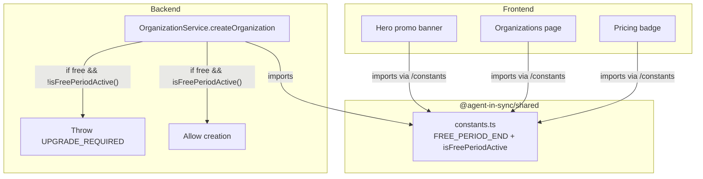

# Design Log #017: Free Period Promotion

## Background

AgentInSync has a two-tier system: `free` and `paid`. Free-tier users are automatically assigned to the Public organization where all content is visible to everyone. Creating private organizations requires a paid plan. There is no billing/subscription system yet -- the `tier` field on the `users` table is a simple enum.

Current state:

- `users.tier` enum: `'free'` (default) | `'paid'`
- `OrganizationService.createOrganization()` checks `getUserTier()` and throws `ForbiddenError('UPGRADE_REQUIRED')` for free users
- Frontend shows a locked "Upgrade to Create" button on the organizations page for free-tier users
- Pricing page lists "Private organizations" as a Team plan feature

## Problem

We want to offer a time-limited promotional period (until April 30, 2026) where all users can create private organizations for free. This helps:

1. **Drive early adoption** -- lower the barrier while the platform is young
2. **Build content** -- more private orgs means more teams contributing solutions
3. **Prove value** -- users experience the full product before committing to pay

The promotion must be self-expiring with no manual intervention needed.

## Questions and Answers

> Q: Should we change the user's tier to `paid` during the promo?

A: No. The `tier` field should reflect the actual subscription state. The promo bypasses the tier check without altering user data, so when it expires the original restrictions resume cleanly.

> Q: Should the date live in the database or in code?

A: In code, as a shared constant. No DB migration, no admin UI needed. It's a one-off promo with a known end date.

> Q: Should the constant live in backend or be shared?

A: Shared (`@agent-in-sync/shared`), since both backend (tier check bypass) and frontend (UI messaging) need it.

> Q: Frontend imports from `@agent-in-sync/shared` cause `node:crypto` externalization errors in Vite. How to handle?

A: The barrel export (`index.ts`) re-exports schemas that transitively pull in Node.js modules. Solution: add a subpath export `@agent-in-sync/shared/constants` so the frontend imports only the constants file without touching the rest.

## Design

### Architecture



### Single Source of Truth

```typescript
// packages/shared/src/constants.ts
export const FREE_PERIOD_END = new Date('2026-04-30T23:59:59Z');
export const isFreePeriodActive = () => new Date() < FREE_PERIOD_END;
```

Exported via subpath in `package.json`:

```json
"exports": {
  ".": { "types": "./dist/index.d.ts", "import": "./dist/index.js" },
  "./constants": { "types": "./dist/constants.d.ts", "import": "./dist/constants.js" }
}
```

### Backend Change

In `OrganizationService.createOrganization()`, the tier gate becomes:

```typescript
const userTier = await this.getUserTier(ownerId);
if (userTier === 'free' && !isFreePeriodActive()) {
  throw new ForbiddenError(
    'UPGRADE_REQUIRED',
    'Private organizations require a paid plan. Upgrade to create private organizations.'
  );
}
```

### Frontend Changes

**Organizations page** (`_protected.organizations.tsx`):

- `canCreateOrg = !isFreeTier || freePeriodActive` controls whether the "Create Organization" button or "Upgrade to Create" is shown
- During promo: green info card with Gift icon and end date
- After promo: original upgrade prompt card

**Hero** (`hero.tsx`):

- Conditional green banner above the hero content: "All features free until April 30, 2026 -- Create private organizations, no credit card needed."

**Pricing** (`pricing.tsx`):

- Team plan badge changes from "Most Popular" to "Free until April 30, 2026" during the promo

## Implementation Plan

Single phase -- the change is small:

1. Create `packages/shared/src/constants.ts` with `FREE_PERIOD_END` and `isFreePeriodActive()`
2. Re-export from `packages/shared/src/index.ts`; add `./constants` subpath export in `package.json`
3. Add `@agent-in-sync/shared` as a dependency of `packages/frontend`
4. Backend: add `&& !isFreePeriodActive()` to tier check in `organization.service.ts`
5. Frontend: update organizations page, hero, and pricing components

## Examples

✅ Good: Free user creates org during promo

```
POST /api/v1/organizations
X-API-Key: ask_abc123
{ "name": "My Team", "slug": "my-team" }

→ 201 Created (user tier is "free", but isFreePeriodActive() returns true)
```

✅ Good: Free user after promo expires

```
POST /api/v1/organizations
X-API-Key: ask_abc123
{ "name": "My Team", "slug": "my-team" }

→ 403 { "error": "Private organizations require a paid plan.", "code": "UPGRADE_REQUIRED" }
```

❌ Bad: Changing user tier to simulate promo

```typescript
// Don't do this -- mutating user data for a temporary promo
await db.update(users).set({ tier: 'paid' }).where(eq(users.id, userId));
```

## Trade-offs

| Pros                                             | Cons                                                                            |
| ------------------------------------------------ | ------------------------------------------------------------------------------- |
| Zero DB changes -- pure code                     | Date is hardcoded, requires code change to extend                               |
| Self-expiring, no cleanup needed                 | Shared package must be rebuilt after editing constant                           |
| Single source of truth across backend + frontend | Subpath export needed to avoid Vite node:crypto issue                           |
| User `tier` stays accurate for future billing    | Frontend evaluates date client-side (could be spoofed, but backend also checks) |

## Files Created/Modified

**New files:**

- `packages/shared/src/constants.ts` -- `FREE_PERIOD_END` constant and `isFreePeriodActive()` helper

**Modified files:**

- `packages/shared/src/index.ts` -- re-export constants
- `packages/shared/package.json` -- add `./constants` subpath export
- `packages/frontend/package.json` -- add `@agent-in-sync/shared` dependency
- `packages/backend/src/services/organization.service.ts` -- bypass tier check during promo
- `packages/frontend/src/routes/_protected.organizations.tsx` -- promo UI for org creation
- `packages/frontend/src/components/marketing/hero.tsx` -- promo banner
- `packages/frontend/src/components/marketing/pricing.tsx` -- promo badge on Team plan

---

_Created: 2026-02-08_
_Status: Implemented_
