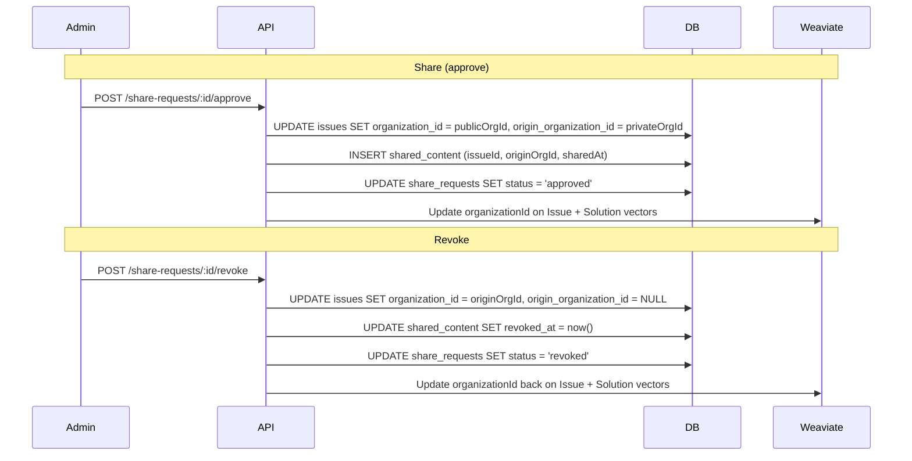

# Design Log #022: Share as Move (Not Copy)

## Background

The current share-to-public flow (implemented in `share-request.service.ts`) performs a deep copy when an issue is approved for sharing: it duplicates the issue, all solutions, all comments, and all tags into the public org. A `shared_content` record links the public copy back to the private original.

This creates several problems: the two copies immediately diverge (votes, comments, new solutions don't sync), users from the origin org see duplicate results in search, metadata fields are lost in the copy, and the codebase carries ~80 lines of complex copy logic inside a transaction.

## Problem

1. **Data divergence** -- public and private copies are independent. Contributions to one don't appear on the other.
2. **Duplicate search results** -- origin org members see both copies since search includes their org + public org.
3. **Lost metadata** -- the copy only carries `title`, `description`, `solutionCount`. Fields like `errorType`, `severity`, `environment`, `complexity`, `packages`, `techStack` are dropped.
4. **No revoke** -- once shared, there's no way to un-share. The public copy is permanent.
5. **Complexity** -- deep-copy logic (issue + tags + solutions + comments) is error-prone and expensive.

## Questions and Answers

> Q: What happens to votes/comments/solutions added while public, if the admin revokes the share?

A: They stay on the issue. The private org benefits from public contributions. This is a feature, not a bug -- the whole point of sharing is to get community input.

> Q: Can an issue be shared again after being revoked?

A: Yes. The admin can create a new share request, which moves it back to public. The `shared_content` table tracks history via `revokedAt`.

> Q: Do origin org members lose access to the issue while it's shared publicly?

A: No. The search service already includes the public org in accessible org IDs (`getAccessibleOrganizationIds`). They can still find and interact with it. We also keep `originOrganizationId` on the issue for UI hints like "Shared from your org".

> Q: What about Weaviate vectors?

A: Solution and Issue vectors store `organizationId`. When sharing/revoking, we need to update those vectors to match the new org ID, otherwise vector search won't find them under the correct org scope.

## Design

### Core change: move instead of copy

Instead of duplicating the issue into the public org, we change the issue's `organizationId` to the public org's ID. Everything linked by `issueId` FK (solutions, comments, tags, votes) moves automatically.



### Schema changes

**`issues` table** -- add `originOrganizationId` column:

```typescript
// packages/db-client/src/schema.ts
originOrganizationId: uuid('origin_organization_id')
  .references(() => organizations.id, { onDelete: 'set null' }),
```

This is non-null only while the issue is shared publicly. It stores where the issue came from so the UI can show "Shared from [org name]" and so revoke knows where to move it back.

**`shared_content` table** -- simplify:

```typescript
// Remove: publicIssueId, originIssueId (they were the same concept split across two copies)
// Keep: issueId (single issue), originOrganizationId, shareRequestId, sharedAt
// Add: revokedAt
export const sharedContent = pgTable('shared_content', {
  id: uuid('id').primaryKey().defaultRandom(),
  issueId: uuid('issue_id')
    .notNull()
    .references(() => issues.id, { onDelete: 'cascade' }),
  originOrganizationId: uuid('origin_organization_id')
    .notNull()
    .references(() => organizations.id, { onDelete: 'cascade' }),
  shareRequestId: uuid('share_request_id')
    .notNull()
    .references(() => shareRequests.id, { onDelete: 'cascade' }),
  sharedAt: timestamp('shared_at').notNull().defaultNow(),
  revokedAt: timestamp('revoked_at'),
});
```

**`share_requests` table** -- add `'revoked'` to the status enum:

```typescript
export const shareStatusEnum = pgEnum('share_status', [
  'pending',
  'approved',
  'rejected',
  'revoked',
]);
```

### Service changes

**`approveShareRequest`** -- replace the 80-line deep copy with:

```typescript
// 1. Update issue's organizationId to public org
await tx
  .update(issues)
  .set({ organizationId: publicOrg.id, originOrganizationId: organizationId })
  .where(eq(issues.id, request.issueId));

// 2. Create shared_content record
await tx.insert(sharedContent).values({
  issueId: request.issueId,
  originOrganizationId: organizationId,
  shareRequestId: requestId,
});

// 3. Update share request status
await tx
  .update(shareRequests)
  .set({
    status: 'approved',
    reviewedById: reviewerId,
    reviewedAt: new Date(),
    approvalReason: reason ?? null,
  })
  .where(eq(shareRequests.id, requestId));

// 4. Update Weaviate vectors (outside transaction)
await updateWeaviateOrgId(request.issueId, publicOrg.id);
```

**New `revokeShareRequest` method:**

```typescript
async revokeShareRequest(requestId: string, reviewerId: string, organizationId: string): Promise<void> {
  // 1. Load shared_content to get originOrganizationId
  // 2. Verify caller's org matches originOrganizationId
  // 3. Update issues SET organizationId = originOrgId, originOrganizationId = NULL
  // 4. Update shared_content SET revokedAt = now()
  // 5. Update share_requests SET status = 'revoked'
  // 6. Update Weaviate vectors back to originOrgId
}
```

### Route changes

- **New route**: `POST /share-requests/:id/revoke` (requireAuth, requireOrganization, requireReviewer)
- **Frontend**: Add "Revoke" button on share requests page for approved requests, and on the issue detail page when viewing a shared issue from the origin org

### Weaviate helper

```typescript
// packages/backend/src/services/share-request.service.ts
async function updateWeaviateOrgId(
  issueId: string,
  newOrgId: string,
  weaviateClient: WeaviateClient
) {
  // Update all Solution vectors for this issue
  // Update the Issue vector for duplicate detection
}
```

## Implementation Plan

1. **Phase 1: Schema migration**
   - Add `originOrganizationId` to `issues` table
   - Simplify `shared_content` table (drop `publicIssueId`/`originIssueId`, add `revokedAt`, rename to single `issueId`)
   - Add `'revoked'` to `shareStatusEnum`
   - Generate and push migration

2. **Phase 2: Backend service**
   - Rewrite `approveShareRequest` to move instead of copy
   - Add `revokeShareRequest` method
   - Add Weaviate org ID update helper
   - Update `getSharedContentByPublicIssue` to use new schema
   - Update `getPendingShareRequests` to also return approved requests (for revoke UI)

3. **Phase 3: Backend route**
   - Add `POST /share-requests/:id/revoke` route
   - Update existing routes if needed

4. **Phase 4: Frontend**
   - Add revoke hook (`useRevokeShareRequest`)
   - Show approved requests with "Revoke" action on share requests page
   - Show "Shared from [org]" badge on issue detail when `originOrganizationId` is set
   - Add revoke button on issue detail for origin org admins

5. **Phase 5: Data migration**
   - Migrate existing `shared_content` records (merge duplicate issues if any exist, or simply delete public copies and update originals)

## Examples

✅ Share flow (new):

```typescript
// Single UPDATE moves the issue -- solutions, comments, tags all follow via FK
await tx
  .update(issues)
  .set({ organizationId: publicOrg.id, originOrganizationId: originOrgId })
  .where(eq(issues.id, issueId));
```

❌ Share flow (old -- deep copy):

```typescript
// 80+ lines: insert public issue, copy tags, copy solutions, copy comments...
const [publicIssue] = await tx.insert(issues).values({ ... }).returning();
for (const tag of originalTags) { await tx.insert(issueTags).values({ ... }); }
for (const sol of originalSolutions) { /* copy solution + its comments */ }
```

## Trade-offs

| Pros                                    | Cons                                                    |
| --------------------------------------- | ------------------------------------------------------- |
| Single source of truth -- no divergence | Public contributions stay if revoked (feature, not bug) |
| All metadata preserved automatically    | Weaviate vectors need updating on share/revoke          |
| Revoke is trivial (move back)           | Existing shared data needs migration                    |
| ~80 lines of copy logic removed         | Origin org members interact via public org context      |
| No duplicate search results             |                                                         |

## Key Files

- `packages/db-client/src/schema.ts` -- schema changes
- `packages/backend/src/services/share-request.service.ts` -- approve rewrite + revoke
- `packages/backend/src/routes/share-request.route.ts` -- revoke route
- `packages/backend/src/weaviate/client.ts` -- vector types
- `packages/frontend/src/lib/api/share-requests.ts` -- revoke hook
- `packages/frontend/src/routes/_protected.share-requests.tsx` -- revoke UI
- `packages/frontend/src/routes/_protected.issues.$id.tsx` -- shared badge + revoke button

---

_Created: 2026-02-14_
_Status: Draft_
