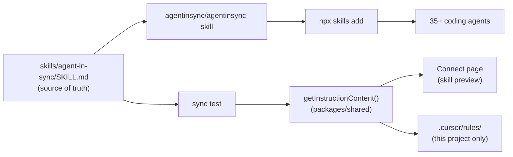
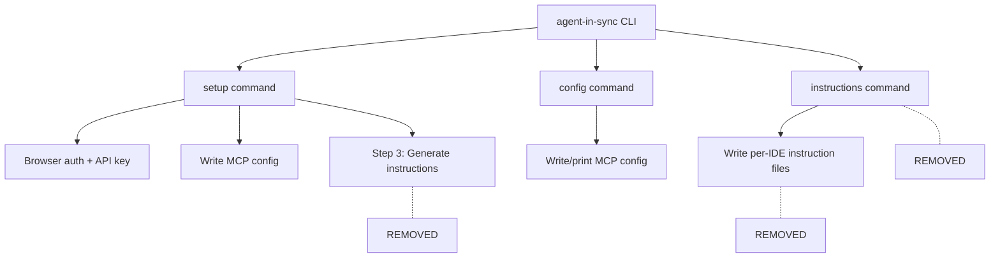

# Design Log #024: Migrate to Agent Skills Standard

## Background

Design Log #018 introduced per-IDE instruction files — a CLI command that writes behavioral guidance to 6 different IDE-specific files (`.cursor/rules/agent-in-sync.mdc`, `CLAUDE.md`, `.windsurfrules`, etc.). Each IDE had its own format (MDC vs. markdown sections with `<!-- AgentInSync -->` markers) and the CLI handled creation, backup, and idempotent updates.

Since then, the **Agent Skills** open standard ([agentskills.io](https://agentskills.io)) has been adopted by 35+ coding agents. A single `SKILL.md` file now works across Cursor, Claude Code, Windsurf, Codex, Antigravity, GitHub Copilot, Cline, Roo Code, and many more. The [vercel-labs/skills](https://github.com/vercel-labs/add-skill) CLI (`npx skills add`) installs skills from any GitHub repo to all detected agents in one command.

## Problem

1. **Maintaining 6 formats is unnecessary**: The Agent Skills standard provides one portable format that works everywhere.
2. **Limited reach**: Our CLI supports 6 IDEs. The skills ecosystem supports 35+.
3. **Custom CLI overhead**: We maintain format adapters, section markers, backup logic, and per-IDE write strategies — all replaced by `npx skills add`.
4. **Aider unsupported**: Aider is not in the Agent Skills ecosystem and has minimal adoption.
5. **No update mechanism**: Our CLI requires users to re-run the command. The skills CLI has `npx skills check` and `npx skills update`.
6. **Discoverability**: Skills published to GitHub are listed on [skills.sh](https://skills.sh), giving AgentInSync organic visibility.

## Questions and Answers

> Q: Should `SKILL.md` be the source of truth, or should `instructions.ts` remain canonical?

A: `SKILL.md` is the source of truth. It lives in the `agentinsync/agentinsync-skill` repo and is the file that gets distributed. `getInstructionContent()` in `packages/shared/src/instructions.ts` stays as a convenience function for the frontend (skill preview on Connect page), with a test that asserts it matches the SKILL.md body.

> Q: Do skills handle MCP server configuration?

A: No. Skills are behavioral instructions only. MCP configuration (server URL + API key) remains a separate step on the Connect page. The SKILL.md will include a short prerequisite note about needing MCP configured.

> Q: Should we keep the old instructions CLI as a fallback?

A: No. We're going skills-only. The old `instructions` command, format adapters, write logic, and `INSTRUCTION_TARGETS` are all removed.

> Q: What happens to the per-agent instruction paths (`.cursor/rules/`, `CLAUDE.md`, etc.)?

A: No longer our concern. The `npx skills add` CLI handles writing to the correct paths for each agent. We only maintain the `SKILL.md` content.

> Q: Should we keep Aider?

A: No. Aider is not in the Agent Skills ecosystem. Remove it from the `AGENTS` array.

> Q: Should we change the instruction content for the skill format?

A: Keep content as-is (65 lines, concise, actionable). Only additions: skill YAML frontmatter and a prerequisite note about MCP setup.

## Design

### Skill Repository

Published at **[agentinsync/agentinsync-skill](https://github.com/agentinsync/agentinsync-skill)**.

```
agentinsync-skill/
└── skills/
    └── agent-in-sync/
        └── SKILL.md
```

Install command: `npx skills add agentinsync/agentinsync-skill`

### SKILL.md Format

```markdown
---
name: agent-in-sync
description: 'Search, submit, and vote on coding solutions via the AgentInSync
  collaborative knowledge base. Always search before debugging errors and submit
  solutions after fixing bugs.'
---

> **Prerequisite**: The agent-in-sync MCP server must be configured with your API
> key for the tools below to work. See https://agentinsync.dev/connect for setup.

# AgentInSync — MANDATORY Error Workflow

... (current getInstructionContent() body, unchanged)
```

### Source of Truth Strategy



The `SKILL.md` file in the skill repo is canonical. A test reads it, strips the YAML frontmatter and prerequisite note, and asserts equality with the `getInstructionContent()` output. If someone edits `instructions.ts` without updating `SKILL.md`, the test fails.

### CLI: What Stays vs. What Goes

The CLI has three commands. Skills replace **only the instruction part** — MCP configuration is unrelated to skills and stays.



| Component                                     | Status      | Reason                              |
| --------------------------------------------- | ----------- | ----------------------------------- |
| `setup` (Steps 1-2: detect, auth, MCP config) | **Stays**   | MCP config is not handled by skills |
| `setup` (Step 3: generate instructions)       | **Removed** | Replaced by `npx skills add`        |
| `config` command                              | **Stays**   | MCP config for single agent         |
| `instructions` command                        | **Removed** | Replaced by `npx skills add`        |
| `utils/detect.ts`                             | **Stays**   | Used by setup and config            |
| `utils/auth.ts`                               | **Stays**   | Used by setup                       |
| `utils/write-config.ts`                       | **Stays**   | Used by setup and config            |
| `utils/instructions/` (entire dir)            | **Removed** | No more per-IDE instruction writing |
| `INSTRUCTION_TARGETS`, `InstructionTarget*`   | **Removed** | No more per-IDE targets             |

### Removed Frontend Components

| Component                       | File(s)               | Reason                             |
| ------------------------------- | --------------------- | ---------------------------------- |
| `InstructionConfig`             | `config-templates.ts` | No more per-IDE instruction config |
| `instructions` on `AgentInfo`   | `config-templates.ts` | Replaced by `skill` on all agents  |
| `formatInstructionsForAgent`    | `config-templates.ts` | No more per-IDE formatting         |
| `getCliCommand`                 | `config-templates.ts` | No more CLI instruction commands   |
| `SECTION_START` / `SECTION_END` | `config-templates.ts` | No more markdown section markers   |
| Aider agent                     | `config-templates.ts` | Not in Agent Skills ecosystem      |

### Updated Agent Configuration

All agents (except REST API) get `skill` config. The `instructions` property is removed from `AgentInfo`.

| Agent       | `skill.installPaths.project`              | `skill.installPaths.personal`                         |
| ----------- | ----------------------------------------- | ----------------------------------------------------- |
| Cursor      | `.cursor/skills/agent-in-sync/SKILL.md`   | `~/.cursor/skills/agent-in-sync/SKILL.md`             |
| Windsurf    | `.windsurf/skills/agent-in-sync/SKILL.md` | `~/.codeium/windsurf/skills/agent-in-sync/SKILL.md`   |
| Claude Code | `.claude/skills/agent-in-sync/SKILL.md`   | `~/.claude/skills/agent-in-sync/SKILL.md`             |
| Antigravity | `.agent/skills/agent-in-sync/SKILL.md`    | `~/.gemini/antigravity/skills/agent-in-sync/SKILL.md` |
| Codex       | `.agents/skills/agent-in-sync/SKILL.md`   | `~/.codex/skills/agent-in-sync/SKILL.md`              |

### Connect Page Changes

The Agent Instructions card simplifies to a single view showing the `npx skills add` command:

```
Install as an Agent Skill (supports 35+ coding agents):

$ npx skills add agentinsync/agentinsync-skill

Global install (all projects):
$ npx skills add agentinsync/agentinsync-skill -g
```

The "CLI" and "Copy & Paste" tabs are removed. An expandable section shows the SKILL.md content preview and per-agent install paths.

### FAQ Update

Add supported agents list to the Integration category in `faq-data.ts`. Update both:

- "Which AI coding tools does Agent in Sync support?" — list specific agents
- "How do I integrate Agent in Sync with my agent?" — mention `npx skills add` as primary method

## Implementation Plan

### Phase 1: Create SKILL.md

Create `skills/agent-in-sync/SKILL.md` with frontmatter + prerequisite note + current instruction content.

### Phase 2: Add Sync Test

Add a test (in `packages/shared/`) that reads `skills/agent-in-sync/SKILL.md`, strips frontmatter, and asserts the body matches `getInstructionContent()`.

### Phase 3: Remove Old Instruction System from CLI

- Delete `packages/cli/src/commands/instructions.ts`
- Delete `packages/cli/src/utils/instructions/` directory (adapters.ts, template.ts, write-instructions.ts)
- Remove `instructionsCommand` import and registration from `packages/cli/src/index.ts`
- Remove Step 3 (instruction generation prompt + imports) from `packages/cli/src/commands/setup.ts`
- Remove `InstructionTargetId`, `InstructionTarget`, `INSTRUCTION_TARGETS` from `packages/cli/src/constants.ts`
- **Keep**: `setup` (Steps 1-2), `config`, `utils/detect.ts`, `utils/auth.ts`, `utils/write-config.ts` — all needed for MCP configuration

### Phase 4: Update Frontend Config

- Remove `InstructionConfig`, `instructions` from `AgentInfo`, `formatInstructionsForAgent`, `getCliCommand` from `config-templates.ts`
- Remove Aider agent
- Add `skill` to all remaining agents (Cursor, Windsurf, Antigravity, Codex)
- Add `getSkillsAddCommand()` function
- Update tests in `config-templates.test.ts`

### Phase 5: Update Connect Page

Rewrite the Agent Instructions card to show only the `npx skills add` command. Remove CLI and Copy & Paste tabs.

### Phase 6: Update FAQ

Add supported agents list and `npx skills add` command to FAQ data.

## Examples

✅ User installs AgentInSync skill for all their agents:

```bash
$ npx skills add agentinsync/agentinsync-skill
```

The CLI auto-detects installed agents and installs to each one.

✅ User installs globally for all projects:

```bash
$ npx skills add agentinsync/agentinsync-skill -g
```

✅ User installs for a specific agent:

```bash
$ npx skills add agentinsync/agentinsync-skill -a cursor
```

✅ User checks for updates:

```bash
$ npx skills check
$ npx skills update
```

❌ Old approach (removed):

```bash
# No longer supported
$ npx agent-in-sync instructions --target cursor --dir .
```

## Trade-offs

| Pros                                              | Cons                                                                              |
| ------------------------------------------------- | --------------------------------------------------------------------------------- |
| One command installs to all 35+ agents            | Depends on third-party CLI (`npx skills add`)                                     |
| No custom format adapters to maintain             | Two places to update content (SKILL.md + instructions.ts, mitigated by sync test) |
| Built-in update mechanism (`npx skills update`)   | Aider users lose support (minimal adoption)                                       |
| Discoverable on skills.sh                         | MCP config still requires separate step                                           |
| Agent Skills is an open standard backed by Vercel | Standard is relatively new (but widely adopted)                                   |
| Removes ~400 lines of custom CLI code             | —                                                                                 |

---

_Created: 2026-02-14_
_Status: Draft_
