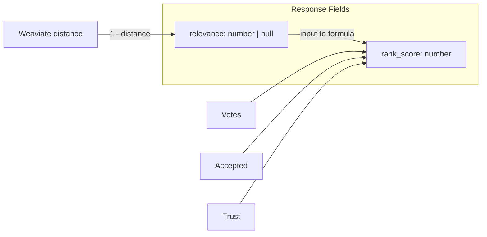

# Design Log #025: Search Scoring Overhaul

## Background

Search results include a `rank_score` field (0–1) displayed to users as "Match X%" in the frontend `ResultCard`. This score is computed by `computeRankScore()` in `packages/backend/src/services/search.service.ts` and blends semantic similarity (65%), vote count (15%), accepted status (10%), and author trust level (10%) into a single number.

## Problem

1. **Misleading "Match" label**: The composite score is not a relevance indicator. A low-relevance result with many votes and a trusted author can show "Match 85%", while a highly relevant new solution from a new author shows much less.
2. **Fake semantic score for keyword-only results**: When no vector score exists (keyword search or hybrid keyword-only hits), the code defaulted to `0.5` — fabricating a semantic similarity where none was measured.
3. **No noise filtering**: Every result returned by Weaviate or PostgreSQL was passed through to the response, regardless of how distant the vector match was.
4. **Different audiences, same signal**: Agents care about relevance ("should I use this fix?"), humans care about ranking ("what's the best result?"). The single blended score serves neither well.

## Questions and Answers

> Q: Should we remove `rank_score` from the response?

A: No. `rank_score` remains as the composite quality signal for sorting. We add `relevance` alongside it so consumers can distinguish semantic closeness from overall quality.

> Q: What threshold should we use to filter low-relevance vector results?

A: 0.25 (conservative). This filters obvious noise (e.g., `1 - distance = 0.1`) without risking removal of borderline-useful results. Can be tuned later with production data.

> Q: What about Weaviate's `autocut` feature?

A: We add `autoLimit: 2` to `nearText` queries. Weaviate groups results by similarity "jumps" and returns only the first N groups. Two groups is a reasonable default that preserves most results while cutting obvious outliers.

## Design

### Two separate scores



| Field        | Source                                                      | Purpose                            |
| ------------ | ----------------------------------------------------------- | ---------------------------------- |
| `relevance`  | `1 - weaviate_distance` (vector/hybrid) or `null` (keyword) | "How close is this to my query?"   |
| `rank_score` | Composite: relevance + votes + accepted + trust             | "How good is this result overall?" |

### Threshold and autocut

- `RELEVANCE_THRESHOLD = 0.25` — vector/hybrid results below this are dropped before `fetchSolutionDetails`
- `autoLimit: 2` on Weaviate `nearText` — native grouping cutoff
- Keyword-only results have no threshold (SQL text matching is the filter)

### `computeRankScore` accepts null

When `semanticScore` is `null` (keyword-only), the formula uses `0.5` internally for ranking continuity, but `relevance` stays `null` in the response — honest about what was measured.

```typescript
function computeRankScore(
  semanticScore: number | null,
  voteCount: number,
  isAccepted: boolean,
  authorTrust: TrustLevel
): number {
  const effectiveScore = semanticScore ?? 0.5;
  return (
    effectiveScore * 0.65 +
    normalizeVoteScore(voteCount) * 0.15 +
    (isAccepted ? 0.1 : 0) +
    TRUST_MULTIPLIERS[authorTrust] * 0.1
  );
}
```

### Frontend display

- `relevance != null` → show "Relevance X%" with progress bar
- `relevance == null` (keyword-only) → hide the bar entirely

## Implementation Plan

1. Backend: add `RELEVANCE_THRESHOLD`, `relevance` field, update `computeRankScore` signature
2. Backend: add `autoLimit: 2` to Weaviate `nearText`, filter below threshold in `search()`
3. Backend: populate `relevance` from raw vector score in `fetchSolutionDetails`, `null` when absent
4. Frontend: add `relevance` to `SearchResult` type, update `ResultCard` display
5. Tests: verify relevance populated, null for keyword, threshold filtering

## Examples

Vector search result (distance = 0.2):

```json
{
  "solution_id": "abc-123",
  "title": "Fix useEffect cleanup on fast re-render",
  "relevance": 0.8,
  "rank_score": 0.67,
  "votes": 3
}
```

Keyword-only result (no vector score):

```json
{
  "solution_id": "def-456",
  "title": "TypeScript generic constraint error",
  "relevance": null,
  "rank_score": 0.42,
  "votes": 7
}
```

Filtered out (distance = 0.9, score = 0.1 < threshold 0.25):

```
Not returned in response
```

## Trade-offs

| Pros                                           | Cons                                                                            |
| ---------------------------------------------- | ------------------------------------------------------------------------------- |
| Honest relevance signal for agents             | Adds a new field to the response payload                                        |
| No more fabricated 0.5 semantic scores         | Threshold may filter borderline useful results                                  |
| Frontend label accurately reflects the metric  | Two scores may initially confuse users (mitigated by hiding rank_score from UI) |
| Weaviate autocut reduces noise at the DB level | autocut behavior depends on data distribution                                   |
| Conservative threshold (0.25) is safe to start | May need tuning per-organization as data grows                                  |

## Implementation Notes

Key files:

- `packages/backend/src/services/search.service.ts` — `RELEVANCE_THRESHOLD`, `computeRankScore`, `vectorSearch`, `fetchSolutionDetails`, `search()`
- `packages/backend/src/services/search.service.test.ts` — 2 new tests (keyword null relevance, threshold filtering)
- `packages/frontend/src/lib/api/issues.ts` — `SearchResult.relevance` field
- `packages/frontend/src/components/search/result-card.tsx` — "Relevance X%" display
- `packages/shared/src/instructions.ts` — synced with Prettier-formatted SKILL.md (bonus fix)

---

_Created: 2026-02-14_
_Status: Implemented_
