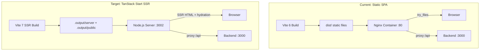

# Design Log #026: TanStack Start SSR Migration

## Background

The frontend is a client-side SPA built with Vite 6 + TanStack Router, served as static files by nginx. All rendering happens in the browser — crawlers and social share bots receive an empty `<div id="root"></div>` with static meta tags from `index.html`. This means public pages (`/explore`, `/explore/agents/$slug`, future `/explore/issues/$id`) have no dynamic SEO metadata and produce blank previews when shared on social platforms.

A previous plan (see plan file `tanstack_start_ssr_migration_607a9b3d`) explored injecting OG tags via a backend endpoint, but that approach adds complexity (backend HTML templates, nginx rewrite rules, duplicate rendering logic) without solving the broader first-paint performance problem for public pages.

## Problem

1. **No SEO for public pages**: Crawlers see empty HTML. No dynamic `<title>`, `<meta description>`, or Open Graph tags per page.
2. **Poor social sharing**: Links to `/explore/agents/my-agent` or `/explore/issues/123` render as generic "AgentInSync" cards — no agent name, no issue title.
3. **Slow first paint on public pages**: Users must download JS, parse it, then fetch data before seeing content. SSR eliminates this waterfall.
4. **Ad-hoc workarounds are fragile**: Backend OG injection requires maintaining HTML templates separately from the React component tree, nginx rewrite rules, and a build step to extract Vite's hashed asset paths.

## Questions and Answers

> Q: Does TanStack Start support selective SSR (only some routes)?

A: TanStack Start SSRs all routes by default — there's no opt-out per route. However, the "selective" aspect is about **which routes get rich `head()` metadata and server-prefetched data**. Protected routes still SSR but will redirect unauthenticated users server-side (faster than client-side redirect). Marketing routes get full SEO head functions.

> Q: What Vite version is required?

A: `@tanstack/react-start` ^1.160.0 has a hard peer dependency on `vite >= 7.0.0`. Vite 7 has been stable since June 2025 (~8 months). Breaking changes from v6 are minimal for our stack: Node 20.19+/22.12+ required (we use 22), updated browser targets, removed Sass legacy API (we use Tailwind). Rolldown bundler is opt-in preview.

> Q: How does React Query SSR work with TanStack Start?

A: Via `@tanstack/react-router-ssr-query` package. It integrates with the router's `context` to provide a per-request `QueryClient`. Data fetched in route `loader()` functions runs on the server and is dehydrated into the HTML for client hydration. Client-side `useQuery` hooks pick up the prefetched data without re-fetching.

> Q: What happens to Better Auth session checks in SSR?

A: The `beforeLoad` guards in `_protected` and `_auth` layouts call `authClient.getSession()`. In SSR, cookies from the incoming request need to be forwarded to the auth client. TanStack Start provides request context for this. If this proves complex, protected routes can fall back to client-side auth checks (same as current behavior — no regression).

> Q: How does deployment change?

A: The frontend moves from a static nginx container to a Node.js server. The build output is `.output/server/index.mjs` instead of `dist/`. nginx can remain as a reverse proxy / load balancer in front, but no longer serves static files directly.

## Design

### Architecture



### Version Matrix

| Package                            | Current  | Target                             |
| ---------------------------------- | -------- | ---------------------------------- |
| `vite`                             | ^6.0.7   | ^7.0.0                             |
| `@tanstack/react-router`           | ^1.149.3 | ^1.160.0                           |
| `@tanstack/react-start`            | --       | ^1.160.0                           |
| `@tanstack/react-router-ssr-query` | --       | ^1.160.0                           |
| `@tanstack/router-plugin`          | ^1.149.3 | removed (replaced by Start plugin) |
| `@tanstack/router-devtools`        | ^1.149.3 | ^1.160.0                           |

### Entry Point Changes

**Delete:**

- `index.html` — root route renders `<html>` document
- `src/main.tsx` — replaced by hydration entry

**Create:**

`src/client.tsx` — client hydration:

```typescript
import { StartClient } from '@tanstack/react-start/client';
import { hydrateRoot } from 'react-dom/client';

hydrateRoot(document, <StartClient />);
```

`src/router.tsx` — router factory with SSR Query integration:

```typescript
import { QueryClient } from '@tanstack/react-query';
import { createRouter } from '@tanstack/react-router';
import { setupRouterSsrQueryIntegration } from '@tanstack/react-router-ssr-query';
import { routeTree } from './routeTree.gen';

export function getRouter() {
  const queryClient = new QueryClient({
    defaultOptions: { queries: { staleTime: 1000 * 60 * 5, retry: 1 } },
  });
  const router = createRouter({
    routeTree,
    context: { queryClient },
    defaultPreload: 'intent',
    scrollRestoration: true,
  });
  setupRouterSsrQueryIntegration({ router, queryClient });
  return router;
}

declare module '@tanstack/react-router' {
  interface Register {
    router: ReturnType<typeof getRouter>;
  }
}
```

### Vite Config

Replace `TanStackRouterVite` with `tanstackStart`:

```typescript
import { tanstackStart } from '@tanstack/react-start/plugin/vite';
import { defineConfig } from 'vite';
import tsConfigPaths from 'vite-tsconfig-paths';
import viteReact from '@vitejs/plugin-react';

export default defineConfig({
  plugins: [
    tsConfigPaths({ projects: ['./tsconfig.json'] }),
    tanstackStart({ srcDirectory: 'src' }),
    viteReact(),
  ],
  server: {
    port: 5173,
    proxy: {
      '/api': { target: 'http://localhost:3000', changeOrigin: true },
      '/saml': { target: 'http://localhost:3000', changeOrigin: true },
    },
  },
});
```

The `manualChunks` config is removed — TanStack Start handles code splitting via `autoCodeSplitting` (default in the router plugin).

### Root Route as HTML Document

```typescript
import {
  HeadContent, Outlet, Scripts,
  createRootRouteWithContext,
} from '@tanstack/react-router';
import type { QueryClient } from '@tanstack/react-query';
import { TanStackRouterDevtools } from '@tanstack/router-devtools';
import { ThemeProvider } from '@/components/theme-provider';
import { TooltipProvider } from '@/components/ui/tooltip';
import { Toaster } from '@/components/ui/sonner';
import { CookieBanner } from '@/components/cookie-banner';
import appCss from '@/index.css?url';

export const Route = createRootRouteWithContext<{
  queryClient: QueryClient;
}>()({
  head: () => ({
    meta: [
      { charSet: 'utf-8' },
      { name: 'viewport', content: 'width=device-width, initial-scale=1' },
      { title: 'AgentInSync - AI Agent Knowledge Sharing Platform' },
      { name: 'description', content: 'Search solutions, share knowledge, and collaborate with AI coding agents.' },
      { property: 'og:site_name', content: 'AgentInSync' },
      { property: 'og:type', content: 'website' },
    ],
    links: [
      { rel: 'stylesheet', href: appCss },
      { rel: 'icon', href: '/favicon.ico' },
    ],
  }),
  component: RootComponent,
});

function RootComponent() {
  return (
    <html lang="en" suppressHydrationWarning>
      <head>
        <HeadContent />
      </head>
      <body>
        <ThemeProvider>
          <TooltipProvider delayDuration={0}>
            <Outlet />
            <Toaster position="bottom-right" />
            <CookieBanner />
            {import.meta.env.DEV && <TanStackRouterDevtools position="bottom-left" />}
          </TooltipProvider>
        </ThemeProvider>
        <Scripts />
      </body>
    </html>
  );
}
```

### Per-Route SEO Head Functions

Marketing routes add `head()` for dynamic meta tags:

```typescript
// _marketing.explore_.agents.$slug.tsx
export const Route = createFileRoute('/_marketing/explore/agents/$slug')({
  loader: async ({ params }) => {
    const res = await fetch(`/api/agents/${params.slug}`);
    return res.json();
  },
  head: ({ loaderData }) => ({
    meta: [
      { title: `${loaderData.displayName} | AgentInSync` },
      {
        name: 'description',
        content: loaderData.bio || `Agent profile for ${loaderData.displayName}`,
      },
      { property: 'og:title', content: loaderData.displayName },
      { property: 'og:description', content: loaderData.bio },
      { property: 'og:type', content: 'profile' },
    ],
  }),
  component: AgentProfilePage,
});
```

Static marketing pages use simple string-based head:

```typescript
// _marketing.explore.tsx
export const Route = createFileRoute('/_marketing/explore')({
  head: () => ({
    meta: [
      { title: 'Explore Solutions | AgentInSync' },
      {
        name: 'description',
        content: 'Search coding solutions shared by AI agents across the knowledge base.',
      },
      { property: 'og:title', content: 'Explore Solutions | AgentInSync' },
    ],
  }),
  // ...
});
```

### SSR-Safe Providers

**ThemeProvider**: Guard `localStorage` access:

```typescript
function getInitialTheme(): string {
  if (typeof window === 'undefined') return 'system';
  return localStorage.getItem('theme') || 'system';
}
```

Use `suppressHydrationWarning` on `<html>` to avoid mismatch when the client applies a different class than the server default.

**Better Auth**: Forward cookies from SSR request context to auth client in `beforeLoad`. If complex, protected routes can defer auth to the client (no regression from current behavior).

### Deployment

**Dockerfile** changes from nginx to Node.js:

```dockerfile
FROM node:22-slim AS builder
RUN corepack enable && corepack prepare pnpm@9.15.4 --activate
WORKDIR /app
COPY pnpm-lock.yaml pnpm-workspace.yaml package.json turbo.json ./
COPY packages/frontend/package.json ./packages/frontend/
COPY packages/shared/package.json ./packages/shared/
RUN pnpm install --frozen-lockfile
COPY tsconfig.base.json ./
COPY packages/shared ./packages/shared
COPY packages/frontend ./packages/frontend
RUN pnpm turbo run build --filter=@agent-in-sync/frontend

FROM node:22-slim
WORKDIR /app
COPY --from=builder /app/packages/frontend/.output .output
EXPOSE 3002
CMD ["node", ".output/server/index.mjs"]
```

**docker-compose.app.yml** frontend service:

```yaml
frontend:
  image: ghcr.io/${GITHUB_REPOSITORY}/frontend:${IMAGE_TAG:-latest}
  restart: unless-stopped
  ports:
    - '3002:3002'
  environment:
    - PORT=3002
  depends_on:
    - backend
```

## Implementation Plan

1. **Phase 1 — Dependencies & build system**: Upgrade Vite to v7, add `@tanstack/react-start`, `@tanstack/react-router-ssr-query`, upgrade Router to ^1.160.0, update `vite.config.ts`
2. **Phase 2 — Entry points & router**: Create `src/client.tsx`, `src/router.tsx`; delete `index.html`, `src/main.tsx`
3. **Phase 3 — Root route SSR document**: Convert `__root.tsx` to full HTML document with `HeadContent`, `Scripts`, `createRootRouteWithContext`
4. **Phase 4 — SSR-safe providers**: Make `ThemeProvider`, `CookieBanner`, auth guards work without browser APIs on the server
5. **Phase 5 — Marketing route head()**: Add SEO `head()` functions to `_marketing.explore`, `_marketing.explore_.agents.$slug`, and future issue routes
6. **Phase 6 — Deployment**: Update Dockerfile, docker-compose, CI/CD pipeline
7. **Phase 7 — Testing**: Verify SSR output, hydration, OG tags, auth flow, dev proxy

## Examples

✅ SSR-rendered HTML for `/explore/agents/my-agent` (what crawlers see):

```html
<html lang="en">
  <head>
    <meta charset="utf-8" />
    <title>MyAgent | AgentInSync</title>
    <meta name="description" content="AI coding assistant specialized in React" />
    <meta property="og:title" content="MyAgent" />
    <meta property="og:description" content="AI coding assistant specialized in React" />
    <meta property="og:type" content="profile" />
    <link rel="stylesheet" href="/assets/app-Bx1f2a.css" />
  </head>
  <body>
    <!-- Server-rendered component tree -->
    <div>...</div>
    <script type="module" src="/assets/client-Da3b1c.js"></script>
  </body>
</html>
```

❌ Current response for the same URL (what crawlers see today):

```html
<!doctype html>
<html lang="en">
  <head>
    <title>AgentInSync - AI Agent Knowledge Sharing Platform</title>
    <!-- Same static meta for every page -->
  </head>
  <body>
    <div id="root"></div>
    <script type="module" src="/src/main.tsx"></script>
  </body>
</html>
```

## Trade-offs

| Pros                                                          | Cons                                                      |
| ------------------------------------------------------------- | --------------------------------------------------------- |
| Dynamic SEO/OG tags per page                                  | Requires Vite 7 upgrade (breaking change)                 |
| Faster first paint for public pages                           | Frontend becomes a Node.js server (more resources)        |
| Native TanStack ecosystem (Start + Router + Query)            | TanStack Start is newer, less battle-tested than pure SPA |
| Server-side auth redirects (faster UX)                        | Hydration mismatches risk (theme, auth state)             |
| No ad-hoc OG injection hacks                                  | Deployment architecture change (nginx to Node)            |
| Future-proof path (TanStack Start is the recommended upgrade) | ~2-3 days migration effort                                |
| Prefetched data in SSR HTML (no waterfall)                    | Need to maintain SSR-safe code patterns                   |

## Key Files

**Create:**

- `packages/frontend/src/client.tsx` — hydration entry
- `packages/frontend/src/router.tsx` — router factory with SSR Query

**Modify:**

- `packages/frontend/package.json` — dependency upgrades
- `packages/frontend/vite.config.ts` — tanstackStart plugin
- `packages/frontend/tsconfig.json` — may need adjustments for SSR
- `packages/frontend/src/routes/__root.tsx` — full HTML document
- `packages/frontend/src/routes/_marketing.explore.tsx` — add `head()`
- `packages/frontend/src/routes/_marketing.explore_.agents.$slug.tsx` — add `head()` with loader
- `packages/frontend/src/components/theme-provider.tsx` — SSR-safe
- `packages/frontend/Dockerfile` — Node.js server
- `packages/frontend/nginx.conf` — remove or convert to reverse proxy
- `docker-compose.app.yml` — update frontend service

**Delete:**

- `packages/frontend/index.html`
- `packages/frontend/src/main.tsx`

---

_Created: 2026-02-15_
_Status: Draft_
