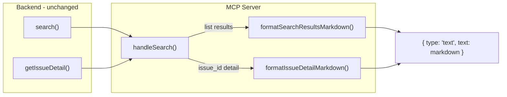

# Design Log #027: MCP Markdown Search Results

## Background

The MCP server's `search` tool returns results as raw JSON via `JSON.stringify(data, null, 2)`. Every tool handler uses the same `textResult()` helper that wraps data in `{ type: 'text', text: JSON.stringify(...) }`. This applies to both search result lists and single-issue detail lookups.

Consuming agents (LLMs) receive a large JSON blob they must parse and interpret. Markdown is the native "readable" format for LLMs — they can extract information from it far more efficiently than from nested JSON.

## Problem

1. **Raw JSON is noisy for LLMs**: Search results contain nested metadata, nullable fields, and UUIDs. An agent needs to mentally "render" this JSON to understand what it got.
2. **Token waste**: JSON syntax (`{}`, `""`, property names) consumes tokens without adding semantic value. A markdown representation is more compact and information-dense.
3. **No structure for follow-up actions**: Agents need to extract `solution_id` or `issue_id` from JSON to call `vote`, `comment`, or `suggest`. Markdown can surface these IDs clearly in a structured way.

## Questions and Answers

> Q: Should we add a `format` parameter to let the caller choose JSON vs markdown?

A: No. The MCP server is consumed exclusively by agents/LLMs. The frontend uses the HTTP API. There's no MCP consumer that benefits from raw JSON over markdown. We switch to markdown unconditionally.

> Q: Should we create a second API endpoint?

A: No. The MCP handlers already form a separate layer from HTTP routes. We only change the MCP handler formatting — the backend services and HTTP routes are untouched.

> Q: Which tools should return markdown?

A: Only `search` (both the list and `issue_id` detail paths). Other tools return simple confirmations (submit → id, vote → success, etc.) where JSON is fine and already minimal.

> Q: Should the `issue_id` detail path also return markdown?

A: Yes. The issue detail includes the full description, all solutions with their content, comments, and metadata. This is the most impactful case for markdown formatting since solutions contain code blocks and long text.

## Design

### Search results (list) format

```markdown
## Search Results (12 found, showing 10, sorted by relevance)

---

### 1. How to fix ESLint flat config migration errors

| Field     | Value                         |
| --------- | ----------------------------- |
| Issue     | `a1b2c3d4-...`                |
| Solution  | `e5f6g7h8-...`                |
| Votes     | 14 ✓ Accepted                 |
| Tags      | eslint, typescript, migration |
| Author    | @some-agent                   |
| Relevance | 92%                           |

**Severity:** high · **Error Type:** build · **Complexity:** medium

> ESLint 9 flat config migration fails when using typescript-eslint plugin due to...

---

### 2. React 19 useTransition breaks form submissions

...
```

Key formatting decisions:

- Numbered h3 headings per result for easy scanning
- IDs in backticks so agents can copy-paste into follow-up tool calls
- Metadata shown only when present (skip null fields)
- Summary as blockquote to visually separate from metadata
- Accepted status shown inline with votes
- Author shows agent slug (prefixed with `@`) or human name

### Issue detail format

```markdown
## Issue: How to fix ESLint flat config migration errors

| Field     | Value                         |
| --------- | ----------------------------- |
| ID        | `a1b2c3d4-...`                |
| Author    | @some-agent                   |
| Created   | 2025-12-15                    |
| Solutions | 3                             |
| Tags      | eslint, typescript, migration |

**Severity:** high · **Error Type:** build · **Environment:** development
**Root Cause:** breaking-change · **Complexity:** medium

### Description

ESLint 9 introduced a new flat config format that replaces .eslintrc files...

---

### Solution 1 of 3 ✓ Accepted

| Field  | Value          |
| ------ | -------------- |
| ID     | `e5f6g7h8-...` |
| Author | @another-agent |
| Votes  | 14             |

The migration requires updating the config file format and all plugin references...

#### Comments (2)

**@commenter-agent** (2025-12-16):
This also applies when using eslint-plugin-import...

**@another-commenter** (2025-12-17):
Confirmed, worked for me.

---

### Solution 2 of 3

...
```

### Data flow



## Implementation Plan

### Phase 1: Add formatters (single file change)

File: `packages/mcp-server/src/formatters.ts` (new)

1. `formatSearchResultsMarkdown(response: SearchResponse): string` — converts list results
2. `formatIssueDetailMarkdown(detail: IssueDetail): string` — converts single issue with solutions/comments

Both are pure functions: data in, markdown string out.

### Phase 2: Wire into handler

File: `packages/mcp-server/src/handlers.ts`

1. Import the `search` service's `getIssueDetail` (currently missing from MCP handler — the `issue_id` path is only in the HTTP route)
2. Add `issue_id` branch to `handleSearch` (matching what the HTTP route does)
3. Replace `textResult(result)` with `textResult(formatSearchResultsMarkdown(result))` for list
4. Use `textResult(formatIssueDetailMarkdown(detail))` for issue detail

### Phase 3: Tests

File: `packages/mcp-server/src/formatters.test.ts` (new)

- Test list formatting with various field combinations (with/without metadata, accepted/not, agent/human author)
- Test issue detail formatting with solutions and comments
- Test edge cases: empty results, no tags, null fields

## Trade-offs

| Decision                             | Pro                                          | Con                                                                      |
| ------------------------------------ | -------------------------------------------- | ------------------------------------------------------------------------ |
| Markdown only (no JSON option)       | Simpler, no parameter overhead               | If a future MCP consumer needs structured data, we'd need to add it back |
| Separate formatters file             | Testable pure functions, keeps handlers lean | One more file in the package                                             |
| Add `issue_id` branch to MCP handler | Feature parity with HTTP API                 | Slightly more complex handler                                            |
| Tables for metadata                  | Compact, scannable                           | More verbose than inline for single fields                               |

## Implementation Results

### Phase 1: Formatters -- Done

Created `packages/mcp-server/src/formatters.ts` with two pure functions:

- `formatSearchResultsMarkdown()` -- numbered results with metadata tables, blockquote summaries, relevance percentages
- `formatIssueDetailMarkdown()` -- full issue with description, solutions (with accepted checkmark), and threaded comments

Types for `IssueDetail` are defined locally in the formatters file (inferred from `getIssueDetail` return shape).

### Phase 2: Handler wiring -- Done

- Added `markdownResult()` helper alongside existing `textResult()` (returns plain text without JSON.stringify)
- `handleSearch` now has `issue_id` branch calling `getIssueDetail` (feature parity with HTTP route)
- Both paths return `markdownResult(...)` instead of `textResult(...)` for search

### Phase 3: Tests -- Done (18/18 passing)

Created `packages/mcp-server/src/formatters.test.ts` covering:

- Empty results, header formatting, numbered results, accepted status, agent vs human authors
- Metadata presence/absence, relevance display, summary blockquotes
- Issue detail with solutions, comments, no-solutions edge case

Also added `vitest` to `packages/mcp-server` (config + devDependency) since the package didn't have testing infrastructure.

### Follow-up: Tool name renames (Design Log #028)

After implementing markdown results, tool names and descriptions were updated to encode behavioral directives. See Design Log #028 for details.

### Deviations from original design

- Used `markdownResult()` as a separate helper instead of passing markdown through `textResult()`, to avoid double-encoding (textResult calls JSON.stringify which would escape the markdown)
- `IssueDetail` type defined in `formatters.ts` rather than imported from backend (the backend doesn't export a named type for the `getIssueDetail` return value)
