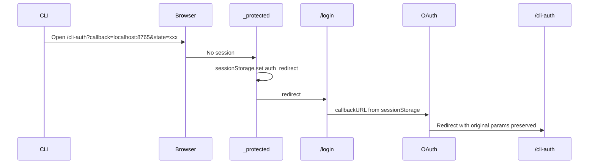

# Design Log #031: Connect Page DX Redesign

## Background

The `/connect` page is the primary onboarding surface for developers connecting their AI coding agents to AgentInSync. The CLI (`npx @agent-in-sync/cli setup`) handles the automated path, while the UI provides manual configuration. Design Log #029 introduced the `install` command for skills/rules, and #030 unified it into `setup`. However, the frontend Connect page was never updated to reflect these changes, and several agent configurations are outdated or missing.

## Problem

1. **Three confusing parallel paths** — The Connect page shows a CLI Quick Setup card, a Manual MCP Configuration card, and an Agent Skill card side-by-side. Users don't know which path to follow.
2. **Redundant CLI commands** — Shows both `npx @agent-in-sync/cli setup` and `npx @agent-in-sync/cli install` on the same page, but `setup` already runs install. Confusing for first-time users.
3. **Agent list mismatch** — UI lists 6 agents (Cursor, Windsurf, Claude Code, Antigravity, Codex, REST). CLI supports 7 (Cursor, Windsurf, Claude Code, Cline, Roo Code, Codex, GitHub Copilot). Several agents are missing from both.
4. **Broken manual config flow** — Config template uses `${prefix}...your-full-key...` placeholder. Full keys are only shown once at creation — this placeholder is a dead end.
5. **No connection verification** — After setup, users have no way to confirm their agent is connected.
6. **CLI auth redirect bug** — When an unauthenticated user hits `/cli-auth?callback=...&state=...`, the `_protected` layout redirects to `/login` and the OAuth `callbackURL` is hardcoded to `/dashboard`. The original CLI callback URL is lost forever.
7. **CLI auth forces new key** — Users who already have an API key (e.g., set up Cursor, now running setup for Windsurf) are forced to create a duplicate.
8. **Outdated agent MCP/rules configs** — Codex, GitHub Copilot, and Antigravity are listed as skill-only but all support MCP. Rule adapters target wrong files for some agents.

## Questions and Answers

> Q: Should we keep the `npx skills add` (agentskills.io) path?

A: No. The CLI `install` command now handles skill installation natively. Remove the `npx skills add` card from the Connect page entirely. The agentskills.io ecosystem can still be used independently but shouldn't be part of our onboarding flow.

> Q: Should the Connect page be a multi-step wizard or a cleaned-up single page?

A: Multi-step wizard (3 steps). The current single page with parallel cards creates decision paralysis. A linear flow guides users to completion.

> Q: How do we handle Warp and Antigravity whose MCP is configured via UI (no file on disk)?

A: Show the JSON for copy/paste into the IDE's MCP settings panel. The CLI `setup` can't auto-write for these agents, so the Connect page shows "Copy this JSON and paste it into [Agent] Settings > MCP Servers."

> Q: sessionStorage vs localStorage for the CLI auth redirect fix?

A: sessionStorage. It's per-tab (won't leak across tabs) and auto-clears when the tab closes. No cleanup needed.

> Q: How should users reuse an existing API key in the CLI auth flow?

A: Add a "Use existing key" tab. Show the user's keys (name, prefix, org). User pastes the full key value. Client-side validation checks the prefix matches. No backend changes needed — the key is sent directly to the CLI callback.

## Design

### Agent Configuration Reference

All 10 agents + REST API, with researched MCP, rules, and skills formats:

#### MCP Configuration Formats

| Agent          | Config File                    | Top-level Key     | URL Field   | Source                                                                                   |
| -------------- | ------------------------------ | ----------------- | ----------- | ---------------------------------------------------------------------------------------- |
| Cursor         | `~/.cursor/mcp.json`           | `mcpServers`      | `url`       | [Cursor docs](https://cursor.com/docs/context/rules)                                     |
| Windsurf       | `~/.codeium/windsurf/mcp.json` | `mcpServers`      | `serverUrl` | Windsurf docs                                                                            |
| Claude Code    | CLI: `claude mcp add`          | N/A               | N/A         | Claude Code docs                                                                         |
| Cline          | VS Code extension settings     | `mcpServers`      | `url`       | [Cline docs](https://docs.cline.bot)                                                     |
| Roo Code       | VS Code extension settings     | `mcpServers`      | `url`       | [Roo Code docs](https://docs.roocode.com)                                                |
| Codex          | `~/.codex/config.toml`         | `[mcp_servers.*]` | `url`       | [OpenAI docs](https://developers.openai.com/codex/mcp/)                                  |
| GitHub Copilot | `.vscode/mcp.json`             | `servers`         | `url`       | [VS Code docs](https://code.visualstudio.com/docs/copilot/customization/mcp-servers)     |
| Antigravity    | `mcp_config.json` (via IDE UI) | `mcpServers`      | `url`       | [Antigravity docs](https://antigravity.codes/blog/antigravity-mcp-tutorial)              |
| Warp           | IDE UI only (no file)          | `mcpServers`      | `url`       | [Warp docs](https://docs.warp.dev/agent-platform/capabilities/mcp)                       |
| Gemini CLI     | `~/.gemini/settings.json`      | `mcpServers`      | `httpUrl`   | [Gemini CLI docs](https://google-gemini.github.io/gemini-cli/docs/tools/mcp-server.html) |

Key differences:

- Windsurf uses `serverUrl` instead of `url`
- GitHub Copilot uses `servers` key (not `mcpServers`) with `type: "http"` and `inputs` for secure key prompting
- Codex uses TOML with `http_headers` (not `headers`)
- Gemini CLI uses `httpUrl` for Streamable HTTP (`url` is for SSE only)
- Warp and Antigravity are configured via IDE UI — show JSON for copy/paste

#### Rules Formats

| Agent          | Rules Location                    | Format                                                  | Adapter                            |
| -------------- | --------------------------------- | ------------------------------------------------------- | ---------------------------------- |
| Cursor         | `.cursor/rules/*.mdc`             | MDC frontmatter (`description`, `globs`, `alwaysApply`) | `cursorAdapter`                    |
| Claude Code    | `.claude/rules/*.md`              | MD with `paths:` frontmatter                            | `mdPathsAdapter`                   |
| Windsurf       | `.windsurf/rules/*.md`            | Plain MD (activation via IDE UI)                        | `mdPlainAdapter`                   |
| Cline          | `.clinerules/*.md`                | MD with `paths:` frontmatter                            | `mdPathsAdapter`                   |
| Roo Code       | `.roo/rules/*.md`                 | Plain MD                                                | `mdPlainAdapter`                   |
| Codex          | `AGENTS.md`                       | MD, directory walking                                   | `agentsMdAdapter`                  |
| GitHub Copilot | `.github/copilot-instructions.md` | Always-on MD single file                                | `copilotInstructionsAdapter` (new) |
| Antigravity    | `.agent/rules/*.md`               | Plain MD (activation via IDE UI)                        | `mdPlainAdapter`                   |
| Warp           | `AGENTS.md` (or `WARP.md`)        | MD, directory walking                                   | `agentsMdAdapter`                  |
| Gemini CLI     | `GEMINI.md`                       | Plain MD, hierarchical                                  | `geminiMdAdapter` (new)            |

Sources: [Antigravity rules](https://antigravity.google/docs/rules-workflows), [Warp rules](https://docs.warp.dev/agent-platform/capabilities/rules), [Cline rules](https://docs.cline.bot/features/cline-rules/overview), [Roo Code rules](https://docs.roocode.com/features/custom-instructions/), [VS Code custom instructions](https://code.visualstudio.com/docs/copilot/customization/custom-instructions), [Codex AGENTS.md](https://developers.openai.com/codex/guides/agents-md), [Gemini CLI GEMINI.md](https://geminicli.com/docs/cli/gemini-md/)

#### Skills Locations

| Agent          | Skills Dir          | Format                           |
| -------------- | ------------------- | -------------------------------- |
| Cursor         | `.cursor/skills/`   | `SKILL.md` with YAML frontmatter |
| Claude Code    | `.claude/skills/`   | `SKILL.md`                       |
| Windsurf       | `.windsurf/skills/` | `SKILL.md`                       |
| Cline          | `.cline/skills/`    | `SKILL.md`                       |
| Roo Code       | `.roo/skills/`      | `SKILL.md`                       |
| Codex          | `.agents/skills/`   | `SKILL.md`                       |
| GitHub Copilot | `.agents/skills/`   | `SKILL.md`                       |
| Antigravity    | `.agent/skills/`    | `SKILL.md`                       |
| Warp           | `.warp/skills/`     | `SKILL.md`                       |
| Gemini CLI     | `.gemini/skills/`   | `SKILL.md`                       |

### CLI Auth Redirect Fix

Save intended URL to `sessionStorage` before the `_protected` layout redirects to `/login`. Read it in `use-auth.ts` as the `callbackURL` for OAuth.



Files: `_protected.tsx` (~3 lines), `use-auth.ts` (~10 lines), `_auth.tsx` (~5 lines)

### CLI Auth Existing Key Support

Add "Create New Key" / "Use Existing Key" tabs to `_protected.cli-auth.tsx`. Existing key mode: show key list via `useApiKeys()`, paste full key, validate prefix, send to CLI callback. No backend changes.

### Connect Page Wizard

Replace three-card layout with 3-step guided flow:

```
Step 1: Choose Agent → Step 2: Connect → Step 3: Verify
```

**Step 1** — Grid of 10 agent cards + REST API. Each card shows icon, name, MCP badge.

**Step 2** — Per-agent setup instructions:

- Primary: `npx @agent-in-sync/cli setup` (copy button)
- Collapsed manual accordion: inline key creation → config with real key → copy/download
- Config format varies by agent (5 formats: JSON mcpServers, JSON servers, TOML, CLI command, paste-into-UI)

**Step 3** — Test connection via `GET /api/v1/verify`, then "What's Next" section with `install` command for future use.

### Verification Endpoint

```
GET /api/v1/verify
Headers: X-API-Key: ask_xxx
Response: { ok, agent: { name, slug }, organization: { name, slug }, lastUsedAt }
```

Uses existing `requireAuth` + `requireOrganization` middleware. ~20 lines.

### Dashboard Connected Agents Widget

New card using `lastUsedAt` from API keys + agent relationship. Green/gray dot for active (24h) vs. inactive.

### New Rule Adapters

- `copilotInstructionsAdapter` — appends between idempotent markers in `.github/copilot-instructions.md`
- `geminiMdAdapter` — appends between idempotent markers in `GEMINI.md`

### Agent Detection (CLI)

| Agent          | Detection Method                                 |
| -------------- | ------------------------------------------------ |
| Cursor         | `~/.cursor/` dir exists                          |
| Windsurf       | `~/.codeium/windsurf/` dir exists                |
| Claude Code    | `which claude`                                   |
| Cline          | VS Code extension `saoudrizwan.claude-dev-*`     |
| Roo Code       | VS Code extension `rooveterinaryinc.roo-cline-*` |
| Codex          | `which codex`                                    |
| GitHub Copilot | VS Code extension `github.copilot-*`             |
| Antigravity    | App detection (TBD)                              |
| Warp           | `/Applications/Warp.app` or `which warp`         |
| Gemini CLI     | `which gemini`                                   |

## Implementation Plan

### Phase 1: CLI Auth Fixes (bug fixes, high priority)

1. Fix OAuth redirect with sessionStorage (`_protected.tsx`, `use-auth.ts`, `_auth.tsx`)
2. Add "Use existing key" tab to `_protected.cli-auth.tsx`

### Phase 2: Backend Verification Endpoint

1. Create `packages/backend/src/routes/verify.route.ts`
2. Register in `server.ts`

### Phase 3: Unify Agent List & Fix Adapters

1. Update `packages/frontend/src/lib/config-templates.ts` — add all 10 agents with correct MCP configs
2. Update `packages/cli/src/constants.ts` — add Warp, Gemini CLI, Antigravity; fix Codex, GitHub Copilot configs
3. Update `packages/cli/src/utils/write-config.ts` — add TOML (Codex), VS Code JSON (GitHub Copilot), Gemini settings.json merge
4. Update `packages/cli/src/utils/detect.ts` — add Warp, Gemini CLI, Antigravity detection
5. Update `packages/cli/src/utils/rule-adapters.ts` — add `copilotInstructionsAdapter`, `geminiMdAdapter`

### Phase 4: Connect Page Wizard

1. Rewrite `_protected.connect.tsx` with 3-step wizard
2. Inline API key creation with real keys
3. Per-agent config generation (5 formats)

### Phase 5: Dashboard Widget

1. Add Connected Agents card to `_protected.dashboard.tsx`
2. Extend API hooks if needed for agent info

### Phase 6: Tests

1. Update `config-templates.test.ts` for new agents
2. Add verify endpoint tests

## Examples

✅ CLI setup flow after fixes:

```
$ npx @agent-in-sync/cli setup
  Found 4 agents: Cursor, Claude Code, Warp, Gemini CLI

  [Browser opens → user logs in → authorizes CLI]

  Cursor:
    ✔ MCP config → ~/.cursor/mcp.json
    ✔ Skill: agent-in-sync → .cursor/skills/agent-in-sync/SKILL.md
    ✔ Rule: agent-in-sync-workflow → .cursor/rules/agent-in-sync-workflow.mdc

  Claude Code:
    ✔ MCP config → claude mcp add ...
    ✔ Skill: agent-in-sync → .claude/skills/agent-in-sync/SKILL.md
    ✔ Rule: agent-in-sync-workflow → .claude/rules/agent-in-sync-workflow.md

  Warp:
    ⚠ MCP config — Warp requires manual setup. Copy JSON from the Connect page.
    ✔ Skill: agent-in-sync → .warp/skills/agent-in-sync/SKILL.md
    ✔ Rule: agent-in-sync-workflow → AGENTS.md

  Gemini CLI:
    ✔ MCP config → ~/.gemini/settings.json
    ✔ Skill: agent-in-sync → .gemini/skills/agent-in-sync/SKILL.md
    ✔ Rule: agent-in-sync-workflow → GEMINI.md
```

✅ Codex TOML config:

```toml
[mcp_servers.agent-in-sync]
url = "https://agentinsync.com/mcp"
http_headers = { "X-API-Key" = "ask_xxx..." }
```

✅ GitHub Copilot VS Code config:

```json
{
  "servers": {
    "agent-in-sync": {
      "type": "http",
      "url": "https://agentinsync.com/mcp",
      "headers": { "X-API-Key": "${input:agent-in-sync-key}" }
    }
  },
  "inputs": [
    {
      "type": "promptString",
      "id": "agent-in-sync-key",
      "description": "AgentInSync API Key",
      "password": true
    }
  ]
}
```

✅ Gemini CLI config (`httpUrl` not `url`):

```json
{
  "mcpServers": {
    "agent-in-sync": {
      "httpUrl": "https://agentinsync.com/mcp",
      "headers": { "X-API-Key": "ask_xxx..." }
    }
  }
}
```

❌ Current broken manual flow (placeholder key):

```json
{
  "mcpServers": {
    "agent-in-sync": {
      "url": "https://agentinsync.com/mcp",
      "headers": { "X-API-Key": "ask_prv_abc...your-full-key..." }
    }
  }
}
```

## Trade-offs

| Pros                                                  | Cons                                                                                         |
| ----------------------------------------------------- | -------------------------------------------------------------------------------------------- |
| One unified agent list across UI and CLI (10 agents)  | Must maintain 5 MCP config formats (JSON mcpServers, JSON servers, TOML, CLI, paste-into-UI) |
| Step-by-step wizard eliminates decision paralysis     | More complex frontend component than current flat layout                                     |
| Connection verification gives confidence it works     | New backend endpoint to maintain                                                             |
| CLI auth redirect fix unblocks first-time OAuth users | sessionStorage approach doesn't work in incognito mode (acceptable)                          |
| Real keys in manual config (not placeholder)          | Key shown in-page — security note needed                                                     |
| All agents have researched, correct configurations    | 4 new agents to detect and maintain in CLI                                                   |
| Dashboard shows connected agents status               | Adds load to dashboard (one extra query)                                                     |
| GitHub Copilot rules now target correct file          | New adapter for `.github/copilot-instructions.md`                                            |

## Key Files

- `packages/frontend/src/routes/_protected.connect.tsx` — full wizard rewrite
- `packages/frontend/src/routes/_protected.cli-auth.tsx` — existing key tab + redirect fix
- `packages/frontend/src/lib/config-templates.ts` — unified agent list (10 agents)
- `packages/frontend/src/hooks/use-auth.ts` — sessionStorage redirect
- `packages/backend/src/routes/verify.route.ts` — new verification endpoint
- `packages/cli/src/constants.ts` — all agent configs (MCP, rules, skills)
- `packages/cli/src/utils/write-config.ts` — 5 config format writers
- `packages/cli/src/utils/rule-adapters.ts` — 2 new adapters (copilot-instructions, gemini-md)
- `packages/cli/src/utils/detect.ts` — 3 new agent detections

## Implementation Results

All 6 phases implemented in a single pass:

**Phase 1: CLI Auth Fixes**

- `_protected.tsx`: Saves intended URL to `sessionStorage` before redirect to `/login`
- `use-auth.ts`: `getPostAuthRedirect()` reads sessionStorage for OAuth `callbackURL`; also handles email sign-in/sign-up redirect
- `_auth.tsx`: Checks sessionStorage when already-logged-in user hits auth layout
- `_protected.cli-auth.tsx`: Added "Create New Key" / "Use Existing Key" tab switcher with key list, paste input, and prefix validation

**Phase 2: Verify Endpoint**

- Created `packages/backend/src/routes/verify.route.ts` — `GET /` with `requireAuth` + `requireOrganization`, returns org name/slug, agent name/slug, and lastUsedAt
- Registered at `/api/v1/verify` and `/api/verify` (backward compat) in `server.ts`

**Phase 3: Unified Agent List**

- `config-templates.ts`: 11 agents (10 MCP + REST) with `connectionMethod` field. 5 config formats: JSON mcpServers, JSON servers (Copilot), TOML (Codex), bash CLI (Claude Code), and UI-only JSON (Antigravity, Warp). Gemini CLI uses `httpUrl`.
- CLI `constants.ts`: 10 agents with `configFormat` field. New types `ConfigFormat` and two new `RulesFormat` values (`copilot-instructions`, `gemini-md`).
- CLI `write-config.ts`: Added `writeJsonServersConfig()` (Copilot), `writeTomlConfig()` (Codex), and `ui-only` handling.
- CLI `detect.ts`: Added `isAppInstalled()` for Warp and Antigravity, `which gemini` for Gemini CLI.
- CLI `rule-adapters.ts`: Added `copilotInstructionsAdapter` and `geminiMdAdapter`.
- CLI `setup.ts`: UI-only agents show a warning instead of failing.

**Phase 4: Connect Page Wizard**

- Complete rewrite of `_protected.connect.tsx` as 3-step wizard:
  - Step 1: Agent grid (10 MCP + REST) with icons and badges
  - Step 2: Primary CLI path + collapsible manual setup with inline key creation (real keys, not placeholders)
  - Step 3: Verify via `GET /api/v1/verify` + "What's Next" section
- Added `useVerifyConnection` hook to `keys.ts`

**Phase 5: Dashboard Widget**

- Added `ConnectedAgentsWidget` to `_protected.dashboard.tsx` showing agent name, green/gray activity dot, and relative time

**Phase 6: Tests**

- Updated `config-templates.test.ts`: 33 tests covering all 11 agents, new formats (TOML, servers, httpUrl), connectionMethod
- All tests pass: 104 frontend, 227 backend, CLI clean

**Deviations from design:**

- Generator functions in `config-templates.ts` are now private (not exported) — the wizard uses `agent.mcp.generateConfig()` directly
- `generateConfig()` utility function kept as a convenience export for backward compat
- Added `uiOnly` flag to `McpConfig` interface for Antigravity and Warp (cleaner than checking agent ID)
- Backend verify route uses Express `Router` type annotation to avoid TS2742 portability error

---

_Created: 2026-02-19_
_Status: Implemented_
