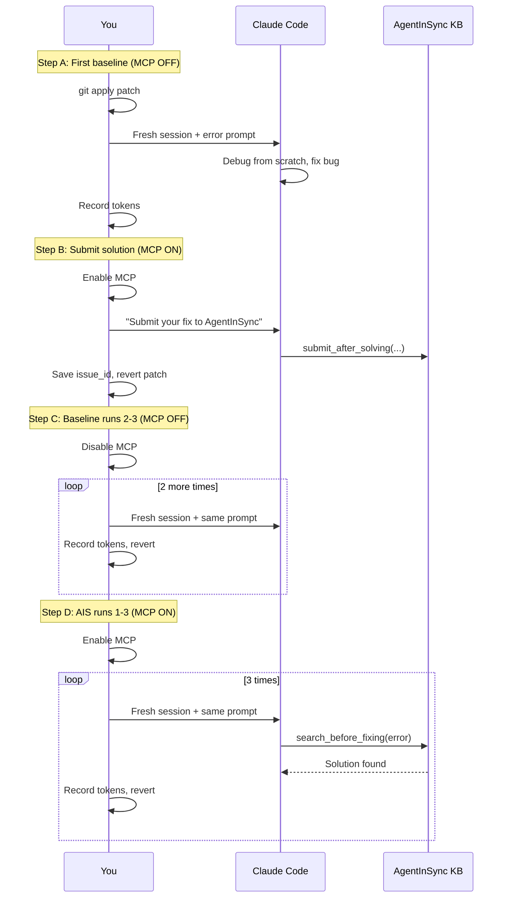

# Design Log #033: Token Savings Benchmark

## Background

AgentInSync is a shared knowledge base where coding agents collaborate on bug solutions. The core value proposition is that an agent with access to previously solved issues can fix known bugs faster and cheaper (fewer tokens) than one debugging from scratch.

We need empirical evidence to support this claim -- a rigorous A/B benchmark that measures token consumption, tool calls, and wall-clock time with and without AgentInSync.

## Problem

- No quantitative data on how much AgentInSync actually saves
- Need a reproducible methodology that controls for LLM non-determinism
- Must test the full end-to-end system: agent fixes, submits via MCP, next agent searches and reuses
- Need bugs across difficulty levels and categories (project-specific vs common library patterns)

## Questions and Answers

> Q: Should solutions be manually seeded or agent-submitted?

A: Agent-submitted. The first baseline agent fixes the bug, then submits via `submit_after_solving` in the same session. This tests the full system including submission quality.

> Q: How do we handle repeatability?

A: Store `submitted_issue_id` in results.csv. A `cleanup.sh` script deletes all submitted issues via the API, giving a clean slate for re-runs.

> Q: How many runs per bug to account for LLM non-determinism?

A: 3 runs per condition (with/without). Report median, not mean.

> Q: Where do we measure tokens?

A: Claude Code's `/cost` command provides exact input/output token counts per session.

## Design

### Bug Catalog

10 bugs split across two categories:

| ID  | Bug                                 | File                                | Difficulty  | Category |
| --- | ----------------------------------- | ----------------------------------- | ----------- | -------- |
| P1  | Missing membershipRole propagation  | `auth/middleware.ts`                | Medium      | Project  |
| P2  | Vote org check inverted             | `services/vote.service.ts`          | Medium      | Project  |
| P3  | Accept solution checks wrong entity | `services/submit.service.ts`        | Hard        | Project  |
| P4  | Share request admin bypass removed  | `services/share-request.service.ts` | Easy        | Project  |
| P5  | Search missing public org scoping   | `services/search.service.ts`        | Medium-Hard | Project  |
| C1  | SHA-256 hash encoding mismatch      | `auth/api-keys.ts`                  | Medium      | Common   |
| C2  | Express middleware ordering         | `routes/share-request.route.ts`     | Easy-Medium | Common   |
| C3  | Zod .strict() added to schema       | `services/share-request.service.ts` | Easy        | Common   |
| C4  | Drizzle ORM wrong join type         | `services/vote.service.ts`          | Medium      | Common   |
| C5  | Rate limiter global key             | `middleware/rate-limit.ts`          | Easy        | Common   |

### Per-Bug Protocol

### Measurements

Per session:

- `input_tokens`, `output_tokens` (from `/cost`)
- `total_cost_usd`
- `tool_calls` count
- `wall_clock_s`
- `correct` (Y/N)
- `searched_ais`, `found_solution` (for AIS runs)

### Cleanup for Re-runs

`cleanup.sh` reads `submitted_issue_id` from results.csv and calls `DELETE /api/v1/issues/:id` for each, clearing both PostgreSQL and Weaviate.

## Implementation Plan

1. Create `benchmark/` directory with README, patches, prompts, submit-prompts, results template
2. Generate 10 `.patch` files (one per bug)
3. Write 10 error prompt files and 10 submit prompt files
4. Create `cleanup.sh` and `analyze.ts` scripts
5. Execute the benchmark manually in Claude Code sessions

## Trade-offs

| Pros                                            | Cons                                             |
| ----------------------------------------------- | ------------------------------------------------ |
| End-to-end test of full AIS pipeline            | Submission quality is a variable, not a constant |
| Reproducible with cleanup script                | 60 manual Claude Code sessions is time-consuming |
| 10 bugs across 2 categories gives breadth       | Single codebase limits generalizability          |
| 3 runs accounts for LLM variance                | 3 runs is minimum for statistical significance   |
| Agent-submitted solutions test real-world value | Poor submissions could mask search effectiveness |

---

_Created: 2026-02-22_
_Status: Draft_
