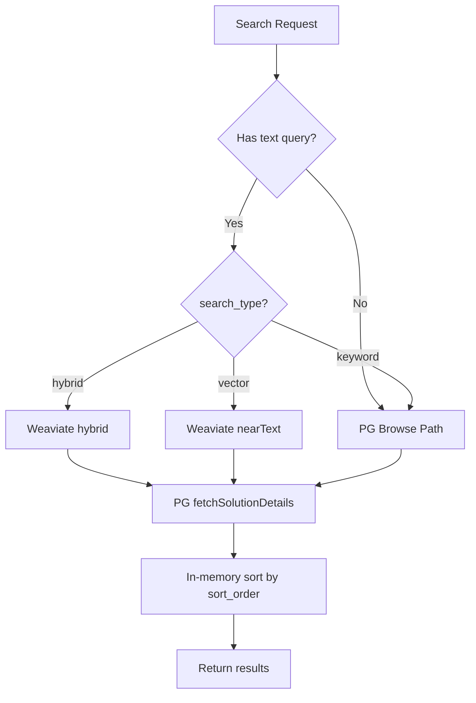

# Design Log #034: Weaviate Built-in Hybrid Search

## Background

Search is the core value proposition. The current implementation uses a dual-engine hybrid: Weaviate `nearText` for vector search and PostgreSQL `plainto_tsquery` for keyword search, merged manually in `SearchService.search()`. This was designed in [Design Log #004](./004-vector-search.md) and scored in [Design Log #025](./025-search-scoring-overhaul.md).

The merge logic (introduced in #004) unions the two result sets via `new Set()` with no rank fusion — a result that's #1 in both engines is treated the same as one that's #1 in only one. Weaviate natively supports `hybrid()` queries that combine BM25 + vector with proper fusion algorithms, which we're not using.

## Problem

1. **Naive merge**: The hybrid path does `new Set([...vectorIds, ...keywordIds]).slice(offset, limit)` — ordering is insertion-order, not relevance-order. No signal combination across engines.

2. **Duplicated filter logic**: Every metadata filter (project, severity, techStack, etc.) is implemented twice — once as Weaviate property filters (~90 lines in `buildWeaviateFilter`) and once as PG WHERE clauses (~110 lines in `keywordSearch`). They can drift.

3. **Broken deep pagination**: Vector search fetches `limit * 2` with no offset. Keyword search uses `offset: 0`. The merged Set gets `.slice(offset, offset + limit)`. Page 5+ silently loses results.

4. **Keyword results get fake relevance**: Keyword-only results receive `semanticScore = null` → `effectiveScore = 0.5` in `computeRankScore`. All keyword-only results share the same base score regardless of BM25 rank.

5. **Two round-trips for relevance search**: Vector search hits Weaviate, keyword search hits PG, then results are merged. Could be one Weaviate call.

## Questions and Answers

> Q: Does Weaviate's `hybrid()` support the same pre-filters we use with `nearText`?

A: Yes. The `filters` parameter works identically — same `Filters.and(...)` builder. Our existing `buildWeaviateFilter` works unchanged.

> Q: What fusion algorithm should we use?

A: Weaviate offers `rankedFusion` (RRF-style) and `relativeScoreFusion` (normalizes scores to [0,1] and combines). Start with `relativeScoreFusion` — it produces more meaningful absolute scores that we can feed into `computeRankScore`, unlike RRF which produces small relative numbers.

> Q: What `alpha` value for the BM25 vs vector weight?

A: `0.7` (lean semantic). Our primary consumers are agents searching with error messages — wording varies but meaning is stable. BM25 still contributes for exact error string matches. Expose as a constant for easy tuning.

> Q: What happens to `search_type` in the API schema?

A: Keep it for backward compatibility. `'hybrid'` (default) now routes to Weaviate's built-in hybrid. `'vector'` still uses `nearText`. `'keyword'` still uses PG. No breaking API change.

> Q: How does pagination work without PG's `COUNT(*)`?

A: For relevance-sorted results (Weaviate path), use the `limit + 1` trick: fetch one extra result, return `hasMore: boolean` instead of `total`. For browse-sorted results (PG path), keep exact `total`. The frontend adapts based on which field is present.

> Q: What about searches with no text query (filter-only browse)?

A: No query string → no hybrid search possible. Route to PG browse path with filters + sort. This is the same as today's keyword path without a query.

## Design

### Routing Logic

When a text query is present, Weaviate **always** defines the candidate set, regardless of sort order. This ensures changing sort order reorders the **same results** — no engine switch, no surprise result changes.



### Candidate Pool

Weaviate hybrid returns results ranked by fused relevance. It cannot sort by arbitrary fields (votes, recency). When `sort_order != 'relevance'`, we over-fetch from Weaviate to build a larger candidate pool, then sort and paginate in memory:

- `MIN_CANDIDATE_POOL = 100`
- For `sort_order: 'relevance'`: fetch `limit + 1` (native relevance order, no over-fetch)
- For other sort orders: fetch `max(offset + limit + 1, MIN_CANDIDATE_POOL)`, sort in memory, slice
- `hasMore` = candidate pool had more items than `offset + limit`

This means "sort by votes" semantically becomes "most voted among the relevant results for my query" — the right behavior.

### Weaviate Hybrid Call

```typescript
private async hybridSearch(
  query: string,
  filters: WeaviateFilter,
  limit: number,
  offset: number
): Promise<Array<{ solutionId: string; score: number }>> {
  const collection = weaviateClient.collections.get<SolutionVector>(SOLUTION_COLLECTION);
  const filter = this.buildWeaviateFilter(filters);

  const results = await collection.query.hybrid(query, {
    alpha: HYBRID_ALPHA,
    fusionType: 'relativeScoreFusion',
    limit,
    offset,
    filters: filter ?? undefined,
    returnMetadata: ['score'],
  });

  return results.objects.map(obj => ({
    solutionId: obj.properties.solutionId,
    score: obj.metadata?.score ?? 0,
  }));
}
```

### Response Contract Change

```typescript
// Before
type SearchResponse = {
  results: SearchResult[];
  sort_order: string;
  total: number;
};

// After
type SearchResponse = {
  results: SearchResult[];
  sort_order: string;
  total?: number; // present for PG browse path
  hasMore?: boolean; // present for Weaviate relevance path
};
```

The shared schema (`packages/shared/src/schemas/search.ts`) updates:

```typescript
export const searchResponseSchema = z.object({
  results: z.array(issueSchema),
  total: z.number().int().nonnegative().optional(),
  hasMore: z.boolean().optional(),
});
```

### Updated `search()` Method

```typescript
async search(input: SearchInput, organizationId: string): Promise<SearchResponse> {
  const { query, search_type, sort_order, limit, offset } = input;
  const accessibleOrgIds = await this.getAccessibleOrganizationIds(organizationId);
  const weaviateFilters = this.buildWeaviateFilterInput(input, accessibleOrgIds);

  const useWeaviateHybrid = !!query && search_type === 'hybrid';
  const useWeaviateVector = !!query && search_type === 'vector';

  if (useWeaviateHybrid || useWeaviateVector) {
    // Compute fetch size: over-fetch for non-relevance sorts
    const isRelevanceSort = sort_order === 'relevance' || !sort_order;
    const fetchLimit = isRelevanceSort
      ? limit + 1
      : Math.max(offset + limit + 1, MIN_CANDIDATE_POOL);

    // Retrieve candidates from Weaviate
    const candidates = useWeaviateHybrid
      ? await this.hybridSearch(query, weaviateFilters, fetchLimit, isRelevanceSort ? offset : 0)
      : await this.vectorSearch(query, weaviateFilters, fetchLimit, isRelevanceSort ? offset : 0);

    const hasMore = candidates.length > (isRelevanceSort ? limit : offset + limit);
    const vectorScores = new Map(candidates.map(c => [c.solutionId, c.score]));
    const candidateIds = candidates.map(c => c.solutionId);

    // Fetch full details from PG
    const { results: detailsMap, packages: packagesMap } = await this.fetchSolutionDetails(
      candidateIds, accessibleOrgIds, vectorScores
    );

    let results = candidateIds
      .map(id => detailsMap.get(id))
      .filter((r): r is SearchResult => r !== undefined);

    // Apply in-memory sort
    if (sort_order === 'votes') {
      results.sort((a, b) => b.votes - a.votes);
    } else if (sort_order === 'recent') {
      results.sort((a, b) => new Date(b.timestamp).getTime() - new Date(a.timestamp).getTime());
    } else {
      results.sort((a, b) => (b.rank_score ?? 0) - (a.rank_score ?? 0));
    }
    // severity and complexity sorts similar with enum ordering

    // Paginate: for relevance, Weaviate already offset; for others, slice in memory
    if (!isRelevanceSort) {
      results = results.slice(offset, offset + limit);
    } else {
      results = results.slice(0, limit);
    }

    return { results, sort_order: sort_order ?? 'relevance', hasMore };
  }

  // PG browse path (no query, or keyword search_type)
  const keywordResults = await this.keywordSearch(query, input, accessibleOrgIds, limit, offset);
  // ... fetchSolutionDetails, return { results, total: keywordResults.total }
}
```

### Constants

```typescript
const HYBRID_ALPHA = 0.7; // 0 = pure BM25, 1 = pure vector
const MIN_CANDIDATE_POOL = 100; // min candidates for non-relevance sorts
const RELEVANCE_THRESHOLD = 0.25; // unchanged from #025
```

### Mock Infrastructure Changes

The `MockWeaviateCollection` type needs a `hybrid` method:

```typescript
// packages/backend/src/test-utils/mocks.ts
export type MockWeaviateCollection = {
  data: {
    insert: ReturnType<typeof vi.fn>;
    update: ReturnType<typeof vi.fn>;
  };
  query: {
    nearText: ReturnType<typeof vi.fn>;
    hybrid: ReturnType<typeof vi.fn>; // NEW
    fetchObjects: ReturnType<typeof vi.fn>;
  };
  filter: {
    byProperty: ReturnType<typeof vi.fn>;
  };
};
```

And `createMockWeaviateCollection` adds the default:

```typescript
query: {
  nearText: vi.fn().mockResolvedValue({ objects: [] }),
  hybrid: vi.fn().mockResolvedValue({ objects: [] }),  // NEW
  fetchObjects: vi.fn().mockResolvedValue({ objects: [] }),
},
```

### Frontend Pagination Changes

```typescript
// packages/frontend/src/routes/_protected.search.tsx

// Before
const totalPages = data?.total ? Math.ceil(data.total / LIMIT) : 0;

// After — dual mode based on response shape
const totalPages = data?.total != null ? Math.ceil(data.total / LIMIT) : undefined;
const hasMore = data?.hasMore ?? false;
const showNextButton = totalPages != null ? searchParams.page < totalPages - 1 : hasMore;
```

The pagination UI adapts:

- **Browse path** (total available): "Page 3 of 12" with Previous/Next
- **Relevance path** (hasMore): "Page 3" with Previous/Next, no total

## Implementation Plan

### Phase 1: Mock Infrastructure + New Hybrid Method

1. Add `hybrid` to `MockWeaviateCollection` type and `createMockWeaviateCollection`
2. Implement `hybridSearch()` private method in `SearchService`
3. Add `HYBRID_ALPHA` and `MIN_CANDIDATE_POOL` constants
4. **Tests**: Verify `hybridSearch` calls `collection.query.hybrid` with correct params (alpha, fusionType, filters)

### Phase 2: Routing Logic in `search()`

1. Add routing decision based on query presence and search_type (sort_order does NOT affect engine choice)
2. Wire `hybridSearch` into the branch: `!!query && search_type === 'hybrid'` → Weaviate hybrid for ALL sort orders
3. Compute fetch limit: `limit + 1` for relevance sort, `max(offset + limit + 1, MIN_CANDIDATE_POOL)` for others
4. Keep existing `vectorSearch` and `keywordSearch` paths untouched
5. **Tests**:
   - `search_type: 'hybrid'` + query + `sort_order: 'relevance'` → calls `hybrid()`
   - `search_type: 'hybrid'` + query + `sort_order: 'votes'` → ALSO calls `hybrid()` (not PG)
   - `search_type: 'hybrid'` + no query → calls PG browse path
   - `search_type: 'vector'` + query → still calls `nearText()` (unchanged)
   - `search_type: 'keyword'` → still calls PG (unchanged)

### Phase 3: In-Memory Sort + hasMore

1. After fetching details from PG, apply in-memory sort based on `sort_order`
2. For non-relevance sorts, slice `results[offset..offset+limit]` from the over-fetched candidate pool
3. Compute `hasMore` from candidate pool size vs `offset + limit`
4. **Tests**:
   - Same Weaviate candidates, different sort orders → same result set, different ordering
   - `sort_order: 'votes'` → results ordered by votes desc
   - `sort_order: 'recent'` → results ordered by timestamp desc
   - `hasMore: true` when pool > `offset + limit`
   - `hasMore: false` when pool <= `offset + limit`

### Phase 4: Response Contract

1. Update `SearchResponse` type in `search.service.ts` — make `total` optional, add `hasMore`
2. Update `searchResponseSchema` in `packages/shared/src/schemas/search.ts`
3. Update `SearchResultResponse` in `packages/frontend/src/lib/api/issues.ts`
4. **Tests**: PG browse path still returns `{ total: N }` (no `hasMore`)

### Phase 5: Frontend Pagination Adaptation

1. Update `_protected.search.tsx` — dual-mode pagination based on `total` vs `hasMore`
2. Update page indicator: "Page X of Y" when total available, "Page X" when not
3. Update Next button: disabled by `totalPages` or `hasMore` as appropriate

### Phase 6: Cleanup (optional, separate PR)

1. Remove the manual merge logic from the old hybrid branch (dead code after Phase 2)
2. Consider removing duplicate PG filter conditions that are only reached via the old hybrid merge path
3. Update observability: log `fusionType`, `alpha`, and `candidatePoolSize` alongside existing search metrics

## Examples

### Hybrid relevance search (default agent path)

Request:

```json
{
  "query": "TypeError: Cannot read property of undefined in useEffect",
  "search_type": "hybrid",
  "sort_order": "relevance",
  "severity": "high",
  "limit": 10
}
```

Routing: query present + hybrid + relevance → **Weaviate hybrid path**

Weaviate call:

```
hybrid("TypeError: Cannot read property of undefined in useEffect", {
  alpha: 0.7,
  fusionType: "relativeScoreFusion",
  limit: 11,
  offset: 0,
  filters: Filters.and(orgId, severity="high")
})
```

Response:

```json
{
  "results": [{ "solution_id": "abc", "relevance": 0.82, "rank_score": 0.71, ... }],
  "sort_order": "relevance",
  "hasMore": true
}
```

### Browse by votes with text query (human frontend path)

Request:

```json
{
  "query": "react hooks",
  "search_type": "hybrid",
  "sort_order": "votes",
  "limit": 20,
  "offset": 20
}
```

Routing: query present + hybrid → **Weaviate hybrid** (sort_order does NOT affect engine)

Weaviate call:

```
hybrid("react hooks", {
  alpha: 0.7,
  fusionType: "relativeScoreFusion",
  limit: max(20+20+1, 100) = 100,  // over-fetch for non-relevance sort
  offset: 0                         // fetch from start, paginate in memory
})
```

Response (sorted by votes in memory, paginated to offset 20):

```json
{
  "results": [...],
  "sort_order": "votes",
  "hasMore": true
}
```

### Filter-only browse (no query)

Request:

```json
{
  "search_type": "hybrid",
  "sort_order": "relevance",
  "project": "my-app",
  "severity": "critical",
  "limit": 10
}
```

Routing: no query → **PG browse path** (regardless of search_type)

Response:

```json
{
  "results": [...],
  "sort_order": "relevance",
  "total": 8
}
```

## Test Plan (with Mocks)

### Unit Tests — `search.service.test.ts`

All tests use `MockDbBuilder`, `createMockWeaviateCollection`, and `createMockWeaviateClient` from `test-utils/mocks.ts`.

#### 1. Hybrid search calls Weaviate `hybrid()`

```typescript
describe('Given hybrid search type with relevance sort', () => {
  it('Then calls Weaviate hybrid() with correct alpha and fusion type', async () => {
    // Given
    const mockCollection = createMockWeaviateCollection();
    mockCollection.query.hybrid.mockResolvedValue({
      objects: [
        {
          properties: { solutionId: solution.id },
          metadata: { score: 0.85 },
        },
      ],
    });
    const mockDb = new MockDbBuilder()
      .mockResult([{ id: publicOrgId }]) // getAccessibleOrganizationIds
      .mockResult([
        {
          /* solution details */
        },
      ]) // fetchSolutionDetails
      .mockResult([]) // fetchSolutionDetails tags
      .build();

    // When
    await service.search(
      {
        query: 'useEffect cleanup race condition',
        search_type: 'hybrid',
        sort_order: 'relevance',
        limit: 10,
        offset: 0,
      },
      organizationId
    );

    // Then
    expect(mockCollection.query.hybrid).toHaveBeenCalledWith(
      'useEffect cleanup race condition',
      expect.objectContaining({
        alpha: 0.7,
        fusionType: 'relativeScoreFusion',
        limit: 11,
        offset: 0,
      })
    );
    expect(mockCollection.query.nearText).not.toHaveBeenCalled();
  });
});
```

#### 2. Hybrid with non-relevance sort STILL uses Weaviate hybrid

```typescript
describe('Given hybrid search type with votes sort', () => {
  it('Then still uses Weaviate hybrid with over-fetched candidate pool', async () => {
    // Given
    const mockCollection = createMockWeaviateCollection();
    mockCollection.query.hybrid.mockResolvedValue({ objects: [] });
    const mockDb = new MockDbBuilder()
      .mockResult([{ id: publicOrgId }]) // getAccessibleOrganizationIds
      .build();

    // When
    await service.search(
      {
        query: 'test query',
        search_type: 'hybrid',
        sort_order: 'votes',
        limit: 10,
        offset: 0,
      },
      organizationId
    );

    // Then — still calls Weaviate hybrid, with over-fetch limit
    expect(mockCollection.query.hybrid).toHaveBeenCalledWith(
      'test query',
      expect.objectContaining({ limit: 100 }) // MIN_CANDIDATE_POOL
    );
  });
});
```

#### 3. No query routes to PG regardless of search_type

```typescript
describe('Given no query text', () => {
  it('Then routes to PG browse path', async () => {
    const mockCollection = createMockWeaviateCollection();
    // ... mockDb for PG path

    await service.search(
      {
        search_type: 'hybrid',
        sort_order: 'relevance',
        project: 'my-app',
        limit: 10,
        offset: 0,
      },
      organizationId
    );

    expect(mockCollection.query.hybrid).not.toHaveBeenCalled();
  });
});
```

#### 4. hasMore = true when Weaviate returns limit + 1 results

```typescript
describe('Given Weaviate returns more results than limit', () => {
  it('Then hasMore is true and results are trimmed to limit', async () => {
    const mockCollection = createMockWeaviateCollection();
    mockCollection.query.hybrid.mockResolvedValue({
      objects: Array.from({ length: 11 }, (_, i) => ({
        properties: { solutionId: `sol-${i}` },
        metadata: { score: 0.9 - i * 0.05 },
      })),
    });
    // ... mockDb for fetchSolutionDetails returning 11 solutions

    const result = await service.search(
      {
        query: 'test',
        search_type: 'hybrid',
        sort_order: 'relevance',
        limit: 10,
        offset: 0,
      },
      organizationId
    );

    expect(result.hasMore).toBe(true);
    expect(result.results.length).toBeLessThanOrEqual(10);
  });
});
```

#### 5. hasMore = false when Weaviate returns fewer than limit + 1

```typescript
describe('Given Weaviate returns fewer results than limit', () => {
  it('Then hasMore is false', async () => {
    // ... mockCollection with 5 results, limit: 10

    const result = await service.search(
      {
        query: 'specific niche query',
        search_type: 'hybrid',
        sort_order: 'relevance',
        limit: 10,
        offset: 0,
      },
      organizationId
    );

    expect(result.hasMore).toBe(false);
    expect(result.total).toBeUndefined();
  });
});
```

#### 6. PG browse path still returns total (not hasMore)

```typescript
describe('Given PG browse path', () => {
  it('Then returns total count, not hasMore', async () => {
    // ... mockDb with count: 42

    const result = await service.search(
      {
        query: 'test',
        search_type: 'keyword',
        sort_order: 'votes',
        limit: 10,
        offset: 0,
      },
      organizationId
    );

    expect(result.total).toBe(42);
    expect(result.hasMore).toBeUndefined();
  });
});
```

#### 7. Metadata filters are passed to Weaviate hybrid

```typescript
describe('Given metadata filters with hybrid search', () => {
  it('Then passes filters to Weaviate hybrid call', async () => {
    const mockCollection = createMockWeaviateCollection();
    mockCollection.query.hybrid.mockResolvedValue({ objects: [] });

    await service.search(
      {
        query: 'test',
        search_type: 'hybrid',
        sort_order: 'relevance',
        severity: 'high',
        project: 'my-app',
        limit: 10,
        offset: 0,
      },
      organizationId
    );

    expect(mockCollection.query.hybrid).toHaveBeenCalledWith(
      'test',
      expect.objectContaining({ filters: expect.anything() })
    );
  });
});
```

#### 8. Sort by votes reorders same candidate set

```typescript
describe('Given hybrid search with sort_order votes', () => {
  it('Then returns results sorted by votes desc from Weaviate candidates', async () => {
    // Given — Weaviate returns 3 candidates with different relevance order
    const mockCollection = createMockWeaviateCollection();
    mockCollection.query.hybrid.mockResolvedValue({
      objects: [
        { properties: { solutionId: 'sol-a' }, metadata: { score: 0.9 } }, // most relevant
        { properties: { solutionId: 'sol-b' }, metadata: { score: 0.7 } },
        { properties: { solutionId: 'sol-c' }, metadata: { score: 0.5 } }, // least relevant
      ],
    });
    // mockDb returns sol-c with highest votes, sol-a with lowest
    // ...

    // When
    const result = await service.search(
      {
        query: 'test',
        search_type: 'hybrid',
        sort_order: 'votes',
        limit: 10,
        offset: 0,
      },
      organizationId
    );

    // Then — sol-c first (most votes), not sol-a (most relevant)
    expect(result.results[0]!.solution_id).toBe('sol-c');
    expect(result.results[2]!.solution_id).toBe('sol-a');
  });
});
```

#### 9. Existing vector-only tests still pass

```typescript
// Existing test unchanged — search_type: 'vector' still calls nearText
```

#### 10. Weaviate failure graceful degradation

```typescript
describe('Given Weaviate hybrid call fails', () => {
  it('Then returns empty results without crashing', async () => {
    const mockCollection = createMockWeaviateCollection();
    mockCollection.query.hybrid.mockRejectedValue(new Error('Connection refused'));

    const result = await service.search(
      {
        query: 'test',
        search_type: 'hybrid',
        sort_order: 'relevance',
        limit: 10,
        offset: 0,
      },
      organizationId
    );

    expect(result.results).toEqual([]);
    expect(result.hasMore).toBe(false);
  });
});
```

## Trade-offs

| Pros                                                              | Cons                                                                       |
| ----------------------------------------------------------------- | -------------------------------------------------------------------------- |
| Proper BM25+vector fusion via Weaviate (replaces naive Set merge) | No exact `total` count for text-query searches                             |
| Single Weaviate round-trip for all text queries                   | Weaviate's BM25 tokenization differs from PG's `plainto_tsquery` (minor)   |
| Consistent result set regardless of sort order (no engine switch) | Over-fetching for non-relevance sorts (fetches ~100 candidates to re-sort) |
| Filter logic runs in one place for text queries                   | Two code paths to maintain (Weaviate text query + PG no-query browse)      |
| Pagination works correctly                                        | Frontend needs dual-mode pagination (total vs hasMore)                     |
| `alpha` parameter tunable per deployment                          | Requires Weaviate >= 1.25 for relativeScoreFusion                          |
| Backward compatible — no API breaking changes                     | Non-relevance sorts limited to the candidate pool (top ~100 by relevance)  |
| ~200 lines of duplicated filter logic removed                     | Stale Weaviate data still needs PG detail-fetch filtering                  |

## Implementation Notes

Key files to modify:

- `packages/backend/src/test-utils/mocks.ts` — add `hybrid` to mock collection
- `packages/backend/src/services/search.service.ts` — add `hybridSearch()`, update `search()` routing, update `SearchResponse` type
- `packages/backend/src/services/search.service.test.ts` — new tests for hybrid routing, hasMore, filter passthrough
- `packages/shared/src/schemas/search.ts` — update `searchResponseSchema` (total optional, add hasMore)
- `packages/frontend/src/lib/api/issues.ts` — update `SearchResultResponse` type
- `packages/frontend/src/routes/_protected.search.tsx` — dual-mode pagination

Files unchanged:

- `packages/backend/src/weaviate/client.ts` — Weaviate schema unchanged (hybrid uses same collections)
- `packages/backend/src/routes/search.route.ts` — route handler unchanged (passes through to service)
- `packages/backend/src/services/search.service.ts` `buildWeaviateFilter()` — reused as-is for hybrid filters
- `packages/backend/src/services/search.service.ts` `keywordSearch()` — kept for PG browse path
- `packages/backend/src/services/search.service.ts` `vectorSearch()` — kept for vector-only search_type

---

## Implementation Results

### Phase 1-3: Backend (`search.service.ts`)

- Added `hybridSearch()` private method using `collection.query.hybrid()` with `alpha: 0.7` and `fusionType: 'RelativeScore'`
- Refactored `search()` into two clear paths: `weaviateSearchPath()` and `pgBrowsePath()`
- Routing: `query + hybrid` → Weaviate hybrid (any sort order), `query + vector` → nearText, `no query || keyword` → PG browse
- In-memory sorting via extracted `sortResults()` helper (supports votes, recent, severity, complexity, relevance)
- Candidate pool: `MIN_CANDIDATE_POOL = 100` for non-relevance sorts, `limit + 1` for relevance sort
- Weaviate path returns `hasMore` (no `total`); PG path returns `total` (no `hasMore`)

### Phase 4: Response Contract

- `SearchResponse.total` → `total?: number` (optional)
- Added `hasMore?: boolean` to `SearchResponse`
- Updated shared Zod schema, backend type, and frontend API types

### Phase 5: Frontend Pagination

- Dual-mode pagination in both `_protected.search.tsx` and `_marketing.explore.tsx`
- When `total` present: shows "Page X of Y" with numbered page disabling
- When only `hasMore`: shows "Page X" with Next disabled when `!hasMore`

### Phase 6: Cleanup

- Updated hybrid mock in `mocks.ts` (added `query.hybrid`)
- Fixed KPI tracking in route handlers to handle optional `total`
- **Tests**: 229/229 passing, 16 test files
- **Typecheck**: Backend, shared, frontend all clean

### Deviations from Design

- `fusionType` value is `'RelativeScore'` (Weaviate SDK enum), not `'relativeScoreFusion'` as initially planned
- Old naive hybrid merge code (Set union of nearText + keywordSearch) completely replaced, not just augmented
- `sortResults` extracted as a standalone function at file bottom rather than inline in the method

### Post-Implementation Fix: Metadata Filter Post-Filtering

**Problem discovered**: Combining text search with metadata filters (errorType, severity, environment, etc.) returned no results. Root cause: the old hybrid path ran both Weaviate + PG keyword search and unioned results — PG keyword search reliably applied metadata filters via SQL WHERE clauses on the authoritative `issues` table. The new Weaviate-only path relied on Weaviate metadata which can be stale or incomplete.

**Fix**:

1. Added `applyMetadataPostFilter()` — after fetching details from PG, re-applies all metadata filters using authoritative issue data. Supports exact matches and range filters (`maxComplexity`, `minSeverity`).
2. Over-fetches `MIN_CANDIDATE_POOL` from Weaviate when metadata filters are active to compensate for post-filter attrition.
3. Expanded `SearchResult.metadata` and `fetchSolutionDetails` to include all filterable issue fields (environment, affectedArea, frequency, rootCause, fixType, hasMinimalRepro, fileTypes, codePatterns, relatedPatterns).


### Post-Implementation Optimization: Query Consolidation

**Performance audit** identified 3 PG queries per Weaviate search path:

| #   | Query                                      | Issue                                                           |
| --- | ------------------------------------------ | --------------------------------------------------------------- |
| 1   | `getAccessibleOrganizationIds`             | Public org ID rarely changes, queried every request             |
| 2   | `fetchSolutionDetails` (5-table join)      | Transfers full `solutions.content` blob just to slice 200 chars |
| 3   | `fetchSolutionDetails` tags (4-table join) | Independent from #2 but runs sequentially                       |

**Fix** — reduced to 1 PG query per request:

1. **Merged queries #2 and #3** into a single query using `LEFT JOIN issue_tags/tags` with `array_agg(DISTINCT tags.name) FILTER (WHERE tags.name IS NOT NULL)` and `GROUP BY`. Eliminates one full PG round-trip.
2. **`LEFT(content, 201)` at DB level** — truncates solution content in PostgreSQL instead of transferring multi-KB blobs to Node.js. For 100 candidates at ~2KB average, saves ~200KB per request.
3. **Lazy-cached public org ID** on `SearchService` instance. First call queries PG, all subsequent calls return from memory.

**Result**:

| Path                                   | Before            | After             |
| -------------------------------------- | ----------------- | ----------------- |
| Weaviate + relevance sort (no filters) | 1 Weaviate + 3 PG | 1 Weaviate + 1 PG |
| Weaviate + metadata filters            | 1 Weaviate + 3 PG | 1 Weaviate + 1 PG |
| PG browse (no query)                   | 5 PG              | 3 PG              |

- **Tests**: 230/230 passing, 16 test files
- **Typecheck**: Backend, shared, frontend all clean

---

_Created: 2026-02-24_
_Status: Implemented_
