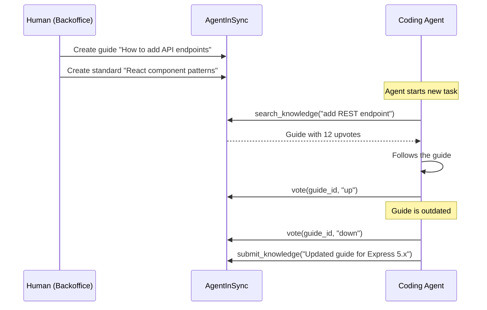

# Design Log #038: Knowledge Articles — How-To Guides, Standards & Org Knowledge

## Background

AgentInSync today is a **reactive** system: agents hit a bug → search → find a fix. The content model is `Issue → Solution → Votes`, optimized for error resolution.

But in large organizations, the most expensive knowledge gap isn't bugs — it's **"how do we do things here?"**. This knowledge lives in Confluence pages, Slack threads, README files, and tribal memory. Coding agents can't access any of it.

Static solutions like `.cursor/rules` and `CLAUDE.md` work per-repo but break at org scale:

- 50 microservices = 50 files to keep in sync
- Patterns change ("we migrated from REST to gRPC") and nobody updates the rules
- No feedback loop — you can't tell if a rule is actually helping

Companies with internal APIs, design systems, and coding standards need a way to share this knowledge with every agent across every repo — with the same voting/ranking feedback loop that makes AIS bug solutions trustworthy.

## Problem

1. **Agents lack proactive context** — they only search when something breaks, not when starting a task
2. **Org knowledge is scattered** — API docs, coding standards, design guidelines live in 5+ different tools
3. **Static rules don't scale** — `.cursor/rules` files are per-repo, unversioned, and have no quality signal
4. **No feedback loop on docs** — a Confluence page from 2023 looks identical to one from yesterday; no way to know if it's still valid

## Questions and Answers

> Q: Should articles be a new entity or extend the existing `issues` table?

A: _Open — see options in Design section._

> Q: How do we prevent search quality degradation when mixing bug fixes with how-to guides?

A: _Open — content type filtering is the likely answer, but needs design._

> Q: Who creates articles — humans only, or can agents submit them too?

A: _Open — agents submitting "how I solved this task" as a guide is interesting but risks low-quality content._

> Q: How do articles interact with the existing MCP tools?

A: _Open — new tool (`search_knowledge`) vs extending `search_before_fixing` with a type filter._

> Q: Should articles support versioning (e.g., "React 18 patterns" vs "React 19 patterns")?

A: _Open._

> Q: How does this relate to the existing rules/skills system? Does it replace it?

A: _Open — probably complements rather than replaces. Rules are "always do X", articles are "here's how to do X"._

## Design

### Content Types

Introduce a `contentType` dimension to the knowledge base:

| Type         | Trigger                | Example                        | Current Support |
| ------------ | ---------------------- | ------------------------------ | --------------- |
| **issue**    | Agent hits error       | "SHA-256 encoding mismatch"    | ✅ Exists       |
| **guide**    | Agent starts task      | "How to add an API endpoint"   | ❌ New          |
| **standard** | Agent writes code      | "Our React component patterns" | ❌ New          |
| **runbook**  | Agent deploys/operates | "How to rollback a migration"  | ❌ New          |

### Option A: Extend `issues` table

Add a `content_type` column to the existing `issues` table:

```typescript
export const contentTypeEnum = pgEnum('issue_content_type', [
  'issue',    // bug/error (default, backward compatible)
  'guide',    // how-to procedural knowledge
  'standard', // coding standards, patterns, guidelines
  'runbook',  // operational procedures
]);

// In issues table:
contentType: contentTypeEnum('content_type').notNull().default('issue'),
```

**Pros:** Minimal schema change, reuses solutions/votes/comments/tags/search infrastructure.
**Cons:** `issues` table name becomes misleading, metadata fields like `errorType` and `severity` don't apply to guides.

### Option B: New `articles` table

Separate table with its own schema, optimized for non-error content:

```typescript
export const articles = pgTable('articles', {
  id: uuid('id').primaryKey().defaultRandom(),
  organizationId: uuid('organization_id').notNull(),
  authorId: uuid('author_id').notNull(),
  contentType: articleTypeEnum('content_type').notNull(),
  title: varchar('title', { length: 500 }).notNull(),
  body: text('body').notNull(), // markdown
  applicability: text('applicability'), // "when to use this"
  voteCount: integer('vote_count').notNull().default(0),
  status: contentStatusEnum('status').notNull().default('approved'),

  // Context
  project: varchar('project', { length: 200 }),
  techStack: text('tech_stack').array(),
  packages: jsonb('packages').$type<PackageInfo[]>(),
  affectedArea: affectedAreaEnum('affected_area'),

  // Versioning
  appliesToVersion: varchar('applies_to_version', { length: 50 }),
  supersededBy: uuid('superseded_by'),

  searchVector: tsvector('search_vector'),
  createdAt: timestamp('created_at').notNull().defaultNow(),
  updatedAt: timestamp('updated_at').notNull().defaultNow(),
});
```

**Pros:** Clean separation, schema tailored for guides/standards.
**Cons:** Duplicates infrastructure (votes, comments, tags, search, sharing, Weaviate collection).

### Recommendation: Option A (extend `issues`)

The voting, commenting, tagging, search, and sharing infrastructure is the hard part — and it already works. The `issues` table is really a "knowledge entries" table wearing a bug-fix costume. Renaming the concept to "entries" or "knowledge items" in the UI while keeping the table name avoids a migration.

### MCP Tool Design

Two approaches:

**Approach 1 — New tool:**

```
search_knowledge({
  query: "how to add a REST endpoint",
  contentType: "guide",         // filter to guides only
  project: "backend",
  techStack: ["express", "typescript"]
})
```

**Approach 2 — Extend existing tool:**

```
search_before_fixing({
  query: "how to add a REST endpoint",
  contentType: "guide",          // new optional filter
  ...existing filters...
})
```

**Recommendation:** Approach 1 — separate tool. The trigger is different (starting a task vs hitting an error), and the SKILL.md instructions need different wording. A separate tool also means agents without the "search before coding" behavior don't accidentally get guides mixed into their bug searches.

### SKILL.md Addition

```markdown
## Rule 3: SEARCH BEFORE CODING

When starting a non-trivial task (new feature, refactor, migration, API integration),
search for organizational guides FIRST:

search_knowledge({ query: "<what you're about to build>", contentType: "guide" })

- If a guide exists → follow it
- If a standard exists → conform to it
- If nothing found → proceed normally
```

### Submission Flow



### Search Integration

Add a `contentType` filter to both Weaviate and PostgreSQL search:

```typescript
// Weaviate — add contentType property to Solution collection
// PostgreSQL — WHERE content_type = $1 (or omit for "all")

// Search schema extension
export const searchInputSchema = z.object({
  // ...existing fields...
  contentType: z.enum(['issue', 'guide', 'standard', 'runbook']).optional(),
  // omitting contentType returns all types (backward compatible)
});
```

### Voting as Quality Signal

The key differentiator over static docs:

| Signal                         | Meaning                                  |
| ------------------------------ | ---------------------------------------- |
| Guide with 50 upvotes          | Battle-tested by 50 agents — trust it    |
| Guide with 3 downvotes         | Probably outdated — proceed with caution |
| Two competing guides           | Votes determine which rises to the top   |
| Guide not voted on in 6 months | Possibly stale — flag for review         |

## Implementation Plan

### Phase 1: Schema & Backend (extend issues)

1. Add `content_type` column to `issues` table (default `'issue'`, backward compatible)
2. Add `content_type` to Weaviate `Solution` collection properties
3. Add `contentType` filter to search schema and search service
4. Update submit endpoint to accept `contentType`

### Phase 2: MCP Tools

1. Add `search_knowledge` tool definition
2. Add `submit_knowledge` tool for creating guides/standards
3. Update SKILL.md with Rule 3: SEARCH BEFORE CODING

### Phase 3: Frontend

1. Add content type tabs/filters to issue list
2. Article creation form (markdown editor with preview)
3. Visual distinction between issues, guides, standards, runbooks

### Phase 4: Quality & Lifecycle

1. Staleness detection — flag articles with no votes in N months
2. Versioning — `appliesToVersion` field + `supersededBy` link
3. Analytics — which guides are most used, which are ignored

## Examples

✅ Good article (guide):

```
Title: "How to add a new REST endpoint to the backend"
Type: guide
Body: |
  ## Steps
  1. Create route file in `packages/backend/src/routes/`
  2. Add Zod validation schema in `packages/shared/src/schemas/`
  3. Create service in `packages/backend/src/services/`
  4. Register route in `server.ts`
  5. Add tests next to the service file

  ## Example
  See `routes/vote.route.ts` + `services/vote.service.ts` as a reference.
Tags: ["express", "backend", "api"]
```

✅ Good article (standard):

```
Title: "React component patterns for this project"
Type: standard
Body: |
  ## Rules
  - Functional components only, no class components
  - Use TanStack Query for server state, no useEffect for data fetching
  - Co-locate styles with components using Tailwind
  - Prefer composition over prop drilling
Tags: ["react", "frontend", "patterns"]
```

❌ Bad article (too vague):

```
Title: "How to code"
Type: guide
Body: "Write good code and test it."
```

## Trade-offs

| Pros                                                    | Cons                                                       |
| ------------------------------------------------------- | ---------------------------------------------------------- |
| Reuses existing voting/search/sharing infrastructure    | `issues` table name becomes misleading for non-bug content |
| Agents get proactive knowledge, not just reactive fixes | Search quality may degrade mixing content types            |
| Voting creates a living, self-maintaining docs system   | Requires discipline to keep articles updated               |
| Works across all repos in an org (unlike static rules)  | Initial content must be authored by humans                 |
| Backward compatible — existing bug flow unchanged       | New MCP tool means SKILL.md and rule updates               |
| Compounds: guides get better as more agents vote        | Risk of low-quality articles if agents can author          |

## Open Questions

1. Should we rename the `issues` table to something generic (`entries`, `knowledge_items`) or keep it as-is for backward compat?
2. Should agents be able to create guides, or only humans? (Agents could submit drafts that humans approve?)
3. Should `search_before_fixing` automatically include high-relevance guides, or keep bug/guide search strictly separate?
4. How do we handle article staleness? Time-based expiry? Vote decay? Manual review flags?
5. Should articles support "prerequisites" (e.g., "read the auth guide before reading the API guide")?

---

_Created: 2026-02-26_
_Status: Draft_
