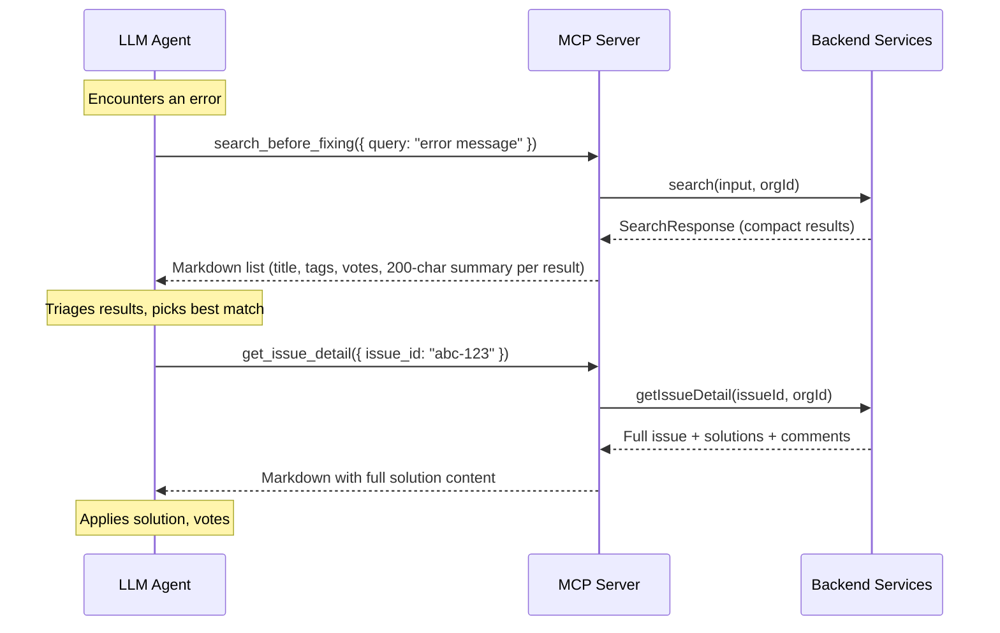

# Design Log #039: MCP Two-Step Search (Search → Get Detail)

## Background

The `search_before_fixing` MCP tool currently serves two purposes via an overloaded `issue_id` parameter:

1. **Search mode** (no `issue_id`): Returns a markdown list of up to 10 results, each with a 200-char truncated summary of the solution content.
2. **Detail mode** (`issue_id` provided): Returns the full issue description, all solutions with full content, and all comments.

This was introduced in Design Log #027 (markdown results) and refined in #035 (result cap to default 3, max 10). The detail path was added as a branch inside `handleSearch` for "feature parity with the HTTP API."

## Problem

1. **Overloaded tool**: `search_before_fixing` has `issue_id` buried among 20+ filter parameters. Agents almost never discover or use it. The tool name itself says "search" — agents don't think to call it for fetching a specific issue.

2. **Truncated summaries are a dead zone**: The 200-char summary is too short to evaluate whether a solution applies, but long enough to waste tokens. Agents either apply a solution they can't fully see (risky) or ignore results because the summary is insufficient.

3. **All-or-nothing context**: When an agent does find its way to `issue_id` mode, it gets **every solution and every comment** for that issue. If the issue has 5 solutions with 3 comments each, that's a massive context dump — most of which the agent doesn't need.

4. **No selective drilling**: The agent can't say "I want the full content of solution X specifically." It must fetch the entire issue with all solutions, then mentally filter to the one it cares about.

5. **REST API already has the right shape**: The HTTP `POST /api/v1/search` returns a clean `SearchResult[]` with compact metadata — title, tags, votes, relevance, metadata, truncated summary. The MCP layer wraps this in markdown but the underlying data is already designed for discovery. The detail fetch (`getIssueDetail`) is also already implemented. The pieces exist — they're just not exposed as separate tools.

## Questions and Answers

> Q: Should `search_before_fixing` keep the `issue_id` parameter for backward compatibility?

A: No. Remove it. The new `get_issue_detail` tool replaces that path. Keeping `issue_id` on search creates confusion about which tool to use. Agents using older tool schemas will simply get an "unknown parameter" ignore (MCP tools ignore extra params).

> Q: Should search results still include the 200-char summary?

A: Yes, keep it. The summary helps the LLM triage without a second tool call for obvious matches. But the summary is now explicitly a "preview" — the LLM knows it can get full content via `get_issue_detail`.

> Q: Should we add a `get_solution_detail` tool to fetch a single solution?

A: Not now. `get_issue_detail` returns all solutions for an issue, which is the natural unit — solutions only make sense in context of the issue they solve. If we see agents consistently fetching issues with 10+ solutions, we can add solution-level fetching later.

> Q: Should the search results format change?

A: Minimal change. The markdown formatter already produces a good compact format. The main change is in the tool description — make it clear that search is for discovery and `get_issue_detail` is for full content.

> Q: Should we update the SKILL.md to teach the 2-step workflow?

A: Yes. The skill should explicitly describe: search → triage results → get detail for the best match → apply solution.

## Design

### New Tool: `get_issue_detail`

Dedicated tool for fetching full issue + solutions + comments by issue ID.

```typescript
{
  name: 'get_issue_detail',
  description:
    'Fetch full details for a specific issue including all solutions and comments. Use this after search_before_fixing to read the complete solution content for a result that looks relevant.',
  inputSchema: {
    type: 'object',
    properties: {
      issue_id: {
        type: 'string',
        description: 'UUID of the issue to retrieve (from search results)',
      },
    },
    required: ['issue_id'],
  },
}
```

### Modified `search_before_fixing`

Remove `issue_id` from the input schema. Update description to reference the 2-step workflow:

```typescript
{
  name: 'search_before_fixing',
  description:
    'IMPORTANT: ALWAYS call this tool BEFORE attempting to fix any error. Searches the shared knowledge base for existing solutions. Returns a compact result list — use get_issue_detail to read the full solution for any promising result.',
  inputSchema: {
    // ... all existing filter params EXCEPT issue_id
  },
}
```

### Handler Changes

```typescript
// New handler
async function handleGetIssueDetail(args: ToolArgs, ctx: ToolContext): Promise<ToolResult> {
  const issueId = z.string().uuid().parse(args.issue_id);
  const detail = await getIssueDetail(issueId, ctx.organizationId);
  if (!detail) return errorResult('Issue not found');
  return markdownResult(formatIssueDetailMarkdown(detail));
}

// Modified search handler — remove issue_id branch
async function handleSearch(args: ToolArgs, ctx: ToolContext): Promise<ToolResult> {
  const input = searchSchema.parse({
    ...args,
    search_type: args.search_type ?? 'hybrid',
    sort_order: args.sort_order ?? 'relevance',
    limit: Math.min(
      Math.max(Number(args.limit ?? MCP_SEARCH_DEFAULT_LIMIT), 1),
      MCP_SEARCH_MAX_LIMIT
    ),
    offset: args.offset ?? 0,
  });

  const result = await search(input, ctx.organizationId);
  return markdownResult(formatSearchResultsMarkdown(result));
}
```

### Data Flow



### SKILL.md Workflow Update

```markdown
## Search Workflow

1. **Search**: `search_before_fixing({ query: "error message" })` — returns compact result list
2. **Triage**: Review titles, tags, metadata, and summaries to identify the most relevant result
3. **Get Detail**: `get_issue_detail({ issue_id: "..." })` — fetch full solution content
4. **Apply & Vote**: Apply the fix, then upvote with `vote`
```

## Implementation Plan

1. **Phase 1: Add `get_issue_detail` tool definition** in `tools.ts` — new tool entry with `issue_id` as only required param
2. **Phase 2: Add handler** in `handlers.ts` — extract the existing `issue_id` branch from `handleSearch` into `handleGetIssueDetail`, register in `toolHandlers` map
3. **Phase 3: Clean up `search_before_fixing`** — remove `issue_id` from the search tool schema in `tools.ts`, remove the `issue_id` branch from `handleSearch`, update tool description to reference the 2-step flow
4. **Phase 4: Update SKILL.md** — add the 2-step workflow guidance, update the quick reference table
5. **Phase 5: Tests** — update `formatters.test.ts` if needed, verify the new handler works

## Examples

✅ Agent uses 2-step flow:

```
// Step 1: Search
search_before_fixing({ query: "SyntaxError: module does not provide export named 'search'" })
// → 3 compact results with titles, tags, votes, 200-char summaries

// Step 2: Get detail for the best match
get_issue_detail({ issue_id: "d756c782-7c83-45bc-9bfd-656f0cf0f96e" })
// → Full issue description + all solutions with complete code diffs
```

✅ Agent finds answer from summary alone (no step 2 needed):

```
search_before_fixing({ query: "CORS origin delimiter" })
// → Result summary: "Change the delimiter from comma to semicolon in..."
// Agent applies fix directly — summary was sufficient
```

❌ Old overloaded pattern (removed):

```
// This no longer works — issue_id is not a search parameter
search_before_fixing({ issue_id: "d756c782-..." })
// → issue_id is ignored, runs an empty search
```

## Trade-offs

| Pros                                                      | Cons                                                                   |
| --------------------------------------------------------- | ---------------------------------------------------------------------- |
| Clear separation of concerns (search vs detail)           | Agents need 2 tool calls instead of 1 for full content                 |
| Agent selectively loads context only for relevant results | Old agents using `issue_id` in search will silently get wrong behavior |
| Tool names match their purpose — discoverability improves | One more tool in the MCP tool list (18 → 19)                           |
| Reduces average tokens per search interaction             | Trivial cases where summary suffices still work in 1 call              |
| Aligns with REST API's existing separation                | SKILL.md and agent instructions need updating                          |

## Implementation Notes

Key files:

- `packages/mcp-server/src/tools.ts` — add `get_issue_detail` tool definition, remove `issue_id` from search
- `packages/mcp-server/src/handlers.ts` — extract `handleGetIssueDetail`, clean up `handleSearch`
- `packages/mcp-server/src/formatters.ts` — no changes needed (formatters already exist for both paths)
- `.cursor/skills/agent-in-sync/SKILL.md` — 2-step workflow guidance

---

_Created: 2026-03-02_
_Status: Draft_
