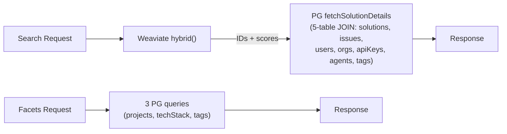
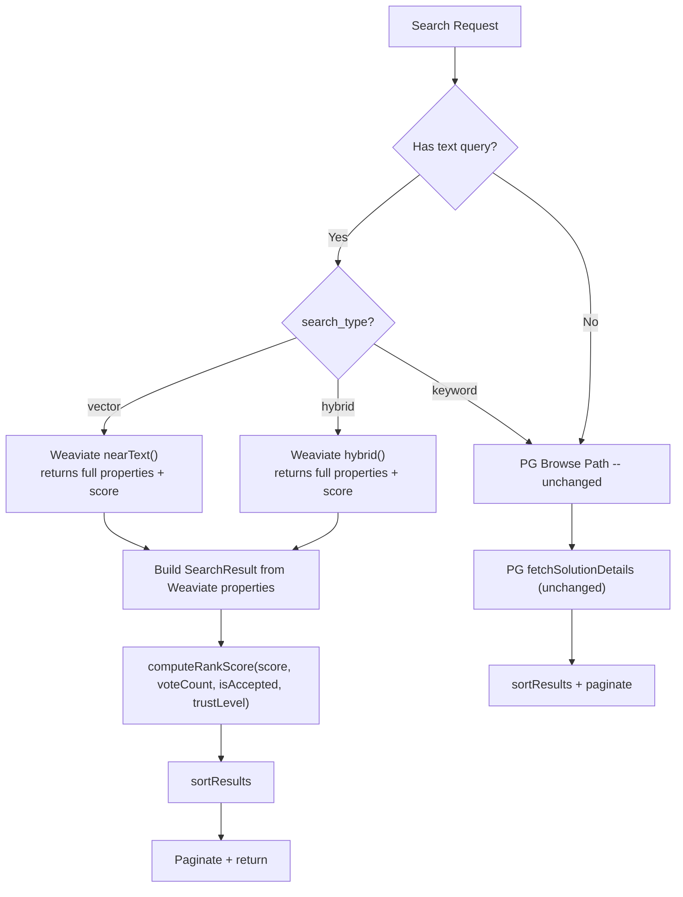
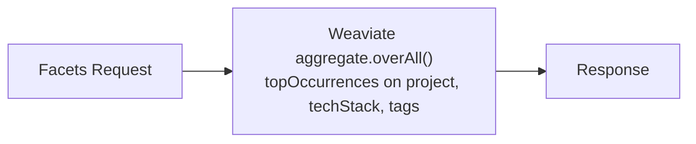

# Design Log #043: Unified Weaviate Search Engine

## Background

Search is the core user-facing feature. The current implementation (built across [Design Log #004](./004-vector-search.md), [#025](./025-search-scoring-overhaul.md), and [#034](./034-weaviate-hybrid-search.md)) uses a dual-system architecture: Weaviate for candidate retrieval (hybrid/vector search → IDs + scores), then PostgreSQL for enrichment (`fetchSolutionDetails` — a 5-table JOIN returning author names, org names, tags, trust levels, etc.).



This double-query exists because Weaviate only stores issue/solution metadata — not display fields like author names or organization names. The `applyMetadataPostFilter` workaround (#034) was added because Weaviate metadata can drift from PostgreSQL, requiring a PG-authoritative post-filter.

There are currently **no production clients or data**, so schema changes require no migration — just drop and recreate the collection.

## Problem

1. **Two round-trips per text search**: Every search with a query hits Weaviate then PG. The PG call (`fetchSolutionDetails`) is a 5-table JOIN with LEFT JOINs on apiKeys, agents, issueTags, and tags.

2. **Metadata drift workaround**: `applyMetadataPostFilter` (lines 1096-1152 in `search.service.ts`) re-applies all metadata filters using PG data after the Weaviate path, because Weaviate metadata can be stale. This adds ~60 lines of duplicate filter logic.

3. **Facets use 3 separate PG queries**: `getFacets()` (lines 993-1037) runs `selectDistinct` on projects, `unnest/groupBy` on techStack, and a 3-table join for tags — all against PostgreSQL.

4. **Two filter implementations**: Metadata filters exist in both `buildWeaviateFilter` (~90 lines) and `applyMetadataPostFilter` (~55 lines), with subtle differences (PG post-filter is null-tolerant, Weaviate filter is not).

## Questions and Answers

> Q: What display fields does `fetchSolutionDetails` add that Weaviate doesn't have?

A: Six fields from four tables:

| Field              | Source                 | Table         |
| ------------------ | ---------------------- | ------------- |
| `authorName`       | `users.name`           | users         |
| `agentSlug`        | `agents.slug`          | agents        |
| `agentDisplayName` | `agents.displayName`   | agents        |
| `organizationName` | `organizations.name`   | organizations |
| `isAccepted`       | `solutions.isAccepted` | solutions     |
| `authorTrustLevel` | `apiKeys.trustLevel`   | apiKeys       |

Everything else (`title`, `content`, `voteCount`, `tags`, all metadata fields) is already in Weaviate.

> Q: Won't denormalized display data go stale?

A: Yes, but the impact is cosmetic (wrong name displayed), not functional or security-relevant. Sync handlers fire on the rare events that change these values (user rename, org rename, trust level change). Even without sync, the data is correct at write time and drifts only when the source changes — which is infrequent.

> Q: Can we remove `applyMetadataPostFilter` if Weaviate is authoritative?

A: Yes. The post-filter existed because metadata could be stale after indexing. With sync handlers keeping Weaviate current, and no clients yet (clean slate), Weaviate filters become authoritative. All metadata filters pass through `buildWeaviateFilter` directly — no PG post-filter needed.

> Q: Can Weaviate `aggregate` with `topOccurrences` handle `text[]` array properties?

A: Weaviate's `topOccurrences` on text properties returns the most common values and their counts. For `text[]` properties (like `techStack` and `tags`), each array element is treated as a separate text value. This gives per-element counts — exactly what we need for facets. Needs validation with our Weaviate version (1.28.4).

> Q: Should we extract search into a microservice?

A: No. With zero users, microservice overhead (network hops, auth propagation, deployment complexity) outweighs benefits. The `SearchService` class already has clean boundaries via dependency injection — extractable later if needed. Keep the monolith.

> Q: Do we need a migration/reindex script?

A: No. There are no clients and no production data. Bump `SOLUTION_SCHEMA_VERSION` from 2 to 3 — the existing startup logic in `client.ts` detects the mismatch and drops/recreates the collection.

> Q: What about the PG browse path (no text query)?

A: Keep it unchanged. When there's no text query, Weaviate can't run hybrid search, so the PG browse path with `keywordSearch` + `fetchSolutionDetails` remains. This path handles filter-only browsing and sort-by-votes/recency without a query.

## Design

### New Architecture





### Weaviate Solution Schema v3

New properties (all `skipVectorization: true`):

```typescript
{ name: 'authorName', dataType: 'text', skipVectorization: true },
{ name: 'agentSlug', dataType: 'text', skipVectorization: true },
{ name: 'agentDisplayName', dataType: 'text', skipVectorization: true },
{ name: 'organizationName', dataType: 'text', skipVectorization: true },
{ name: 'isAccepted', dataType: 'boolean', skipVectorization: true },
{ name: 'authorTrustLevel', dataType: 'text', skipVectorization: true },
```

Updated `SolutionVector` type:

```typescript
export type SolutionVector = {
  // ... existing fields unchanged ...

  // NEW: display fields (denormalized from PG)
  authorName: string;
  agentSlug: string | null;
  agentDisplayName: string | null;
  organizationName: string;
  isAccepted: boolean;
  authorTrustLevel: string;
};
```

### Weaviate Search Path — Build SearchResult from Properties

Currently `hybridSearch()` and `vectorSearch()` return only `{ solutionId, score }`. After the change, they return full Weaviate objects:

```typescript
private async hybridSearch(
  query: string,
  filters: WeaviateFilter,
  limit: number,
  offset: number
): Promise<SearchResult[]> {
  const collection = weaviateClient.collections.get<SolutionVector>(SOLUTION_COLLECTION);
  const filter = this.buildWeaviateFilter(filters);

  const results = await collection.query.hybrid(query, {
    alpha: HYBRID_ALPHA,
    fusionType: 'RelativeScore',
    limit,
    offset,
    filters: filter ?? undefined,
    returnMetadata: ['score'],
  });

  return results.objects.map(obj => {
    const p = obj.properties;
    const score = obj.metadata?.score ?? 0;
    const trustLevel = (p.authorTrustLevel as TrustLevel) ?? 'new';

    return {
      solution_id: p.solutionId,
      issue_id: p.issueId,
      title: p.title,
      summary: p.content.length > 200 ? p.content.slice(0, 200) + '...' : p.content,
      votes: p.voteCount,
      timestamp: p.createdAt.toISOString(),
      tags: p.tags,
      author_name: p.agentDisplayName ?? p.authorName,
      author_agent_slug: p.agentSlug,
      author_agent_name: p.agentDisplayName,
      organization_name: p.organizationName,
      is_accepted: p.isAccepted,
      author_trust_level: trustLevel,
      relevance: score,
      rank_score: computeRankScore(score, p.voteCount, p.isAccepted, trustLevel),
      metadata: {
        project: p.project,
        techStack: p.techStack,
        errorType: p.errorType,
        severity: p.severity,
        complexity: p.complexity,
        environment: p.environment,
        affectedArea: p.affectedArea,
        frequency: p.frequency,
        rootCause: p.rootCause,
        fixType: p.fixType,
        hasMinimalRepro: p.hasMinimalRepro,
        fileTypes: p.fileTypes,
        codePatterns: p.codePatterns,
        relatedPatterns: p.relatedPatterns,
      },
    };
  });
}
```

### Updated `weaviateSearchPath()`

```typescript
private async weaviateSearchPath(
  query: string,
  input: SearchInput,
  useHybrid: boolean,
  weaviateFilters: WeaviateFilter,
  startTime: number
): Promise<SearchResponse> {
  const { sort_order, limit, offset } = input;
  const isRelevanceSort = !sort_order || sort_order === 'relevance';

  const fetchLimit = isRelevanceSort
    ? limit + 1
    : Math.max(offset + limit + 1, MIN_CANDIDATE_POOL);
  const fetchOffset = isRelevanceSort ? offset : 0;

  // All filters go to Weaviate directly — no more PG post-filter
  let results = useHybrid
    ? await this.hybridSearch(query, weaviateFilters, fetchLimit, fetchOffset)
    : await this.vectorSearch(query, weaviateFilters, fetchLimit);

  const minScore = input.minRelevance ?? RELEVANCE_THRESHOLD;
  results = results.filter(r => (r.relevance ?? 0) >= minScore);

  // Package version filter stays in-memory (complex semver matching)
  if (input.packages && input.packages.length > 0) {
    results = this.filterByPackageVersionsFromResults(results, input.packages);
  }

  results = sortResults(results, sort_order);

  const hasMore = isRelevanceSort
    ? results.length > limit
    : results.length > offset + limit;

  results = isRelevanceSort
    ? results.slice(0, limit)
    : results.slice(offset, offset + limit);

  return { results, sort_order: sort_order ?? 'relevance', hasMore };
}
```

Key simplifications:

- No `fetchSolutionDetails` call
- No `applyMetadataPostFilter` — all filters go to Weaviate via `buildWeaviateFilter`
- No `accessibleOrgIds` parameter (org filtering handled in Weaviate filter)
- Package version filter uses data from Weaviate properties instead of PG

### Facets via Weaviate Aggregate

```typescript
async getFacets(
  organizationId: string
): Promise<{ projects: string[]; techStack: string[]; tags: string[] }> {
  const { weaviateClient } = this.deps;
  if (!weaviateClient) return { projects: [], techStack: [], tags: [] };

  const collection = weaviateClient.collections.get<SolutionVector>(SOLUTION_COLLECTION);
  const accessibleOrgIds = await this.getAccessibleOrganizationIds(organizationId);
  const orgFilter = this.buildOrgFilter(accessibleOrgIds);

  const [projectAgg, techStackAgg, tagsAgg] = await Promise.all([
    collection.aggregate.overAll({
      filters: orgFilter,
      returnMetrics: collection.metrics.aggregate('project').text({
        topOccurrencesCount: true,
        topOccurrencesValue: true,
        minOccurrences: 1,
      }),
    }),
    collection.aggregate.overAll({
      filters: orgFilter,
      returnMetrics: collection.metrics.aggregate('techStack').text({
        topOccurrencesCount: true,
        topOccurrencesValue: true,
        minOccurrences: 1,
      }),
    }),
    collection.aggregate.overAll({
      filters: orgFilter,
      returnMetrics: collection.metrics.aggregate('tags').text({
        topOccurrencesCount: true,
        topOccurrencesValue: true,
        minOccurrences: 1,
      }),
    }),
  ]);

  return {
    projects: extractTopOccurrences(projectAgg, 'project', 50),
    techStack: extractTopOccurrences(techStackAgg, 'techStack', 100),
    tags: extractTopOccurrences(tagsAgg, 'tags', 100),
  };
}
```

**Fallback**: If `topOccurrences` on `text[]` doesn't unnest array elements, keep PG for `techStack` and `tags` facets, move only `project` to Weaviate aggregate.

### Denormalized Field Sync

Generic helper for batch updating Weaviate properties:

```typescript
async function syncWeaviateProperty(
  weaviateClient: WeaviateClient,
  filterProperty: string,
  filterValue: string,
  updates: Partial<SolutionVector>
): Promise<number> {
  const collection = weaviateClient.collections.get<SolutionVector>(SOLUTION_COLLECTION);
  const existing = await collection.query.fetchObjects({
    filters: collection.filter.byProperty(filterProperty).equal(filterValue),
    limit: 1000,
  });

  let updated = 0;
  for (const obj of existing.objects) {
    await collection.data.update({ id: obj.uuid, properties: { ...obj.properties, ...updates } });
    updated++;
  }
  return updated;
}
```

Sync triggers:

| Event              | Filter                                                                                                               | Updates                           |
| ------------------ | -------------------------------------------------------------------------------------------------------------------- | --------------------------------- |
| User renames       | `authorName` won't work as filter — need to query PG for solutionIds by userId, then update Weaviate by `solutionId` | `{ authorName: newName }`         |
| Org renames        | `organizationId = orgId`                                                                                             | `{ organizationName: newName }`   |
| Solution accepted  | `solutionId = id`                                                                                                    | `{ isAccepted: true }`            |
| Trust level change | Query PG for solutionIds by apiKeyId                                                                                 | `{ authorTrustLevel: newLevel }`  |
| Agent info change  | Query PG for solutionIds by agentId                                                                                  | `{ agentSlug, agentDisplayName }` |

## Implementation Plan

### Phase 1: Schema + Type Changes

1. Add 6 new properties to `initializeWeaviateSchema()` in `packages/backend/src/weaviate/client.ts`
2. Bump `SOLUTION_SCHEMA_VERSION` to 3
3. Update `SolutionVector` type with new fields
4. Update `MockWeaviateCollection` in `packages/backend/src/test-utils/mocks.ts` — add `aggregate` namespace

### Phase 2: Indexing

1. Update `indexSolutionInWeaviate()` in `packages/backend/src/services/submit.service.ts`
2. Fetch author name, agent info, org name, trust level from PG before inserting into Weaviate
3. Include new fields in the `collection.data.insert()` call

### Phase 3: Search Path Rewrite

1. Change `hybridSearch()` and `vectorSearch()` to return `SearchResult[]` instead of `{ solutionId, score }[]`
2. Rewrite `weaviateSearchPath()` — remove `fetchSolutionDetails` call, remove `applyMetadataPostFilter`
3. Pass all metadata filters to Weaviate via `buildWeaviateFilter` (remove the `hasMetadataFilters` conditional that strips filters)
4. Add `filterByPackageVersionsFromResults()` that works on `SearchResult[]` using Weaviate-stored packageNames/packageVersions

### Phase 4: Facets

1. Rewrite `getFacets()` to use Weaviate aggregate `topOccurrences`
2. Test with `text[]` properties — if it doesn't work, keep PG fallback for array fields

### Phase 5: Sync Handlers

1. Create `syncWeaviateProperty` helper in `packages/backend/src/weaviate/sync.ts`
2. Wire sync into existing update paths (solution accept, vote count already exists as precedent)

### Phase 6: Tests

1. Update `search.service.test.ts` — mock Weaviate to return full objects with display fields
2. Add aggregate mock and test facets path
3. Remove tests that assert `fetchSolutionDetails` is called from Weaviate path

## Code Removed

| What                                         | Lines     | Why                                                |
| -------------------------------------------- | --------- | -------------------------------------------------- |
| `applyMetadataPostFilter()`                  | ~55 lines | Weaviate filters are now authoritative             |
| `hasNonTextFilters()`                        | ~20 lines | No longer needed (no conditional filter stripping) |
| Conditional filter stripping in `search()`   | ~20 lines | All filters pass to Weaviate directly              |
| `fetchSolutionDetails` call in Weaviate path | ~15 lines | Results built from Weaviate properties             |
| 3 PG facet queries in `getFacets()`          | ~40 lines | Replaced by Weaviate aggregate                     |

Total: ~150 lines removed, replaced by ~80 lines of Weaviate result building.

## Trade-offs

| Gains                                                   | Costs                                             |
| ------------------------------------------------------- | ------------------------------------------------- |
| Text search: 1 Weaviate call (was 1 Weaviate + 1 PG)    | 6 new denormalized fields to keep in sync         |
| Facets: 1 Weaviate aggregate (was 3 PG queries)         | Eventual consistency on display data (cosmetic)   |
| ~150 lines of post-filter/enrichment code removed       | PG browse path still needs `fetchSolutionDetails` |
| No more metadata drift bugs (single source for search)  | `topOccurrences` on text[] needs validation       |
| All search filters in one place (`buildWeaviateFilter`) | Sync handlers add ~50 lines of new code           |
| No migration needed (no clients)                        | —                                                 |

---

_Created: 2026-03-12_
_Status: Draft_
