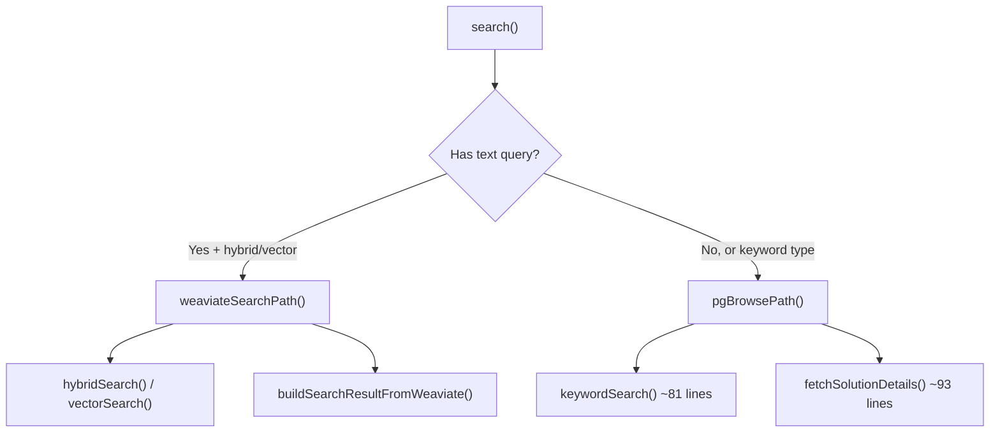
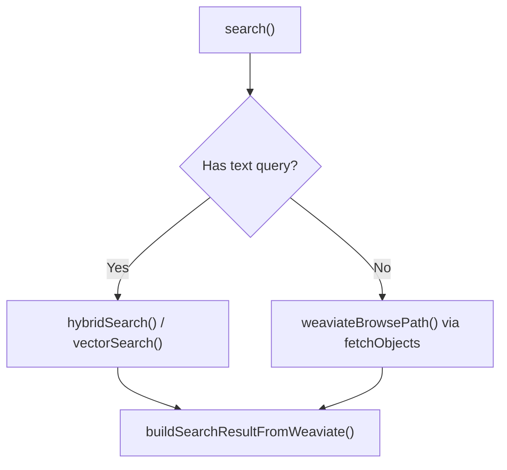

# Design Log #048: Eliminate PG Browse Path — Full Weaviate Consolidation

## Background

[Design Log #043](./043-unified-weaviate-search.md) moved text-based search (hybrid and vector) to be Weaviate-driven, denormalizing display fields into Weaviate so results could be built directly without a PostgreSQL enrichment step. However, the **browse path** (no-query requests) and **keyword search** still routed through PostgreSQL via `pgBrowsePath()` → `keywordSearch()` → `fetchSolutionDetails()`.

This created an inconsistency: text queries went through Weaviate while browse/filter-only queries went through PostgreSQL, maintaining two separate code paths (~234 lines of PG-specific search code).

## Problem

1. **Dual code paths** — two separate search implementations to maintain, test, and debug
2. **Unnecessary PG dependency for reads** — browse/filter queries don't need relational JOINs; Weaviate's inverted index handles exact-match filters, date ranges, and sorting natively
3. **`keyword` search type** — vestigial option with no active clients; hybrid search with `alpha=0` is functionally equivalent
4. **In-memory sorting** — severity and complexity sorts required fetching all candidates then re-sorting in Node.js, since Weaviate lacked numeric order fields

## Questions and Answers

> Q: Can Weaviate handle filter-only queries (no vector/text search) efficiently?

A: Yes. Weaviate's inverted index handles exact-match filters identically to PostgreSQL. `fetchObjects()` with filters uses the inverted index directly without touching the vector index (HNSW). It is the same technology as Postgres/Elasticsearch for structured queries.

> Q: How do we sort by severity/complexity in Weaviate when these are text fields?

A: Add pre-computed integer fields `severityOrder` and `complexityOrder` to the Weaviate schema. These map text values to sort-friendly integers (e.g., critical=1, high=2, medium=3, low=4, null=5). Weaviate sorts natively by these numeric fields via `collection.sort.byProperty()`.

> Q: Do we need a PostgreSQL migration?

A: No. PG tables are unchanged — they remain the source of truth for all writes. Only the Weaviate schema changes (v3 → v4, triggers automatic drop/recreate). A backfill script re-indexes all solutions from PG into Weaviate after the schema upgrade.

> Q: Does removing keyword search break any clients?

A: No active clients use `search_type: 'keyword'`. The frontend was using it for browse queries (no text), which now routes through `weaviateBrowsePath()` instead.

## Design

### Architecture Change

**Before:**



**After:**



### Key Decisions

- **Add `severityOrder` (int) and `complexityOrder` (int)** to Weaviate schema — enables native Weaviate sort for all 5 sort orders without in-memory re-sorting
- **Remove `keyword` from `search_type` enum** — no clients exist, hybrid with alpha=0 is equivalent
- **Pagination**: use `limit + 1` trick for `hasMore` (same as existing Weaviate path, no exact COUNT needed)
- **PG tables unchanged** — still source of truth for all writes; `getIssueDetail()` still uses PG joins

### Sort-Order Mapping

| Sort                  | Weaviate Sort Chain                                                  |
| --------------------- | -------------------------------------------------------------------- |
| `votes`               | `byProperty('voteCount', false)`                                     |
| `recent`              | `byProperty('createdAt', false)`                                     |
| `severity`            | `byProperty('severityOrder', true).byProperty('voteCount', false)`   |
| `complexity`          | `byProperty('complexityOrder', true).byProperty('voteCount', false)` |
| `relevance` (default) | `byProperty('voteCount', false).byProperty('createdAt', false)`      |

### Severity/Complexity Order Mapping

```typescript
// severity: critical=1, high=2, medium=3, low=4, null=5
// complexity: trivial=1, simple=2, medium=3, complex=4, very-complex=5, null=6
```

## Implementation Plan

1. **Schema** — Add `severityOrder`/`complexityOrder` to Weaviate schema, bump to v4, update `SolutionVector` type, add `severityToOrder()`/`complexityToOrder()` helpers
2. **Indexing** — Include order fields in `indexSolutionInWeaviate()` (submit service) and suggest service indexing
3. **Browse path** — Implement `weaviateBrowsePath()` using `fetchObjects` with native sort/filter
4. **Simplify entry** — Route: has query → `weaviateSearchPath()`, no query → `weaviateBrowsePath()`
5. **Remove dead code** — Delete `pgBrowsePath`, `keywordSearch`, `fetchSolutionDetails`, `filterByPackageVersions` (~234 lines)
6. **Remove keyword type** — Drop from shared schema, MCP tools, and frontend
7. **Update tests** — Replace keyword/PG tests with browse path tests, add sort mock chain
8. **Update backfill** — Add order fields to backfill script

## Trade-offs

| Pros                                                 | Cons                                                                     |
| ---------------------------------------------------- | ------------------------------------------------------------------------ |
| Single search engine — one code path for all queries | Weaviate becomes a harder dependency (browse fails if Weaviate is down)  |
| ~170 net lines removed                               | Schema v4 requires backfill after deploy                                 |
| Native Weaviate sorting (no in-memory re-sort)       | Package version filtering is a no-op for now (pre-filtered by name only) |
| Simpler mental model for developers                  | Brief search downtime during schema recreation + backfill                |
| Consistent results between text search and browse    | —                                                                        |

## Implementation Results

**Implemented in commit `ebad03f`** — all 8 phases completed.

### Files Modified (18 files)

**Schema & Helpers:**

- `packages/backend/src/weaviate/client.ts` — Added `severityOrder`/`complexityOrder` properties, bumped to v4, added `severityToOrder()`/`complexityToOrder()` helpers

**Indexing:**

- `packages/backend/src/services/submit.service.ts` — Added order fields to Weaviate insert
- `packages/backend/src/services/suggest.service.ts` — Added order fields to Weaviate insert

**Search Engine:**

- `packages/backend/src/services/search.service.ts` — Added `weaviateBrowsePath()` with `buildWeaviateSort()`, simplified `search()` entry, removed `pgBrowsePath`/`keywordSearch`/`fetchSolutionDetails`/`filterByPackageVersions`

**Schema & MCP:**

- `packages/shared/src/schemas/search.ts` — Removed `keyword` from search type enum
- `packages/mcp-server/src/tools.ts` — Removed `keyword` from MCP tool enum

**Frontend:**

- `packages/frontend/src/lib/api/dashboard.ts` — `keyword` → `hybrid`
- `packages/frontend/src/lib/api/issues.ts` — `keyword` → `hybrid`, updated type
- `packages/frontend/src/lib/api/public.ts` — `keyword` → `hybrid`
- `packages/frontend/src/lib/constants.ts` — Removed keyword search option
- `packages/frontend/src/lib/search-params.ts` — Removed `keyword` from enum

**Tests & Mocks:**

- `packages/backend/src/test-utils/mocks.ts` — Added `sort` mock chain
- `packages/backend/src/services/search.service.test.ts` — Replaced keyword tests with browse path tests

**Backfill:**

- `scripts/backfill-weaviate-solutions.ts` — Added `severityOrder`/`complexityOrder`

### Deviations from Plan

- Plan mentioned `recent` sort using `sort.byCreationTime(false)` — implemented as `sort.byProperty('createdAt', false)` instead, which is equivalent and consistent with how other properties are sorted
- `sortResults()` helper was kept (simplified) for the text search path where Weaviate returns results in relevance order but the user may request votes/recent re-sorting of the candidate pool
- Frontend files (not in original plan) also needed updating since they hardcoded `search_type: 'keyword'` for browse queries

### Test Results

- 264/264 tests passing across 19 test files
- TypeScript compiles clean for backend, shared, and mcp-server packages

### Deployment

1. Deploy new backend (auto-creates v4 Weaviate schema)
2. Run backfill: `pnpm --filter @agent-in-sync/backend exec tsx ../../scripts/backfill-weaviate-solutions.ts`
3. Brief search downtime between schema recreation and backfill completion

---

_Created: 2026-03-15_
_Status: Implemented_
